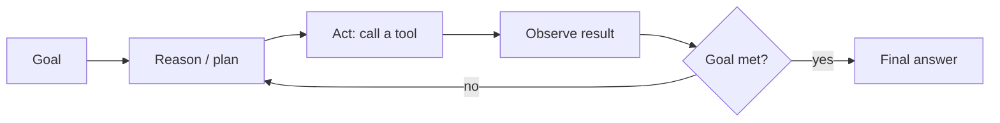

# Agents

## Up
- [[Theory]]

An **LLM agent** is a model put in a loop: it can **reason, call tools, observe results, and act** toward a goal — instead of answering in one shot. This is what turns a chatbot into something that books flights, fixes code, or runs a pentest recon step.

---

## The agent loop

**ReAct** = **Reason + Act**: think → act → observe → repeat. The model's "thought" chooses the next tool; the environment returns an observation that feeds the next thought.

---

## Core components

| Component | Role |
|---|---|
| **LLM (brain)** | reasoning + decides next action |
| **Tools** | functions the model can call: search, code exec, DB, APIs, browser |
| **Memory** | short-term (context window) + long-term (vector store / notes) |
| **Planning** | decompose goal → steps; re-plan on failure |
| **Orchestration** | the loop/controller + stopping conditions |

---

## Tool use / function calling
- Model emits a **structured call** (name + JSON args); your runtime executes it and returns the result.
- Powers: [[RAG|retrieval]], calculators, code execution, web/browser, any API.
- **Structured outputs / JSON schema** keep calls parseable.

### MCP — Model Context Protocol
- An **open standard** for connecting agents to tools/data via **MCP servers** (a universal "USB-C for tools"). Write a server once; any MCP-capable client (Claude, IDEs, this Cowork session) can use it. Exposes **tools, resources, prompts**.

### A2A — Agent-to-Agent
- Protocol for **agents talking to other agents** (delegation, negotiation) across systems.

---

## Planning patterns
- **ReAct** — interleaved reason/act (default).
- **Plan-and-Execute** — plan all steps up front, then run (with re-planning).
- **Reflection / self-critique** — the agent reviews its own output and retries (Reflexion).
- **Tree/graph of Thoughts** — explore multiple reasoning branches.

---

## Multi-agent systems
- **Roles** — planner, coder, reviewer, researcher collaborating.
- **Topologies** — supervisor/orchestrator → workers; sequential pipeline; debate.
- Frameworks: **LangGraph** (graph/state machines), **CrewAI** (roles/crews), **AutoGen** (conversable agents), **Semantic Kernel**, OpenAI Agents SDK.
- More agents ≠ better — coordination overhead, error compounding; use when parallel/roles genuinely help.

---

## Memory
- **Short-term** — the conversation in the context window.
- **Long-term** — persist facts/embeddings and retrieve later (episodic/semantic memory).
- **Scratchpad / state** — intermediate results the loop carries forward.

---

## Where agents fail (and fixes)
- **Compounding errors** over long loops → checkpoints, verification steps, human-in-the-loop.
- **Infinite loops / no progress** → step limits, budgets, stop conditions.
- **Bad tool calls / hallucinated args** → strict schemas, validation, retries.
- **Prompt injection via tool output / web pages** → treat tool data as untrusted (→ [[Ethics & Safety]], [[nvidia-skillspector]]).
- **Cost/latency** → cache, cheaper models for sub-steps, limit tools.

## Evaluation
Task success rate, steps/cost per task, tool-call accuracy; benchmarks like **SWE-bench**, **GAIA**, **WebArena**, **τ-bench**. → [[Evaluation]].

## Related
- [[Prompting & Inference]] — ReAct/CoT prompting · [[RAG]] — retrieval as a tool
- [[Tools]] — LangGraph/CrewAI/AutoGen · [[Skills]] — packaged agent behaviors
