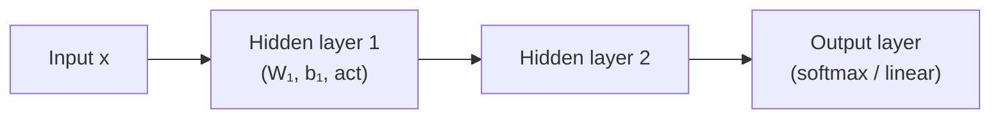
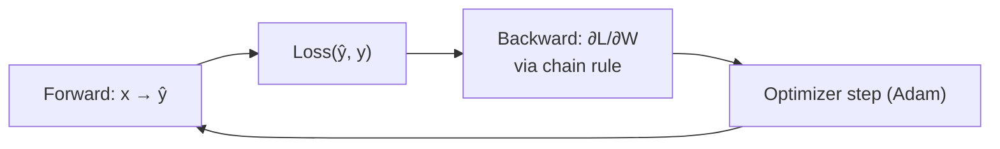

# Deep Learning

## Up
- [[Theory]]

Neural networks — stack differentiable layers, learn the features automatically (no hand-engineering), train end-to-end with **backpropagation**. This is the machinery [[Transformers & Attention]] are built from.

---

## The neuron & the network

A neuron: `y = activation(Σ wᵢxᵢ + b)`. Stack neurons into **layers**, layers into a **network** (MLP / fully-connected).

- **Depth** (many layers) lets the net compose simple features into complex ones.
- **Width** = neurons per layer.

---

## Forward + backward pass

- **Backpropagation** = chain rule applied layer-by-layer to get every weight's gradient efficiently.
- **Autograd** (PyTorch/TensorFlow) computes these automatically.

---

## Activation functions (add non-linearity)

| Fn | Shape / use |
|---|---|
| **ReLU** `max(0,x)` | default for hidden layers; cheap, fights vanishing gradients |
| Leaky ReLU / GELU | ReLU variants; **GELU** common in transformers |
| **Sigmoid** | (0,1) — binary output / gates |
| **Tanh** | (−1,1) — zero-centered |
| **Softmax** | turns logits into a probability distribution (multiclass output) |

Without non-linearity, a deep net collapses to one linear layer.

---

## Architectures

| Family | Good at | Idea |
|---|---|---|
| **MLP** | tabular, generic | fully-connected layers |
| **CNN** | images, spatial | **convolutions** share weights over local patches → translation invariance; pooling downsamples |
| **RNN / LSTM / GRU** | sequences (pre-transformer) | recurrent hidden state; **LSTM/GRU** gates fight vanishing gradients over long sequences |
| **Transformer** | sequences at scale | attention instead of recurrence → see [[Transformers & Attention]] |

CNN staples: convolution → ReLU → pooling, stacked; ResNet added **skip/residual connections** to train very deep nets.

---

## Training deep nets — what makes it work

- **Vanishing / exploding gradients** — deep chains multiply gradients; fixes: ReLU/GELU, residual connections, careful init (Xavier/He), **normalization**.
- **Normalization** — BatchNorm (CNNs), **LayerNorm** (transformers) stabilize and speed training.
- **Regularization** — **Dropout** (randomly zero units), weight decay (L2), data augmentation, early stopping.
- **Optimizers** — SGD+momentum, **Adam/AdamW**; **learning-rate schedules** (warmup + cosine decay).
- **Batching** — mini-batches; larger batches need LR tuning.

---

## Key terms
- **Tensor** — n-dimensional array (the data unit).
- **Logits** — raw pre-softmax scores.
- **Embedding** — learned dense vector for a discrete token/id.
- **Fine-tuning / transfer learning** — start from a pretrained net, adapt to your task.
- **GPU/TPU** — parallel matrix math is why DL scaled.

## Related
- [[ML Fundamentals]] — the loss/gradient basics this extends
- [[Transformers & Attention]] — the architecture behind modern LLMs
- [[Multimodal]] — CNNs/ViTs for vision, etc.
