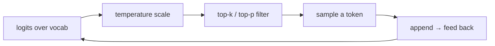

# LLM Fundamentals

## Up
- [[Theory]]

What a Large Language Model actually is: a big **decoder-only [[Transformers & Attention|transformer]]** trained to **predict the next token**. Everything else — chat, reasoning, code — emerges from doing that at scale over enormous text.

---

## The one-line mental model
> An LLM models `P(next token | all previous tokens)`. Generation = sample a token, append it, repeat.

---

## Tokenization

Text is split into **tokens** (sub-word units), each mapped to an integer id.
- Algorithms: **BPE** (GPT), **WordPiece** (BERT), **SentencePiece/Unigram** (Llama, T5).
- Rule of thumb: **~1 token ≈ 4 chars ≈ ¾ of a word** in English; code/other languages differ.
- Why sub-word: handles rare words, typos, and any language without an infinite vocabulary.
- **You pay per token** (context + output) → tokenization drives cost & the context budget.

---

## Embeddings
- Each token id → a learned **embedding vector** (dense, e.g. 4096-dim).
- Similar meanings sit near each other in vector space → the basis for [[RAG]] retrieval and semantic search.
- Inside the model, embeddings + positional info flow through the transformer stack; the final layer projects back to a probability over the vocabulary.

---

## Pretraining
- **Objective:** next-token prediction (self-supervised) over trillions of tokens of web/code/books.
- No labels needed — the text *is* the supervision.
- Produces a **base model**: great at completion, not yet a helpful chatbot (that's [[Training & Alignment]]).
- **Scaling laws** (Chinchilla): loss falls predictably with more params + data + compute; compute-optimal balances params and tokens (~20 tokens/param).
- **Emergent abilities** — some skills appear only past a scale threshold.

---

## Context window
- The max tokens the model can attend to at once (prompt + response). Ranges from a few K to **millions** in current frontier models.
- Costs grow with length (attention is O(n²)); **KV cache** speeds decoding.
- **"Lost in the middle"** — models use the start/end of long contexts better than the middle.

---

## Decoding — turning probabilities into text

| Knob | Effect |
|---|---|
| **Temperature** | 0 ≈ deterministic/greedy; higher = more random/creative |
| **Top-k** | sample only from the k most likely tokens |
| **Top-p (nucleus)** | sample from the smallest set whose prob ≥ p |
| **Greedy / Beam** | always take the best / search several paths (more for translation) |
| **Repetition / frequency penalty** | discourage loops |

- **Autoregressive** = generates one token at a time, left to right.

---

## Why LLMs get things wrong
- **Hallucination** — fluent but false; it's optimizing plausibility, not truth. (→ [[RAG]], [[Evaluation]])
- **Knowledge cutoff** — only knows its training data's era → tools/search fix this ([[Agents]]).
- **No built-in memory** across calls — the context window *is* the working memory.
- **Tokenizer artifacts** — e.g. poor character-level tasks (counting letters), arithmetic quirks.

## Key terms
- **Parameters** (7B, 70B…) · **base vs instruct/chat model** · **logits/probabilities** · **perplexity** (how surprised the model is — lower = better LM) · **MoE** (mixture-of-experts: route each token to a few expert subnetworks for more params at fixed compute).

## Related
- [[Transformers & Attention]] — the architecture underneath
- [[Training & Alignment]] — how a base model becomes a helpful assistant
- [[Prompting & Inference]] · [[RAG]] · [[Agents]] — how you use it well
