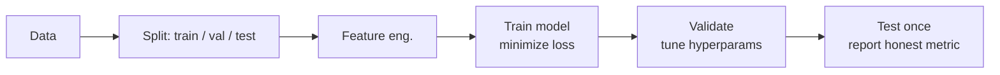
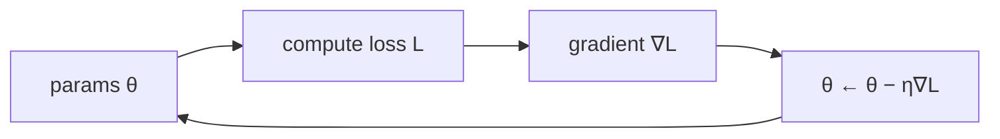

# ML Fundamentals

## Up
- [[Theory]]

Classical machine learning — the vocabulary and mechanics everything else inherits: learning paradigms, how a model is fit (loss + gradient descent), the bias-variance tradeoff, and how you measure success.

---

## Learning paradigms

| Type | Data | Goal | Examples |
|---|---|---|---|
| **Supervised** | labeled `(x, y)` | predict `y` from `x` | classification, regression |
| **Unsupervised** | unlabeled `x` | find structure | clustering (k-means), PCA, anomaly detection |
| **Self-supervised** | unlabeled → auto labels | pretext task | next-token prediction (LLMs), masked modeling |
| **Reinforcement (RL)** | reward signal | maximize return | game play, RLHF, robotics |

**Regression** predicts a continuous value; **classification** predicts a discrete class.

---

## The workflow

- **Train / validation / test split** — fit on train, tune on val, report on test **once**. Touching test during tuning leaks and inflates scores.
- **Cross-validation** (k-fold) — rotate the val split to use data efficiently.

---

## Bias–variance & fit

| | Underfitting (high bias) | Good fit | Overfitting (high variance) |
|---|---|---|---|
| Train error | high | low | very low |
| Val error | high | low | high |
| Fix | bigger model, more features | — | more data, regularization, simpler model |

**Regularization** (L1/Lasso → sparsity, L2/Ridge → shrink weights, dropout, early stopping) trades a little bias for a lot less variance.

---

## Training = minimize a loss with gradient descent

- **Loss function** measures wrongness: **MSE** (regression), **cross-entropy** (classification).
- **Gradient descent** nudges parameters *downhill* on the loss: `θ ← θ − η · ∇L(θ)`.
- **Learning rate `η`** — too big diverges, too small crawls.
- **Batch / Mini-batch / Stochastic (SGD)** — how many samples per step. Modern optimizers: **Adam / AdamW**.

---

## Metrics that matter

**Classification** (from the confusion matrix TP/FP/FN/TN):
- **Accuracy** = correct / total — misleading on imbalanced data.
- **Precision** = TP/(TP+FP) — "of predicted positives, how many right."
- **Recall** = TP/(TP+FN) — "of actual positives, how many caught."
- **F1** = harmonic mean of precision & recall.
- **ROC-AUC** — ranking quality across thresholds.

**Regression:** MAE, MSE/RMSE, R².

---

## Key terms
- **Feature** — an input variable; **feature engineering** — crafting them.
- **Hyperparameter** — set by you (LR, depth), not learned.
- **Parameter / weight** — learned by training.
- **Epoch** — one full pass over the training set.
- **Generalization** — performance on unseen data (the whole point).

## Classic algorithms (non-deep)
Linear/Logistic Regression · Decision Trees · **Random Forest** · **Gradient Boosting (XGBoost/LightGBM)** · SVM · k-NN · Naive Bayes · k-Means · PCA. Still state-of-the-art on lots of **tabular** problems.

## Related
- [[Deep Learning]] — when you stack layers and learn features automatically
- [[scikit-learn]] — the go-to library for classical ML (under [[Python]])
