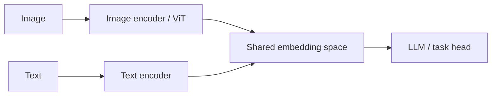
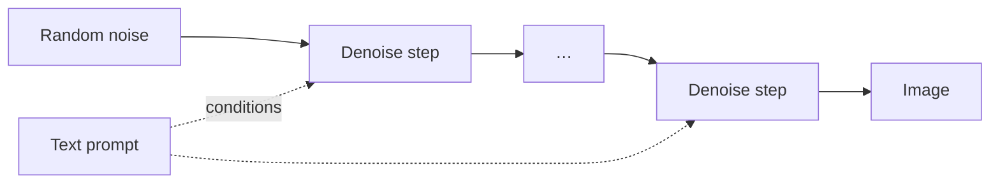

# Multimodal

## Up
- [[Theory]]

Models that work across **more than text** — images, audio, video — often mapping everything into a shared representation so a [[Transformers & Attention|transformer]] can reason over it. Covers vision understanding, generation (diffusion), and speech.

---

## The core trick: shared embedding space
Encode each modality into vectors in a **common space**, then a transformer processes them together.
- **CLIP** — trained on image–text pairs with **contrastive learning** so matching image/text vectors align. Enables zero-shot classification and text↔image search; the backbone of many generators.
- **VLMs (Vision-Language Models)** — an image encoder (often a ViT) feeds visual tokens into an LLM → describe images, read charts/screenshots, answer visual questions (GPT-4o, Claude, Gemini, Llava, Qwen-VL).

---

## Vision understanding
- **ViT (Vision Transformer)** — split an image into patches → treat patches as tokens → transformer. Rivals/beats CNNs at scale.
- **CNNs** still strong for many vision tasks ([[Deep Learning]]).
- Tasks: classification, detection, segmentation (SAM), OCR, document/chart understanding.

---

## Image / video generation — Diffusion

- **Diffusion models** learn to **reverse a noising process**: start from noise, iteratively denoise, conditioned on a text prompt (via CLIP-like encoders + cross-attention).
- **Latent diffusion** (Stable Diffusion) denoises in a compressed latent space → efficient. Others: **FLUX**, DALL·E, Midjourney, Imagen.
- Controls: guidance scale (prompt adherence), steps, seeds, **ControlNet / LoRA** for conditioning & style.
- Video: adds temporal consistency (Sora, Veo, Runway).
- (Earlier approach: **GANs** — generator vs. discriminator; largely superseded by diffusion for quality/controllability.)

---

## Audio & speech
- **ASR (speech→text)** — **Whisper** (robust, multilingual).
- **TTS (text→speech)** — neural voices (ElevenLabs, etc.).
- **Audio understanding/generation** — music (Suno), general audio; some LLMs take audio directly (GPT-4o realtime).

---

## "Any-to-any" / native multimodal
Frontier models increasingly take **and** emit multiple modalities in one network (text+image+audio) rather than bolting encoders on — enabling real-time voice, image reasoning, and generation in one model.

## Key terms
- **Contrastive learning** · **ViT / patch embedding** · **cross-attention** (how the prompt conditions generation) · **latent space** · **guidance scale** · **modality gap**.

## Related
- [[Transformers & Attention]] — ViT & cross-attention · [[Deep Learning]] — CNNs
- [[RAG]] — multimodal retrieval · [[LLM Fundamentals]] — the text backbone
