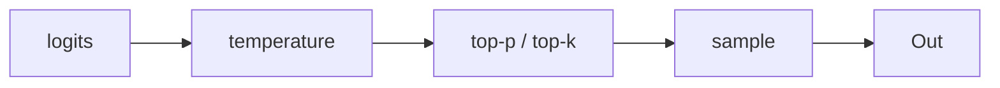

# Prompting & Inference

## Up
- [[Theory]]

Getting the most out of a model **without training it** — how to structure prompts, and the inference knobs that shape the output. Cheapest lever you have; try it before [[RAG]] or fine-tuning.

---

## Prompting techniques

| Technique | What it is | When |
|---|---|---|
| **Zero-shot** | just ask | simple tasks |
| **Few-shot** | include 2–5 worked examples | teach a format/pattern in-context |
| **Chain-of-Thought (CoT)** | "think step by step" → show reasoning | math, logic, multi-step |
| **Self-consistency** | sample several CoT paths, take majority | boost CoT accuracy |
| **ReAct** | interleave Reasoning + Actions (tools) | agents → [[Agents]] |
| **Role / system prompt** | set persona, rules, constraints | steer tone & guardrails |
| **Decomposition** | break into sub-tasks / prompt chains | complex workflows |
| **Structured output** | demand JSON/schema | machine-readable results |

---

## Anatomy of a good prompt
1. **Role / context** — who the model is, background.
2. **Task** — the explicit instruction (one clear ask).
3. **Constraints** — length, tone, format, do/don't.
4. **Examples** — few-shot demonstrations (optional).
5. **Input data** — clearly delimited (e.g. triple backticks / XML tags).
6. **Output format** — exactly what you want back.

**Tips:** be specific; show don't tell (examples); put instructions *before* long data; use delimiters; ask for step-by-step on hard tasks; give it an "out" ("say 'unknown' if unsure") to cut hallucination.

---

## In-context learning
The model "learns" the pattern from what's *in the prompt* — no weights change. Few-shot examples, retrieved docs ([[RAG]]), and prior turns all condition the next prediction. The context window is the whole scratchpad.

---

## Inference knobs (decoding)

| Knob | Low | High |
|---|---|---|
| **Temperature** | precise, deterministic (0 = greedy) | creative, varied |
| **Top-p (nucleus)** | narrow, safe | diverse |
| **Top-k** | few candidates | many |
| **Max tokens** | caps output length/cost | — |
| **Stop sequences** | end generation cleanly | — |
| **Frequency/presence penalty** | ↑ to reduce repetition | — |

Rule of thumb: **factual/extraction → temp ~0**; **brainstorming/creative → temp 0.7–1.0**.

---

## Advanced patterns
- **Prompt chaining** — output of one prompt feeds the next.
- **RAG** — inject retrieved context → [[RAG]].
- **Tool use / function calling** — model emits a structured call → [[Agents]].
- **Reasoning models** — models trained to do long internal CoT ("thinking" tokens) before answering; you spend inference compute for accuracy (**test-time compute**).
- **Prompt caching** — reuse a fixed prefix (system + docs) to cut latency/cost.

## Anti-patterns
Vague asks · burying the instruction after huge data · conflicting constraints · asking for reasoning **and** temp 0 sometimes fights · over-long few-shots that eat the budget · relying on the model for fresh facts (use tools/RAG).

## Related
- [[LLM Fundamentals]] — decoding/temperature explained at the token level
- [[RAG]] — add knowledge · [[Agents]] — add actions
- [[Training & Alignment]] — when prompting isn't enough
