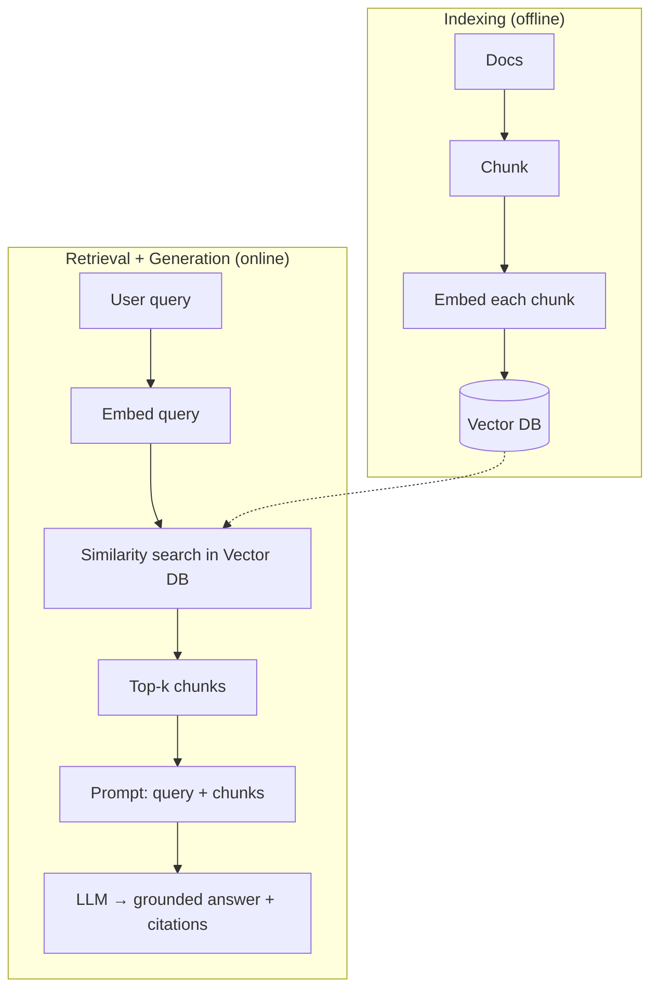

# RAG

## Up
- [[Theory]]

**Retrieval-Augmented Generation** — give the LLM the *right facts at query time* by retrieving relevant documents and stuffing them into the prompt. Fixes stale knowledge and hallucination without retraining. The default way to make a model "know" your data.

---

## Why RAG
- LLMs have a **knowledge cutoff** and **can't cite** what they never saw.
- Fine-tuning teaches *behavior*, not reliable *facts*, and is expensive to keep fresh.
- RAG = keep facts in an external store, retrieve on demand, ground the answer, **cite sources**.

---

## Two phases

---

## Indexing choices
- **Chunking** — split docs into passages. Too big = noisy/costly; too small = lost context. Typical 200–800 tokens with **overlap**; prefer **semantic/structural** splits (by heading/paragraph) over blind fixed-size.
- **Embeddings** — turn each chunk into a vector (OpenAI `text-embedding-3`, `bge`, `e5`, sentence-transformers). Same model for docs and queries.
- **Vector DB** — stores vectors + metadata, does fast **ANN** search (HNSW/IVF): Chroma, Qdrant, Weaviate, Pinecone, FAISS, **pgvector**.
- **Metadata** — attach source/date/section for **filtering** and citations.

---

## Retrieval quality — where RAG lives or dies

| Technique | Helps with |
|---|---|
| **Hybrid search** (dense + **BM25** keyword) | exact terms, IDs, names dense search misses |
| **Reranking** (cross-encoder, e.g. Cohere/bge-reranker) | reorder top-N for precision |
| **Query rewriting / expansion / HyDE** | vague or under-specified queries |
| **MMR** | diversity, less redundancy |
| **Metadata filters** | scope by tenant/date/doc |
| **Parent-doc / small-to-big** | retrieve small, feed larger context |

---

## Advanced variants
- **GraphRAG** — build a knowledge graph, retrieve over relationships (good for "connect X to Y" questions; cf. [[graphify]]).
- **Agentic RAG** — an [[Agents|agent]] decides *when/what* to retrieve, can loop and refine.
- **Contextual retrieval** — prepend chunk-level context before embedding to cut ambiguity.
- **Multimodal RAG** — retrieve images/tables too.

---

## Failure modes & fixes
- **Bad chunking** → retrieve, eyeball chunks. **Retrieval miss** → hybrid + rerank. **Right context, wrong answer** → tighten prompt, demand "answer only from context, else say unknown." **Stale index** → re-embed on update. **Too much context** → rerank + trim (watch "lost in the middle").

## Evaluation
Retrieval: **recall@k / precision@k / MRR / nDCG**. Generation: **faithfulness/groundedness, answer relevance, context precision** (tools: RAGAS, TruLens). → [[Evaluation]].

## Related
- [[LLM Fundamentals]] — embeddings & context window
- [[Tools]] → Vector DBs, LlamaIndex/LangChain · [[Agents]] — agentic retrieval
