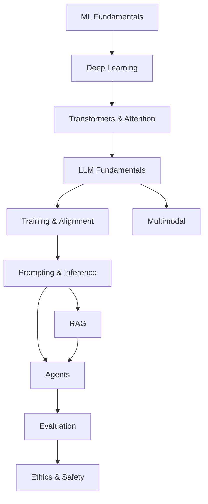

# Theory

## Up
- [[AI]]

Foundations of AI/ML — from classical machine learning up through deep learning, transformers, LLMs, and the training, retrieval, agent, evaluation, and safety concepts that sit on top. Read roughly top-to-bottom; each builds on the last.

## Subtopics
- [[ML Fundamentals]] — supervised/unsupervised/RL, bias-variance, gradient descent, metrics
- [[Deep Learning]] — neural nets, backprop, activations, CNNs, RNNs/LSTMs, regularization
- [[Transformers & Attention]] — self-attention, multi-head, positional encoding, encoder/decoder
- [[LLM Fundamentals]] — tokenization, embeddings, pretraining, context window, decoding
- [[Training & Alignment]] — pretrain → SFT → RLHF/DPO, LoRA/PEFT, quantization, distillation
- [[Prompting & Inference]] — prompt engineering, few-shot, CoT, temperature/top-p, sampling
- [[RAG]] — embeddings, chunking, vector search, retrieval pipelines, reranking
- [[Agents]] — tool use, ReAct, planning, memory, MCP, A2A, multi-agent
- [[Evaluation]] — benchmarks, LLM-as-judge, hallucination, guardrails
- [[Multimodal]] — vision (ViT/CLIP), audio (Whisper), diffusion / image generation
- [[Ethics & Safety]] — bias, alignment, jailbreaks, privacy (cross-link [[Hacking]] → Web LLM attacks)

## The stack, at a glance

## Related
- [[Tools]] — the frameworks/runtimes that implement this theory
- [[LangChain]] · [[Python]] — where you build with it
- [[Hacking]] → Web LLM attacks — the adversarial angle
