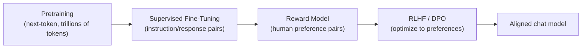

# Training & Alignment

## Up
- [[Theory]]

How a raw next-token predictor ([[LLM Fundamentals|base model]]) becomes a helpful, harmless, honest assistant — and how you adapt or shrink one efficiently.

---

## The pipeline

1. **Pretraining** → broad knowledge, no manners.
2. **SFT (instruction tuning)** → teach it to follow instructions using curated `(prompt, good answer)` pairs.
3. **Preference optimization** → make outputs match *human preferences* (helpful, safe, well-formatted).

---

## Aligning to human preferences

- **RLHF** (RL from Human Feedback): humans rank outputs → train a **reward model** → optimize the LLM against it with **PPO**, with a **KL penalty** keeping it near the SFT model (so it doesn't degenerate/reward-hack).
- **DPO** (Direct Preference Optimization): skips the separate reward model + RL loop — optimizes directly on preference pairs. Simpler, stable, now very common. Cousins: **IPO, KTO, ORPO, GRPO**.
- **RLAIF / Constitutional AI** — use an AI (guided by a written "constitution"/rules) to generate preference labels, reducing human labeling.
- **Reward hacking** — the model games the reward proxy instead of the true goal; a core alignment risk.

---

## Parameter-efficient fine-tuning (PEFT)

Full fine-tuning updates all weights (expensive). PEFT freezes the base and trains a tiny add-on:

| Method | Idea |
|---|---|
| **LoRA** | learn low-rank ΔW matrices injected into attention/FFN; tiny, mergeable |
| **QLoRA** | LoRA on top of a **4-bit quantized** base → fine-tune big models on one GPU |
| Adapters / Prefix / P-tuning | small trainable modules or virtual tokens |

Benefits: cheap, fast, swappable adapters, no catastrophic forgetting of the base.

---

## Making models smaller / faster

- **Quantization** — store weights in fewer bits (FP16 → **INT8/INT4**, GPTQ/AWQ/GGUF). Big memory & speed wins, small quality loss. Enables local run\-time (Ollama/llama.cpp).
- **Distillation** — train a small **student** to mimic a large **teacher**'s outputs.
- **Pruning** — drop unimportant weights.
- **MoE** — more parameters, only a few active per token (compute-efficient scale).

---

## When to fine-tune vs. not

| Want | Reach for |
|---|---|
| New **knowledge/facts** | [[RAG]] (usually), not fine-tuning |
| New **behavior/format/style/tone** | SFT / LoRA |
| A **narrow task** cheaply on a small model | distillation + fine-tune |
| Just better answers now | [[Prompting & Inference|prompting]] first — cheapest |

> Rule of thumb: **prompt → RAG → fine-tune**, in that order of effort.

## Key terms
- **Catastrophic forgetting** · **alignment tax** (safety can cost capability) · **synthetic data** · **checkpoint** · **epochs/steps** · **KL divergence** (drift from reference model).

## Related
- [[LLM Fundamentals]] — the base model this refines
- [[Prompting & Inference]] — the no-training alternative
- [[Ethics & Safety]] — what "alignment" is ultimately for
- [[Tools]] → fine-tuning (HF PEFT, Axolotl, Unsloth)
