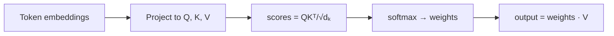
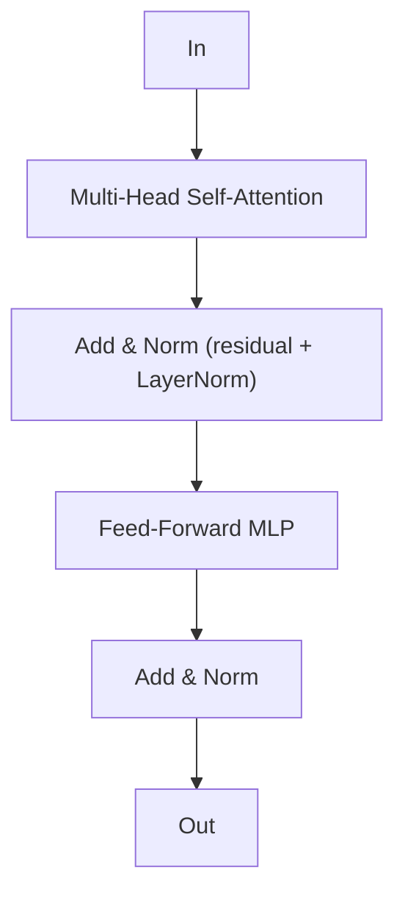

# Transformers & Attention

## Up
- [[Theory]]

The architecture behind virtually every modern LLM (*"Attention Is All You Need"*, 2017). It replaced recurrence with **self-attention**, so every token can look at every other token **in parallel** — which is what let training scale to billions of parameters.

---

## Why it beat RNNs
- **RNNs** process a sequence step-by-step → slow, and long-range dependencies fade.
- **Transformers** process the whole sequence at once, with attention giving direct paths between any two positions. Parallelizable → GPU-friendly → scale.

---

## Self-attention — the core

Each token is projected into three vectors: **Query (Q)**, **Key (K)**, **Value (V)**.

```
Attention(Q,K,V) = softmax( QKᵀ / √dₖ ) V
```

Intuition: a token's **Q** is compared (dot product) with every token's **K** → similarity scores → softmax to weights → take a weighted sum of the **V**s. So each token gathers a context-mix of the others. The `√dₖ` scaling keeps softmax gradients sane.



- **Multi-Head Attention** — run attention `h` times in parallel with different projections, concat → the model attends to different relationship types (syntax, coreference, …) at once.

---

## The transformer block

Each layer = **attention sublayer** + **feed-forward (MLP) sublayer**, each wrapped with a **residual connection** and **LayerNorm**:



Stack N of these blocks. Modern variants tweak: **pre-norm** vs post-norm, **RMSNorm**, **SwiGLU** FFNs, **RoPE** positional encoding, **GQA/MQA** attention.

---

## Positional encoding

Attention is order-blind (a set, not a sequence), so position must be injected:
- **Sinusoidal** (original) — fixed sin/cos patterns added to embeddings.
- **Learned** positional embeddings.
- **RoPE (Rotary)** — rotates Q/K by position; great length generalization, used in Llama/most modern LLMs.
- **ALiBi** — biases attention scores by distance.

---

## Three architecture shapes

| Shape | Attention | Good for | Examples |
|---|---|---|---|
| **Encoder-only** | bidirectional | understanding / embeddings | BERT |
| **Decoder-only** | causal (masked, left-to-right) | generation | GPT, Llama, Claude, Gemini |
| **Encoder-decoder** | both | seq-to-seq (translation) | T5, original Transformer |

Most chat LLMs today are **decoder-only** with **causal masking** (a token can't attend to future tokens).

---

## Costs & scaling
- Self-attention is **O(n²)** in sequence length `n` → long context is expensive. Mitigations: **FlashAttention** (IO-aware kernel), sliding-window/sparse attention, **KV cache** (reuse past K/V during generation), **GQA/MQA** (share K/V heads).

## Key terms
- **d_model** — hidden size · **heads** — parallel attention sets · **context length** — max tokens · **KV cache** — stored keys/values for fast decoding.

## Related
- [[Deep Learning]] — residuals, LayerNorm, MLPs this uses
- [[LLM Fundamentals]] — what you get when you scale a decoder-only transformer
- [[Multimodal]] — Vision Transformers (ViT) apply the same idea to image patches
