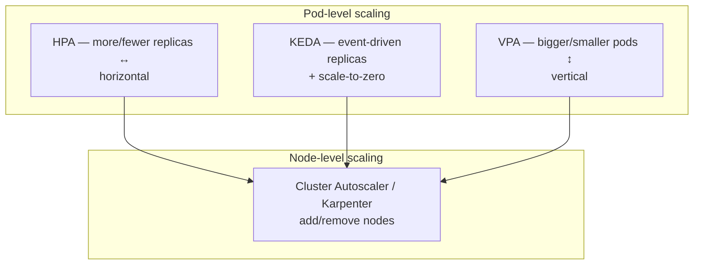

# Autoscaling

## Up
- [[Kubernetes]]

Kubernetes autoscaling adjusts capacity automatically to match demand across **three independent dimensions**: how many pod replicas (**HPA**), how much CPU/memory each pod gets (**VPA**), and scaling on **external events/queues** (**KEDA**) — plus node-level scaling (Cluster Autoscaler / [[Karpenter]]). Knowing which dimension a problem calls for is the whole game.

## Subtopics
- [[HPA]] — HorizontalPodAutoscaler: scale replica **count** on metrics
- [[VPA]] — VerticalPodAutoscaler: right-size pod **requests/limits**
- [[KEDA]] — event-driven autoscaling on queues/streams/custom metrics (scale-to-zero)

## Related
- [[Karpenter]] — node-level autoscaling (provisions the nodes pods land on)

---

## The Three (well, four) Dimensions



| Scaler | Changes | Trigger | Scale to 0? |
|---|---|---|---|
| **[[HPA]]** | Replica **count** | CPU/mem or custom/external metrics | No (needs KEDA) |
| **[[VPA]]** | Pod **CPU/mem requests** | Historical usage recommendations | n/a |
| **[[KEDA]]** | Replica count (drives an HPA) | 60+ event sources (Kafka, queues, Prometheus, cron…) | **Yes** |
| **[[Karpenter]] / CA** | **Nodes** | Unschedulable pods / consolidation | Nodes → 0 possible |

- **Horizontal (HPA/KEDA)** = *more copies* — the default for stateless web/API workloads.
- **Vertical (VPA)** = *right-size one copy* — for workloads that can't easily shard, or to fix over/under-provisioned requests.
- **Node (Karpenter/CA)** = *more machines* — reacts when pods can't be scheduled.

They stack: pods scale out (HPA/KEDA) → nodes fill up → node autoscaler adds machines.

---

## Prerequisite: metrics

- **metrics-server** must be installed for HPA CPU/memory and for VPA recommendations:
  ```bash
  kubectl top nodes ; kubectl top pods    # works only if metrics-server is running
  ```
- Custom/external metrics need an adapter (Prometheus Adapter, or KEDA's metrics API). See [[Prometheus]].

---

## Choosing the Right One

| Situation | Use |
|---|---|
| Stateless service, load varies | **[[HPA]]** on CPU (or RPS via custom metric) |
| Requests are wrong (OOMKills or wasted RAM) | **[[VPA]]** (start in `Off`/recommend mode) |
| Queue/stream workers, bursty or idle | **[[KEDA]]** (scale on lag, scale to zero) |
| Not enough nodes for pending pods | **[[Karpenter]]** / Cluster Autoscaler |
| Batch/Jobs per message | **[[KEDA]]** `ScaledJob` |

> **Gotcha:** **HPA and VPA must not target the same resource metric** (both on CPU) on the same workload — they fight. Use VPA for memory + HPA for CPU, or VPA in recommend-only mode. See [[VPA]].

---

## Takeaways

- Three pod dimensions — **out ([[HPA]]), up ([[VPA]]), on-events ([[KEDA]])** — plus **nodes ([[Karpenter]])**; pick by *what actually limits you*.
- **metrics-server** is the baseline dependency; custom metrics need an adapter/[[Prometheus]].
- Only **KEDA** scales to **zero**; HPA/VPA don't.
- Don't let HPA and VPA both drive the same metric — a classic misconfiguration.
