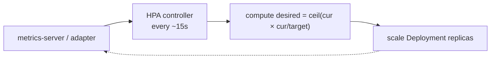

# HPA

## Up
- [[Autoscaling]]

The **HorizontalPodAutoscaler** automatically changes the **number of replicas** of a Deployment/StatefulSet/ReplicaSet to keep an observed metric (CPU, memory, or custom/external) near a target. It's the built-in, default answer for scaling stateless workloads out and back in. Requires **metrics-server** for CPU/memory.

---

## How It Works

The HPA controller runs a loop (default every 15s): read the metric, compute the desired replica count, and scale the target.

```
desiredReplicas = ceil( currentReplicas × (currentMetricValue / targetMetricValue) )
```

- Example: 3 replicas at 90% CPU, target 50% → `ceil(3 × 90/50) = ceil(5.4) = 6` replicas.
- Clamped to `minReplicas`…`maxReplicas`; a tolerance (~10%) avoids thrashing near target.



---

## Basic Usage

```bash
# imperative
kubectl autoscale deployment web --cpu-percent=50 --min=2 --max=10

kubectl get hpa
kubectl describe hpa web        # see current/target metrics + events
```

### Manifest (autoscaling/v2 — the current API)

```yaml
apiVersion: autoscaling/v2
kind: HorizontalPodAutoscaler
metadata:
  name: web
spec:
  scaleTargetRef:
    apiVersion: apps/v1
    kind: Deployment
    name: web
  minReplicas: 2
  maxReplicas: 10
  metrics:
    - type: Resource                 # CPU
      resource:
        name: cpu
        target:
          type: Utilization
          averageUtilization: 50     # % of the pod's CPU *request*
    - type: Resource                 # memory
      resource:
        name: memory
        target:
          type: AverageValue
          averageValue: 500Mi
```

**Important:** utilization is a percentage of the pod's **resource `requests`** — HPA needs CPU/memory `requests` set on the containers, or it can't compute a percentage.

---

## Custom & External Metrics

Scale on things that actually reflect load (requests/sec, queue depth) via a metrics adapter (e.g. **Prometheus Adapter** — see [[Prometheus]]):

```yaml
  metrics:
    - type: Pods                     # per-pod custom metric
      pods:
        metric: { name: http_requests_per_second }
        target: { type: AverageValue, averageValue: "100" }
    - type: External                 # cluster-external (e.g. queue length)
      external:
        metric: { name: queue_messages }
        target: { type: AverageValue, averageValue: "30" }
```

For queues/streams/scale-to-zero, **[[KEDA]]** is usually easier than wiring External metrics by hand (it generates the HPA for you).

---

## Scaling Behavior (v2 — tune the aggressiveness)

```yaml
  behavior:
    scaleUp:
      stabilizationWindowSeconds: 0
      policies:
        - type: Percent
          value: 100          # can double pods…
          periodSeconds: 15    # …every 15s
    scaleDown:
      stabilizationWindowSeconds: 300   # wait 5m of low load before scaling down
      policies:
        - type: Pods
          value: 1
          periodSeconds: 60
```

- **Stabilization window** smooths flapping — longer on scale-down to avoid yo-yo.
- Policies cap how fast it adds/removes pods.

---

## Gotchas & Tips

- **Set resource `requests`** — no requests, no CPU-% scaling.
- **metrics-server required** (`kubectl top pods` must work).
- **HPA can't scale to 0** by default → use **[[KEDA]]** for idle workloads.
- **Don't pair HPA + VPA on the same metric** (both on CPU) — they conflict. See [[VPA]].
- Scaling out only helps if **nodes** have room — combine with **[[Karpenter]]**/Cluster Autoscaler.
- Prefer a **load metric** (RPS, latency, queue depth) over raw CPU for user-facing services.
- Give apps proper **readiness probes** so new replicas take traffic only when ready.
