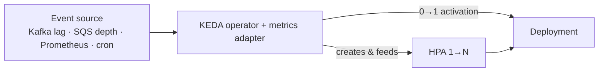

# KEDA

## Up
- [[Autoscaling]]

**KEDA** (Kubernetes Event-Driven Autoscaling) is a CNCF-graduated add-on that scales workloads on **external events** — queue depth, stream lag, a Prometheus query, cloud metrics, cron schedules, and 60+ more — and, crucially, can **scale to zero** when idle. Under the hood it drives a standard **[[HPA]]** (for `ScaledObject`) or manages Jobs (for `ScaledJob`), so it *extends* rather than replaces native autoscaling.

---

## Why KEDA (vs plain HPA)

- Native HPA scales on CPU/memory (and external metrics if you wire an adapter). KEDA gives you **turnkey scalers** for real event sources and **scale-to-zero** — ideal for **workers, consumers, and bursty/idle jobs**.
- It creates and manages the HPA for you; you just declare the trigger.



- **Activation** (0→1) is handled by KEDA directly; **scaling** (1→N) is delegated to the HPA it creates.

---

## Install

```bash
helm repo add kedacore https://kedacore.github.io/charts
helm install keda kedacore/keda -n keda --create-namespace
kubectl get pods -n keda            # operator + metrics-apiserver
```

---

## ScaledObject (scale a Deployment/StatefulSet)

```yaml
apiVersion: keda.sh/v1alpha1
kind: ScaledObject
metadata:
  name: consumer-scaler
spec:
  scaleTargetRef:
    name: consumer            # the Deployment to scale
  minReplicaCount: 0          # scale to ZERO when idle
  maxReplicaCount: 50
  cooldownPeriod: 300         # wait before scaling back to 0
  pollingInterval: 15
  triggers:
    - type: kafka
      metadata:
        bootstrapServers: kafka:9092
        consumerGroup: my-group
        topic: orders
        lagThreshold: "100"    # add a replica per ~100 messages of lag
```

- `minReplicaCount: 0` → **scale to zero**; the first event reactivates it.
- Multiple `triggers` combine (scales to satisfy the most-demanding one).

---

## ScaledJob (one Job per unit of work)

```yaml
apiVersion: keda.sh/v1alpha1
kind: ScaledJob
metadata:
  name: batch-worker
spec:
  jobTargetRef:
    template:
      spec:
        containers: [{ name: worker, image: worker:1.0 }]
        restartPolicy: Never
  minReplicaCount: 0
  maxReplicaCount: 100
  triggers:
    - type: aws-sqs-queue
      metadata:
        queueURL: https://sqs.../jobs
        queueLength: "5"
        awsRegion: us-east-1
```

Use **ScaledJob** for batch/queue work where each message spawns a finite Job (vs. long-running Deployment pods).

---

## Scalers (a taste of the 60+)

| Category | Examples |
|---|---|
| **Messaging** | Kafka, RabbitMQ, NATS, AWS SQS, Azure Service Bus, GCP Pub/Sub |
| **Streams** | Kafka lag, AWS Kinesis, Azure Event Hubs |
| **Metrics/DB** | **Prometheus** (any PromQL!), Datadog, PostgreSQL, MySQL, Redis, MongoDB |
| **Cloud** | AWS CloudWatch, Azure Monitor, GCP Stackdriver |
| **Other** | **Cron** (time-based), HTTP (add-on), external/external-push, CPU/memory |

The **Prometheus** scaler is a favourite — scale on *any* metric you already collect (see [[Prometheus]]):

```yaml
    - type: prometheus
      metadata:
        serverAddress: http://prometheus:9090
        query: sum(rate(http_requests_total[1m]))
        threshold: "100"
```

---

## Auth (TriggerAuthentication)

```yaml
apiVersion: keda.sh/v1alpha1
kind: TriggerAuthentication
metadata: { name: kafka-auth }
spec:
  secretTargetRef:
    - parameter: sasl
      name: kafka-secret
      key: sasl
# then reference it from a trigger:  authenticationRef: { name: kafka-auth }
```

Supports Secrets, pod identity (AWS IRSA, Azure AD Workload Identity), and env — so scalers reach authenticated event sources securely.

---

## Tips & Gotchas

- **Scale-to-zero** is KEDA's superpower — huge cost saver for spiky/idle consumers; mind `cooldownPeriod` and cold-start latency.
- KEDA **creates an HPA** — don't also hand-create one on the same target (conflict), and the same HPA-vs-VPA caution applies (see [[VPA]]).
- Choose **ScaledObject** for steady consumers, **ScaledJob** for discrete units of work.
- Still bounded by **node** capacity → pair with **[[Karpenter]]**/Cluster Autoscaler for the machines.
- Set sensible `maxReplicaCount` so a flooded queue can't stampede the cluster.
- The **cron** scaler is a simple way to pre-scale for known traffic peaks.
