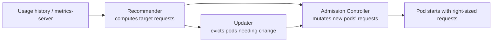

# VPA

## Up
- [[Autoscaling]]

The **VerticalPodAutoscaler** right-sizes pods by adjusting their **CPU/memory `requests` (and limits)** based on observed usage — instead of adding replicas, it makes each pod bigger or smaller. It fixes over-provisioning (wasted cost) and under-provisioning (OOMKills/throttling). VPA is an **add-on** (not built in) and its `Auto` mode traditionally **evicts and recreates** pods to apply changes.

---

## Components



| Component | Role |
|---|---|
| **Recommender** | Watches usage, computes recommended CPU/mem requests (target + bounds) |
| **Updater** | Evicts pods whose requests are off, so they get recreated |
| **Admission Controller** | Rewrites the pod spec with recommended requests at creation |

Install from the autoscaler repo (`vertical-pod-autoscaler/hack/vpa-up.sh`); needs **metrics-server**.

---

## Update Modes

```yaml
apiVersion: autoscaling.k8s.io/v1
kind: VerticalPodAutoscaler
metadata:
  name: web-vpa
spec:
  targetRef:
    apiVersion: apps/v1
    kind: Deployment
    name: web
  updatePolicy:
    updateMode: "Off"        # Off | Initial | Recreate | Auto
  resourcePolicy:
    containerPolicies:
      - containerName: '*'
        minAllowed: { cpu: 50m, memory: 64Mi }
        maxAllowed: { cpu: "2", memory: 2Gi }
        controlledResources: ["cpu", "memory"]
```

| Mode | Behaviour |
|---|---|
| **Off** | **Recommend only** — no changes; read via `kubectl describe vpa` (safest; start here) |
| **Initial** | Apply recommendations **only at pod creation**; never evicts |
| **Recreate** | Evict + recreate pods to apply new requests (disruptive) |
| **Auto** | Currently = Recreate (moving toward in-place as it stabilises) |

```bash
kubectl describe vpa web-vpa      # see Target / Lower / Upper recommendations
```

---

## In-Place Resize (newer, less disruptive)

Kubernetes added **in-place pod resource resize** (`InPlacePodVerticalScaling`, beta in recent versions) so requests can change **without** recreating the pod. VPA is evolving to use it, removing the historic "VPA restarts my pods" pain. Check your cluster/VPA version for support.

---

## The HPA Conflict (important)

- **VPA and HPA must not both act on the same metric** (e.g. both CPU) for the same workload — VPA changing requests shifts HPA's utilization math and they fight.
- **Safe combinations:**
  - HPA on a **custom/RPS metric** + VPA on CPU/memory.
  - VPA on **memory** + HPA on **CPU**.
  - VPA in **`Off`** (recommend) mode alongside HPA.
- Or use the **multidimensional autoscaler** (e.g. GKE MPA) where supported.

---

## When to Use VPA

- Workloads that **can't shard** (singletons, some stateful apps) where horizontal scaling isn't an option.
- **Right-sizing** to cut waste — start every namespace with VPA in **`Off`** mode to *see* recommendations before enforcing.
- Fixing **OOMKills** (memory requests too low) or CPU throttling.

---

## Tips & Gotchas

- **Start in `Off` mode** — treat VPA as a recommender first; enforce only once numbers look sane.
- `Recreate`/`Auto` **evicts pods** — respect PodDisruptionBudgets; avoid on latency-critical singletons without in-place resize.
- Set `minAllowed`/`maxAllowed` bounds so it can't recommend absurd values.
- Needs **metrics-server**; recommendations improve with more usage history.
- For **node** capacity, pair with **[[Karpenter]]**; for **replica** scaling, use **[[HPA]]**/**[[KEDA]]**.
