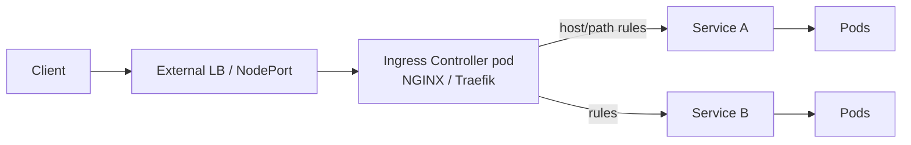

# Ingress Controllers

## Up
- [[Kubernetes]]

An **Ingress** exposes HTTP/HTTPS routes from outside the cluster to Services (host/path routing, TLS). The **Ingress resource** is just config — an **Ingress controller** (NGINX, Traefik, HAProxy, cloud LBs) actually implements it. Newer clusters increasingly use the **Gateway API** instead.

---

## How it fits



- Without a controller installed, Ingress objects do nothing.
- The controller runs as pods + a Service (usually `type: LoadBalancer`) that owns the external IP.

---

## Ingress resource

```yaml
apiVersion: networking.k8s.io/v1
kind: Ingress
metadata:
  name: web
  annotations:
    nginx.ingress.kubernetes.io/rewrite-target: /
spec:
  ingressClassName: nginx            # which controller handles this
  tls:
    - hosts: [app.example.com]
      secretName: app-tls            # cert (see [[cert-manager]])
  rules:
    - host: app.example.com
      http:
        paths:
          - path: /api
            pathType: Prefix
            backend: { service: { name: api, port: { number: 80 } } }
          - path: /
            pathType: Prefix
            backend: { service: { name: web, port: { number: 80 } } }
```

`IngressClass` links an Ingress to a controller; set a default class with the `ingressclass.kubernetes.io/is-default-class: "true"` annotation.

---

## NGINX Ingress Controller

```bash
helm repo add ingress-nginx https://kubernetes.github.io/ingress-nginx
helm install ingress-nginx ingress-nginx/ingress-nginx -n ingress-nginx --create-namespace
kubectl get svc -n ingress-nginx    # external IP of the LB
```
Behaviour is driven by **annotations** (`nginx.ingress.kubernetes.io/*`): rewrite, rate-limit, auth (basic/oauth), canary, proxy-body-size, ssl-redirect, backend-protocol. ConfigMap for global tuning.

> Note: **`ingress-nginx`** (community, Kubernetes project) ≠ **NGINX Inc's `nginx-ingress`** — different annotations. Know which you have.

## Traefik

```bash
helm repo add traefik https://traefik.github.io/charts
helm install traefik traefik/traefik -n traefik --create-namespace
```
- Supports the standard Ingress **and** its own CRDs (`IngressRoute`, `Middleware`) for richer routing.
- Auto service discovery, built-in Let's Encrypt (ACME), dashboard, middlewares (auth, headers, rate-limit, redirects).

---

## Gateway API (the successor)

The modern, role-oriented, vendor-neutral replacement for Ingress:

```yaml
# GatewayClass → Gateway (infra) → HTTPRoute (routing)
apiVersion: gateway.networking.k8s.io/v1
kind: HTTPRoute
metadata: { name: web }
spec:
  parentRefs: [{ name: prod-gateway }]
  hostnames: ["app.example.com"]
  rules:
    - matches: [{ path: { type: PathPrefix, value: /api } }]
      backendRefs: [{ name: api, port: 80 }]
```

Advantages: separates **infra (Gateway)** from **routing (HTTPRoute)**, native header/traffic-splitting, cross-namespace refs, and it's what [[Service Mesh]] (Istio/Linkerd) is standardising on. Prefer it for new clusters where the controller supports it.

---

## Tips
- Install exactly **one default IngressClass**, or set `ingressClassName` explicitly on every Ingress.
- Terminate TLS at the controller and automate certs with **[[cert-manager]]** (`tls.secretName`).
- `pathType: Prefix` vs `Exact` matters — mismatches cause 404s; watch controller-specific rewrite behaviour.
- Check the controller's external IP/Service and its logs first when routes 404/502.
- For advanced traffic control (canary, mTLS, retries) consider [[Service Mesh]] or Gateway API rather than piling on annotations.
