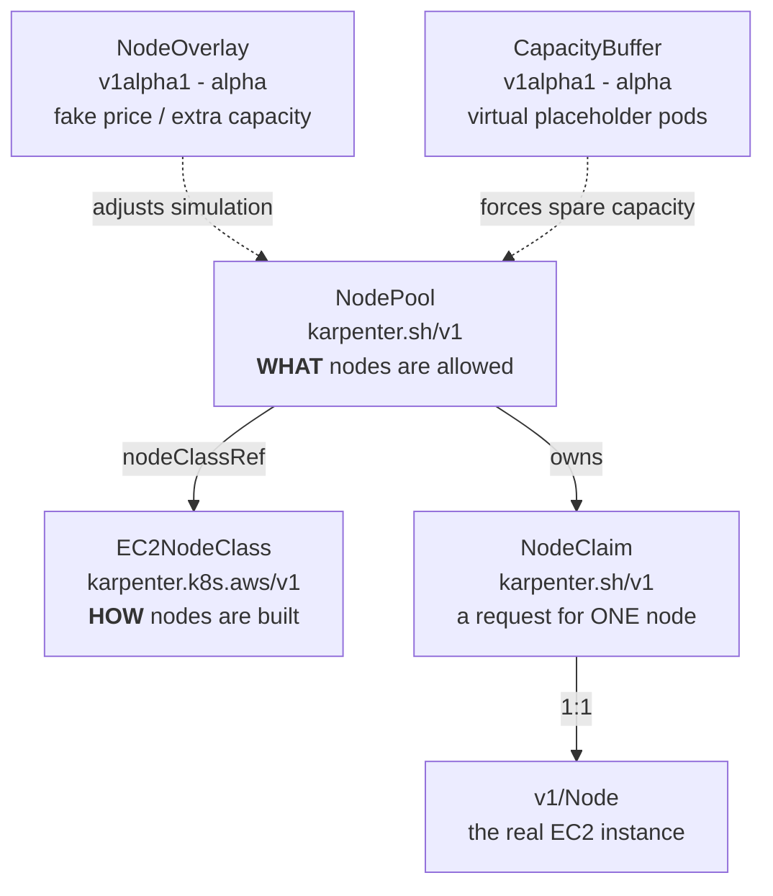
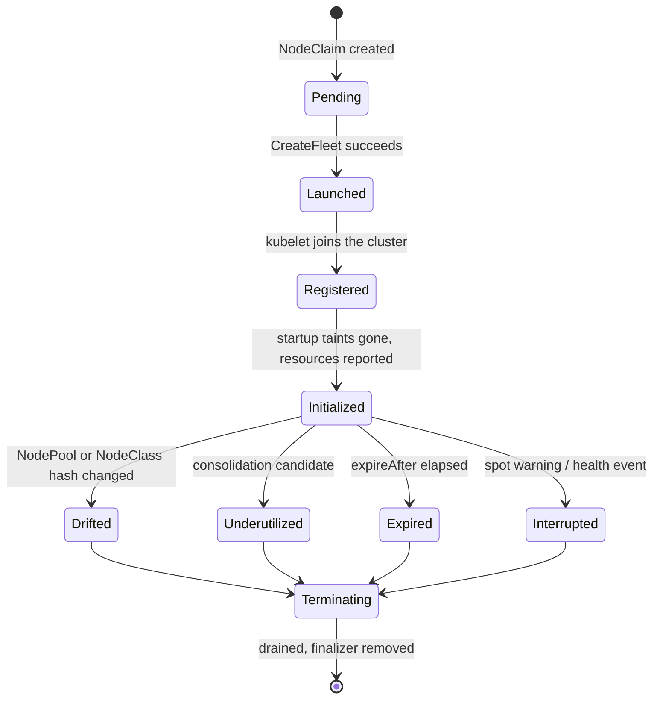
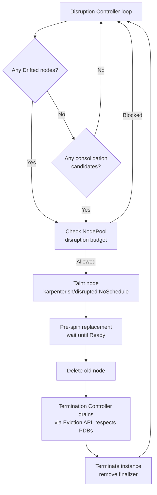
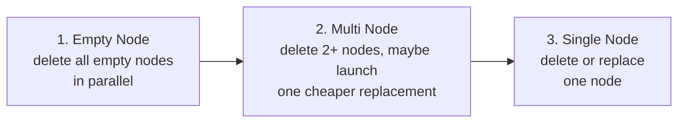
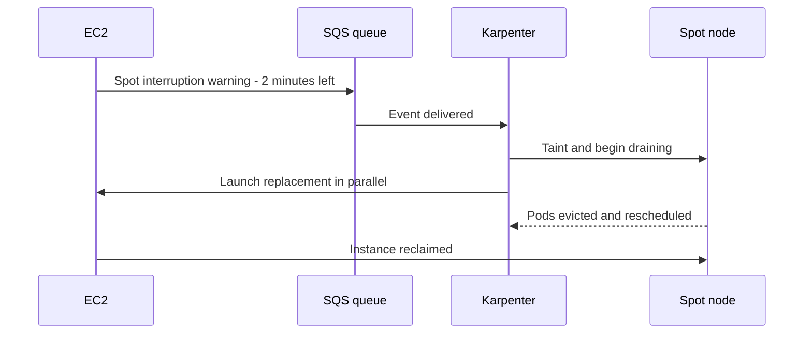

# Karpenter

## Up
- [[Kubernetes]]

> 📌 **What this is:** a single-page reference to take you from *never heard of Karpenter* to *confidently running it in production*. Written against **Karpenter v1.14** (latest stable, July 2026) and the stable `karpenter.sh/v1` API. Diagrams below are live Mermaid blocks.

## 1. What Karpenter actually is
Karpenter is a **node autoscaler** for Kubernetes. When pods can't be scheduled because there's nowhere to put them, Karpenter looks at exactly what those pods need and launches a right-sized instance directly — then removes it when it's no longer worth paying for.

The key difference from the older **Cluster Autoscaler**:

| Aspect | Cluster Autoscaler | Karpenter |
|---|---|---|
| Unit of scaling | Node group / ASG — you pre-define instance types | Individual instance, chosen at launch time |
| Instance choice | Fixed per node group | Picks from hundreds of types based on actual pod requests |
| Speed | Slower — goes through the ASG API | Faster — calls EC2 CreateFleet directly |
| Bin-packing | Scale-down only when a node is nearly empty | Active consolidation — repacks and replaces with cheaper nodes |
| Config surface | ASGs, launch templates, node groups | Two CRDs: NodePool and EC2NodeClass |

> 🧠 **One-sentence mental model:** Cluster Autoscaler asks *"which of my pre-built node groups should get bigger?"* — Karpenter asks *"what is the cheapest single machine that would make these exact pending pods schedulable?"*

### The provisioning loop

```mermaid
flowchart LR
    A["Pods go Pending<br>unschedulable"] --> B["Karpenter watches<br>the API server"]
    B --> C["Batch pending pods<br>1s idle / 10s max"]
    C --> D["Combine pod requirements<br>with NodePool constraints"]
    D --> E["Score instance types<br>cheapest that fits wins"]
    E --> F["Create a NodeClaim"]
    F --> G["EC2 CreateFleet<br>launches the instance"]
    G --> H["kubelet registers<br>Node becomes Ready"]
    H --> I["kube-scheduler<br>binds the pods"]
```


> ⚠️ Karpenter does **not** schedule pods. It only creates nodes. The normal `kube-scheduler` still does the actual binding — Karpenter just runs a *simulation* of the scheduler to decide what node to build.

## 2. The object model
Four custom resources. Learn these and you know 80% of Karpenter.


| Resource | API group | You write it? | Answers the question |
|---|---|---|---|
| **NodePool** | `karpenter.sh/v1` | Yes | Which instance types, zones, architectures, capacity types are allowed? How aggressively can nodes be removed? |
| **EC2NodeClass** | `karpenter.k8s.aws/v1` | Yes | Which AMI, subnets, security groups, IAM role, disks, userData, kubelet config? |
| **NodeClaim** | `karpenter.sh/v1` | No — Karpenter creates it | The in-flight request for one specific node. Great for debugging. |
| **Node** | `v1` (core) | No | The actual Kubernetes node object backed by an EC2 instance. |

> 💡 Think of it like a Deployment: **NodePool** is the `Deployment`, **NodeClaim** is the `Pod`, **Node** is the running container, and **EC2NodeClass** is the shared "base image + machine config" that many NodePools can reference.

## 3. Install (EKS, 60-second version)
```bash
export CLUSTER_NAME="my-cluster"
export KARPENTER_VERSION="1.14.0"

# Karpenter needs (a) an IAM role for the controller, (b) an IAM role for nodes,
# (c) an SQS queue + EventBridge rules for interruption handling.
# The official CloudFormation template sets all of this up:
#   https://karpenter.sh/docs/getting-started/getting-started-with-karpenter/

helm upgrade --install karpenter \
  oci://public.ecr.aws/karpenter/karpenter \
  --version "${KARPENTER_VERSION}" \
  --namespace kube-system \
  --set "settings.clusterName=${CLUSTER_NAME}" \
  --set "settings.interruptionQueue=${CLUSTER_NAME}" \
  --set controller.resources.requests.cpu=1 \
  --set controller.resources.requests.memory=1Gi \
  --wait
```

> 🔑 **Tag your VPC resources or nothing will work.** Karpenter discovers subnets and security groups by tag. Add `karpenter.sh/discovery: <your-cluster-name>` to the subnets and security groups you want nodes to land in.

**Karpenter itself must not run on Karpenter nodes.** Run the controller on a small managed node group, on Fargate, or on the EKS control plane side — otherwise it can delete the node it's running on and deadlock.

## 4. EC2NodeClass — the *how*
Defines the AWS-specific machine build. Every NodePool must reference one.
```yaml
apiVersion: karpenter.k8s.aws/v1
kind: EC2NodeClass
metadata:
  name: default
spec:
  # REQUIRED. Which AMI to boot. `alias` is the easy path.
  amiSelectorTerms:
    - alias: al2023@v20250101   # family@version. Use a pinned version in prod.

  # REQUIRED. Terms are ORed; conditions inside one term are ANDed.
  subnetSelectorTerms:
    - tags:
        karpenter.sh/discovery: "my-cluster"

  securityGroupSelectorTerms:
    - tags:
        karpenter.sh/discovery: "my-cluster"

  # One of `role` or `instanceProfile` is required.
  role: "KarpenterNodeRole-my-cluster"

  # Optional: extra tags on every EC2 instance, volume and launch template
  tags:
    team: platform
    cost-center: "1234"

  # Optional: disks
  blockDeviceMappings:
    - deviceName: /dev/xvda
      ebs:
        volumeSize: 100Gi
        volumeType: gp3
        encrypted: true
        deleteOnTermination: true

  # Optional: kubelet tuning (moved here from NodePool in v1)
  kubelet:
    maxPods: 110
    systemReserved:
      cpu: 100m
      memory: 100Mi
    evictionHard:
      memory.available: 5%

  # Optional: lock down IMDS so pods can't steal node credentials
  metadataOptions:
    httpEndpoint: enabled
    httpTokens: required
    httpPutResponseHopLimit: 1
```

### Fields worth knowing
| Field | What it does |
|---|---|
| `amiSelectorTerms` | **Required in v1.** Select by `alias`, `id`, `name`, `tags`, or `ssmParameter`. Aliases: `al2023`, `al2`, `bottlerocket`, `windows2019/2022/2025`. |
| `amiFamily` | Controls UserData generation and default disks. Implied when you use an `alias`. Use `Custom` if you bring your own AMI and bootstrap. |
| `instanceStorePolicy: RAID0` | Makes NVMe instance-store disks count as node ephemeral-storage. Without it, Karpenter ignores them. |
| `capacityReservationSelectorTerms` | Beta. Lets Karpenter consume On-Demand Capacity Reservations and Capacity Blocks first, before spot or on-demand. |
| `placementGroupSelector` | Puts all nodes from this class into one EC2 placement group — cluster, partition, or spread strategy. |
| `networkInterfaces` | EFA / multi-ENI setups for HPC and ML training. |
| `userData` | Merged with Karpenter's generated bootstrap — it does not replace it, except for the `Custom` family. |

> 🚨 **Don't use `alias: al2023@latest` in production.** A new AMI release will immediately drift every node in the cluster and roll them all. Pin the version and bump it deliberately.

## 5. NodePool — the *what*
The most important object. It's a template that constrains every node Karpenter can create.
```yaml
apiVersion: karpenter.sh/v1
kind: NodePool
metadata:
  name: default
spec:
  template:
    metadata:
      labels:
        billing-team: platform
    spec:
      nodeClassRef:
        group: karpenter.k8s.aws
        kind: EC2NodeClass
        name: default

      # The core of the NodePool: what kinds of machines are legal.
      # Operators: In, NotIn, Exists, DoesNotExist, Gt, Lt, Gte, Lte
      requirements:
        - key: kubernetes.io/arch
          operator: In
          values: ["amd64"]
        - key: kubernetes.io/os
          operator: In
          values: ["linux"]
        - key: karpenter.sh/capacity-type
          operator: In
          values: ["spot", "on-demand"]
        - key: karpenter.k8s.aws/instance-category
          operator: In
          values: ["c", "m", "r"]
        - key: karpenter.k8s.aws/instance-generation
          operator: Gte
          values: ["3"]

      # Max node lifetime. Default 720h (30 days). 'Never' disables it.
      expireAfter: 720h

      # Hard cap on how long a node may drain before forced termination.
      terminationGracePeriod: 48h

  disruption:
    consolidationPolicy: WhenEmptyOrUnderutilized   # or Balanced, or WhenEmpty
    consolidateAfter: 5m                            # or 'Never'
    budgets:
      - nodes: "10%"
      - nodes: "0"                                  # freeze during business hours
        schedule: "0 9 * * mon-fri"
        duration: 8h

  # Cluster-wide ceiling for this pool. Provisioning stops once exceeded.
  limits:
    cpu: "1000"
    memory: 1000Gi

  # Higher weight = preferred when multiple NodePools match a pod.
  weight: 10
```

### Requirements: the fields you'll actually use
| Label key | Example values | Notes |
|---|---|---|
| `karpenter.sh/capacity-type` | `spot`, `on-demand`, `reserved` | Priority order is reserved → spot → on-demand, with automatic fallback. |
| `kubernetes.io/arch` | `amd64`, `arm64` | Include `arm64` only if your images are multi-arch. |
| `node.kubernetes.io/instance-type` | `m5.large` | Avoid pinning single types — it defeats the point of Karpenter. |
| `karpenter.k8s.aws/instance-category` | `c`, `m`, `r`, `g`, `p`, `t` | Broad, safe way to steer instance selection. |
| `karpenter.k8s.aws/instance-family` | `m5`, `c6i`, `r7g` | |
| `karpenter.k8s.aws/instance-generation` | `Gte: ["3"]` | Cheap way to exclude ancient, inefficient hardware. |
| `karpenter.k8s.aws/instance-cpu` | `4`, `8`, `16` | Also `instance-memory`, `instance-gpu-count`, `instance-hypervisor`. |
| `topology.kubernetes.io/zone` | `us-east-1a` | Constrain only if you have a real reason (e.g. zonal EBS volumes). |

> ✅ **Rule of thumb:** be as *unconstrained* as you safely can. Every requirement you add shrinks the pool of instance types Karpenter can shop from, which raises cost and lowers spot availability. Constrain arch, OS, generation and category — then stop.

### minValues — forcing diversity
With spot especially, you want Karpenter to hand EC2 a wide menu so it can pick something actually available:
```yaml
requirements:
  - key: karpenter.sh/capacity-type
    operator: In
    values: ["spot"]
  - key: karpenter.k8s.aws/instance-family
    operator: Exists
    minValues: 5          # at least 5 distinct families must be viable
  - key: node.kubernetes.io/instance-type
    operator: Exists
    minValues: 10         # at least 10 distinct instance types
```
If the minimum can't be met, behaviour depends on `--min-values-policy`: `Strict` fails the loop and falls through to another NodePool, `BestEffort` relaxes the minimum.

### Weighted NodePools — the classic spot-then-on-demand pattern
```yaml
# Preferred: try spot first (higher weight wins)
---
apiVersion: karpenter.sh/v1
kind: NodePool
metadata: { name: spot }
spec:
  weight: 100
  template:
    spec:
      nodeClassRef: { group: karpenter.k8s.aws, kind: EC2NodeClass, name: default }
      requirements:
        - key: karpenter.sh/capacity-type
          operator: In
          values: ["spot"]
---
apiVersion: karpenter.sh/v1
kind: NodePool
metadata: { name: on-demand-fallback }
spec:
  weight: 10
  template:
    spec:
      nodeClassRef: { group: karpenter.k8s.aws, kind: EC2NodeClass, name: default }
      requirements:
        - key: karpenter.sh/capacity-type
          operator: In
          values: ["on-demand"]
```

### Isolating expensive hardware with taints
```yaml
apiVersion: karpenter.sh/v1
kind: NodePool
metadata:
  name: gpu
spec:
  template:
    spec:
      nodeClassRef: { group: karpenter.k8s.aws, kind: EC2NodeClass, name: gpu }
      requirements:
        - key: karpenter.k8s.aws/instance-family
          operator: In
          values: ["g6", "g5"]
      taints:
        - key: nvidia.com/gpu
          value: "true"
          effect: NoSchedule
```
Only pods that *tolerate* `nvidia.com/gpu` can land here — so a stray nginx pod never wakes up a GPU box.

### startupTaints — the one that bites people
If your CNI taints nodes at boot (Cilium does), you **must** declare it as a `startupTaint`, or Karpenter will think the node is unusable and keep launching more:
```yaml
startupTaints:
  - key: node.cilium.io/agent-not-ready
    value: "true"
    effect: NoExecute
```

## 6. NodeClaim — your debugging window
You never write these. Karpenter creates one per node it wants, and it carries the whole story of that node's life.

```bash
kubectl get nodeclaims
kubectl describe nodeclaim <name>     # status conditions tell you WHY a node is stuck
```
Deleting a NodeClaim cascades to the Node, and vice versa — they're linked by owner reference and a finalizer.

## 7. Disruption — how nodes go away
This is where most production incidents come from. Learn it properly.


### Graceful vs forceful
| Method | Type | Trigger | Rate-limited by budgets? |
|---|---|---|---|
| **Consolidation** | Graceful | Node is empty, or workloads fit somewhere cheaper | Yes |
| **Drift** | Graceful | Node no longer matches its NodePool / NodeClass spec | Yes |
| **Expiration** | Forceful | Node lifetime exceeded `expireAfter` | **No** |
| **Interruption** | Forceful | Spot warning, maintenance event, failed status check | **No** |
| **Node Auto Repair** | Forceful | Node unhealthy past its toleration window (alpha) | **No** |

> ⚠️ Disruption budgets **do not** stop expiration or interruption. If you need to protect a window, budgets alone aren't enough — use PodDisruptionBudgets as the second layer.

### Consolidation policies
| Policy | Considers | Pick it when |
|---|---|---|
| `WhenEmpty` | Only nodes with nothing but daemonsets on them | Most conservative. Latency-critical or stateful clusters. |
| `Balanced` | Same candidates as below, but scores savings against pod disruption and skips marginal wins | The pragmatic middle ground. Mixed batch + latency-sensitive workloads. |
| `WhenEmptyOrUnderutilized` | Any node that can be removed or replaced to cut cost | Lowest possible bill, most churn. **This is the default.** |

The three mechanisms Karpenter tries, in order:

`consolidateAfter` is the stability timer: the clock resets every time a pod is added to or removed from the node. A node only becomes a candidate once it's been quiet for that whole duration.

> 🎯 The default `consolidateAfter: 0s` is very aggressive. For production, `1m` to `15m` is a much saner range — long enough that churning workloads settle before Karpenter starts repacking them.

### Drift
Karpenter hashes the fields of your NodePool and EC2NodeClass. If a node's hash no longer matches, it's **drifted** and gets rolled.

**Triggers drift:** `spec.template.spec.requirements`, `expireAfter`, `terminationGracePeriod`, taints, labels, and on the NodeClass: `amiSelectorTerms`, `subnetSelectorTerms`, `securityGroupSelectorTerms`.

**Does *not* trigger drift** (these are "behavioural" fields): `spec.weight`, `spec.limits`, and everything under `spec.disruption`.

### Disruption budgets
```yaml
disruption:
  budgets:
    # up to 20% of the pool's nodes at once, but only for empty/drifted nodes
    - nodes: "20%"
      reasons: ["Empty", "Drifted"]
    # absolute ceiling across all reasons
    - nodes: "5"
    # total freeze on underutilized-consolidation during weekday business hours
    - nodes: "0"
      schedule: "0 9 * * mon-fri"
      duration: 8h
      reasons: ["Underutilized"]
```
- Valid `reasons`: `Drifted`, `Underutilized`, `Empty`. Omit `reasons` and the budget applies to all of them.
- When several budgets apply, Karpenter takes the **most restrictive**.
- Default if you set nothing: `nodes: 10%`.
- `schedule` is cron, **always UTC** — no timezone support. `schedule` and `duration` must be set together.

**Kill switch:** `budgets: [{ nodes: "0" }]` disables all voluntary disruption for that NodePool.

### Protecting individual workloads
```yaml
# Never voluntarily disrupt this pod
metadata:
  annotations:
    karpenter.sh/do-not-disrupt: "true"

# Or: protect it for 30 minutes after it starts running, then let go
metadata:
  annotations:
    karpenter.sh/do-not-disrupt: "30m"
```
The same annotation works on a **Node** to shield that specific node.

> 🚨 **The classic footgun:** `karpenter.sh/do-not-disrupt: "true"` does *not* protect against expiration or interruption — but it *does* block the drain. A node hits `expireAfter`, starts draining, and then hangs forever on an undrained pod. **Always pair `expireAfter` with `terminationGracePeriod`** if any pod in your cluster carries this annotation.

### Spot interruption handling

This only works if you pass `--interruption-queue` (Helm: `settings.interruptionQueue`) and wire up the EventBridge rules. Without it you lose the 2-minute head start.

Karpenter also reacts to instance status-check failures, stop/terminate events and scheduled maintenance — those need only `ec2:DescribeInstanceStatus` permissions, no queue.

## 8. Scheduling patterns worth memorising
### Spread across zones
```yaml
topologySpreadConstraints:
  - maxSkew: 1
    topologyKey: topology.kubernetes.io/zone
    whenUnsatisfiable: DoNotSchedule
    labelSelector:
      matchLabels: { app: web }
```
Karpenter honours this during its simulation and will launch nodes in the zones you're short on. `karpenter.sh/capacity-type` also works as a topology key — handy for enforcing "at most N% of replicas on spot".

### Steer a pod to a NodePool
```yaml
nodeSelector:
  karpenter.sh/nodepool: gpu
# or
affinity:
  nodeAffinity:
    requiredDuringSchedulingIgnoredDuringExecution:
      nodeSelectorTerms:
        - matchExpressions:
            - key: karpenter.k8s.aws/instance-family
              operator: In
              values: ["c6i", "c7i"]
```

> ⚠️ **Preferred** anti-affinity and topology spreads quietly hurt consolidation. Karpenter tries to keep honouring preferences when repacking, so nodes you expect to disappear may stick around. Look for the event `pod ... has a preferred Anti-Affinity which can prevent consolidation`.

## 9. Advanced (alpha features)

### Static NodePools — fixed node count, no autoscaling
Set `spec.replicas` and the NodePool stops reacting to pod demand entirely:
```yaml
apiVersion: karpenter.sh/v1
kind: NodePool
metadata:
  name: static-capacity
spec:
  replicas: 10
  template:
    spec:
      nodeClassRef: { group: karpenter.k8s.aws, kind: EC2NodeClass, name: default }
      requirements:
        - key: node.kubernetes.io/instance-type
          operator: In
          values: ["m5.large", "m5.xlarge"]
  limits:
    nodes: 15
```
Scale it like a workload: `kubectl scale nodepool static-capacity --replicas=20`. Constraints: can't be un-set once applied, only `limits.nodes` is allowed in limits, `weight` is forbidden, and nodes are excluded from consolidation.

### CapacityBuffers — pre-warmed spare capacity for instant scheduling
Creates *virtual* placeholder pods that only exist inside Karpenter's simulation, so real nodes get provisioned ahead of demand.
```yaml
apiVersion: autoscaling.x-k8s.io/v1alpha1
kind: CapacityBuffer
metadata:
  name: web-app-buffer
  namespace: default
spec:
  provisioningStrategy: "buffer.x-k8s.io/active-capacity"
  scalableRef:
    apiGroup: apps
    kind: Deployment
    name: api-service
  percentage: 20        # keep headroom equal to 20% of the deployment
  limits:
    cpu: "20"
    memory: "40Gi"
```
Final chunk count is `min(max(replicas, percentage), limits)`. Nodes hosting buffer capacity are exempt from *empty* consolidation but still eligible for drift and expiry.

### NodeOverlays — lie to the scheduler about price or capacity
Useful for savings plans, licence costs, custom devices, or preview instance types with no public pricing.
```yaml
apiVersion: karpenter.sh/v1alpha1
kind: NodeOverlay
metadata:
  name: savings-plan-discount
spec:
  weight: 10
  requirements:
    - key: karpenter.k8s.aws/instance-family
      operator: In
      values: ["m5"]
  priceAdjustment: "-30%"      # or an absolute `price: "5.00"`
  capacity:
    smarter-devices/fuse: 1    # extended resources only
```
Requires `--feature-gates NodeOverlay=true`. Only affects Karpenter's *simulation* — it changes scheduling and consolidation decisions, not your actual AWS bill or the node's real resources.

## 10. kubectl cheat sheet
```bash
# --- inventory ---
kubectl get nodepools
kubectl get ec2nodeclasses
kubectl get nodeclaims -o wide
kubectl get nodes -l karpenter.sh/nodepool --show-labels

# --- why is this NodePool not working? ---
kubectl describe nodepool default          # look at status.conditions
kubectl describe ec2nodeclass default      # SubnetsReady, SecurityGroupsReady, AMIsReady

# --- why is this node not going away? ---
kubectl get events --field-selector reason=Unconsolidatable
kubectl describe node <node>

# --- current usage of the pool ---
kubectl get nodepool default -o jsonpath='{.status}' | jq

# --- controller logs (the single most useful command) ---
kubectl logs -n kube-system -l app.kubernetes.io/name=karpenter -f

# --- manual removal ---
kubectl delete nodeclaim <name>                    # one node, gracefully
kubectl delete nodes -l karpenter.sh/nodepool      # everything Karpenter owns
kubectl delete nodeclaims -l karpenter.sh/nodepool=default

# --- scale a static NodePool ---
kubectl scale nodepool static-capacity --replicas=20

# --- test it: scale up and watch ---
kubectl create deployment inflate --image=public.ecr.aws/eks-distro/kubernetes/pause:3.7 --replicas=0
kubectl set resources deployment inflate --requests=cpu=1,memory=1.5Gi
kubectl scale deployment inflate --replicas=20
```

## 11. Troubleshooting table
| Symptom | Likely cause | Fix |
|---|---|---|
| Pods stay Pending, no nodes launched | No NodePool matches, or NodeClass isn't Ready | `kubectl describe ec2nodeclass` — check SubnetsReady / SecurityGroupsReady / AMIsReady. Usually a missing discovery tag. |
| Nodes launch then get replaced immediately, in a loop | An undeclared startup taint (CNI) makes Karpenter think pods still can't schedule | Add the taint to `spec.template.spec.startupTaints`. |
| Node stuck Terminating forever | A pod with a blocking PDB or `do-not-disrupt` won't evict | Set `terminationGracePeriod`; find the pod via the drain logs. |
| Node NotReady after launch | Bad userData, wrong IAM role, or no route to the API server | SSM into the node, check `/var/log/user-data.log` and kubelet logs. |
| Nothing ever consolidates | PDBs, `do-not-disrupt`, or preferred anti-affinity | Watch for `Unconsolidatable` events — Karpenter states the reason on the node. |
| Way too much node churn | `consolidateAfter: 0s` plus `WhenEmptyOrUnderutilized` | Raise `consolidateAfter`, switch to `Balanced`, add budgets. |
| Whole cluster rolls unexpectedly | AMI drift from `alias: ...@latest`, or you edited a drift-triggering field | Pin AMI versions; use budgets to cap the blast radius. |
| Spot capacity errors / poor availability | Requirements too narrow | Widen instance families, use `minValues`, add an on-demand fallback NodePool. |

## 12. Production checklist
- [ ] Karpenter controller runs **off** Karpenter-managed nodes
- [ ] `karpenter.sh/discovery` tags on subnets and security groups
- [ ] Interruption queue configured (`settings.interruptionQueue`)
- [ ] AMI **pinned** to a version, never `@latest`
- [ ] `expireAfter` set **and** paired with `terminationGracePeriod`
- [ ] Disruption budgets defined — never rely on the 10% default alone
- [ ] PodDisruptionBudgets on every meaningful workload
- [ ] Requirements kept broad: arch, OS, generation ≥3, categories — and little else
- [ ] `consolidateAfter` raised above `0s`; consider `Balanced`
- [ ] Spot NodePool uses `minValues` for instance-type diversity
- [ ] On-demand fallback NodePool with lower `weight`
- [ ] `limits.cpu` / `limits.memory` set as a runaway-cost guardrail
- [ ] IMDS locked down: `httpTokens: required`, `httpPutResponseHopLimit: 1`
- [ ] Alerting on `karpenter_nodeclaims_*` and consolidation metrics

## 13. Top 8 gotchas
1. **Disruption budgets don't block expiration or interruption.** Only voluntary disruption.
2. **`do-not-disrupt` + `expireAfter` without `terminationGracePeriod` = permanently stuck node.**
3. **Budget schedules are UTC only.** Your "business hours" freeze is probably in the wrong window.
4. **`@latest` AMI aliases roll your entire cluster** the moment AWS publishes a new image.
5. **Over-constrained requirements are the #1 cause of high bills** and spot capacity failures.
6. **Karpenter needs at least one NodePool.** Zero NodePools = it silently does nothing.
7. **Make NodePools mutually exclusive.** If a pod matches several, only the highest `weight` is used — overlapping pools are a debugging nightmare.
8. **kubelet config moved to EC2NodeClass in v1.** Migrating from v1beta1? `spec.kubelet` is no longer on the NodePool.

## 14. Reference links
- [Karpenter docs — Concepts](https://karpenter.sh/docs/concepts/)
- [NodePools reference](https://karpenter.sh/docs/concepts/nodepools/)
- [EC2NodeClasses reference](https://karpenter.sh/docs/concepts/nodeclasses/)
- [Disruption reference](https://karpenter.sh/docs/concepts/disruption/)
- [Scheduling reference](https://karpenter.sh/docs/concepts/scheduling/)
- [Getting Started with Karpenter on EKS](https://karpenter.sh/docs/getting-started/getting-started-with-karpenter/)
- [Migrating from Cluster Autoscaler](https://karpenter.sh/docs/getting-started/migrating-from-cas/)
- [Managing AMIs (upgrade strategy)](https://karpenter.sh/docs/tasks/managing-amis/)
- [Troubleshooting guide](https://karpenter.sh/docs/troubleshooting/)
- [EKS Workshop — Karpenter labs](https://www.eksworkshop.com/docs/autoscaling/compute/karpenter/)
- [GitHub — kubernetes-sigs/karpenter](https://github.com/kubernetes-sigs/karpenter)
