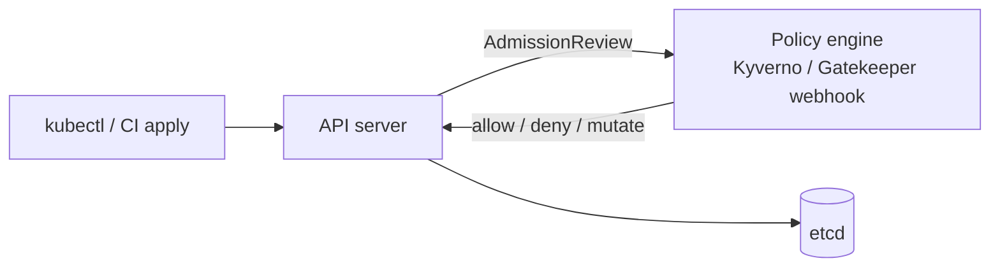

# Kyverno & OPA Gatekeeper

## Up
- [[Kubernetes]]

Policy engines that run as **admission controllers** — they intercept every create/update to the API server and **validate, mutate, or reject** it against your rules (e.g. "no privileged pods", "images only from our registry", "every namespace needs a team label"). This is how you *enforce* the hardening that [[Container Attack Concepts]] describes; runtime detection is [[Falco]]'s job.

---

## Where they sit



Both hook the **ValidatingAdmissionWebhook** (deny) and **MutatingAdmissionWebhook** (change) points.

---

## Kyverno (YAML policies — no new language)

Policies are Kubernetes resources; rules **validate / mutate / generate / verifyImages**.

```yaml
apiVersion: kyverno.io/v1
kind: ClusterPolicy
metadata: { name: disallow-privileged }
spec:
  validationFailureAction: Enforce      # Enforce (block) | Audit (report)
  rules:
    - name: no-privileged
      match: { any: [{ resources: { kinds: [Pod] } }] }
      validate:
        message: "Privileged containers are not allowed"
        pattern:
          spec:
            containers:
              - =(securityContext):
                  =(privileged): "false"
```
```yaml
# mutate: inject default labels/sidecars/limits
    - name: add-team-label
      match: { any: [{ resources: { kinds: [Namespace] } }] }
      mutate: { patchStrategicMerge: { metadata: { labels: { managed-by: kyverno } } } }
# generate: auto-create a NetworkPolicy/ResourceQuota per new namespace
# verifyImages: enforce cosign signatures (supply chain)
```

```bash
helm install kyverno kyverno/kyverno -n kyverno --create-namespace
kubectl get clusterpolicy ; kubectl get policyreport -A     # results
```

## OPA Gatekeeper (Rego policies)

Two-part model: a **ConstraintTemplate** (reusable Rego logic) + **Constraints** (apply it with params).

```yaml
apiVersion: templates.gatekeeper.sh/v1
kind: ConstraintTemplate
metadata: { name: k8srequiredlabels }
spec:
  crd: { spec: { names: { kind: K8sRequiredLabels } } }
  targets:
    - target: admission.k8s.gatekeeper.sh
      rego: |
        package k8srequiredlabels
        violation[{"msg": msg}] {
          not input.review.object.metadata.labels.team
          msg := "missing required label: team"
        }
---
apiVersion: constraints.gatekeeper.sh/v1beta1
kind: K8sRequiredLabels
metadata: { name: ns-must-have-team }
spec:
  match: { kinds: [{ apiGroups: [""], kinds: ["Namespace"] }] }
  enforcementAction: deny            # deny | dryrun | warn
```
Gatekeeper ships an **OPA constraint library** (common policies) and does audit of existing violations.

---

## Kyverno vs Gatekeeper

| | Kyverno | OPA Gatekeeper |
|---|---|---|
| Policy language | **YAML** (K8s-native) | **Rego** (learning curve) |
| Actions | validate, **mutate, generate**, verifyImages | validate (+ limited mutation) |
| Scope | Kubernetes-only | General-purpose OPA (also outside K8s) |
| Best for | Most K8s teams, quick adoption | Complex logic, existing OPA/Rego users |

---

## What to enforce (starter policies)
- Disallow `privileged`, `hostPath`, host namespaces, `runAsRoot` (aligns with **Pod Security Standards: restricted**).
- Require resource requests/limits, liveness/readiness probes, non-root, read-only rootfs.
- Restrict images to trusted registries; require signatures (cosign / [[Trivy]] + [[Harbor]]).
- Require labels/annotations (owner, cost-center); auto-generate default NetworkPolicy/quota per namespace.

---

## Tips
- Roll out in **Audit/dryrun first**, review PolicyReports, then flip to **Enforce** — enforcing untested policies can block deploys cluster-wide.
- Policy engines are the **prevention** layer; pair with **[[Falco]]** (runtime detection) and Pod Security admission (built-in baseline).
- Exclude system namespaces (`kube-system`) from strict policies to avoid breaking the control plane.
- These are also the tooling behind the defenses in [[Container & K8s Security]].
