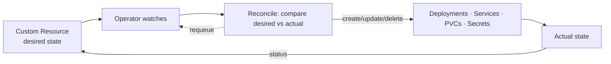

# Operators & CRDs

## Up
- [[Kubernetes]]

**CRDs** extend the Kubernetes API with your own resource types; an **Operator** is a controller that watches those custom resources and drives real-world state to match — encoding human operational knowledge ("how to run Postgres/Kafka/etc.") into software.

---

## Custom Resource Definitions (CRD)

A CRD registers a new kind so `kubectl get <yourkind>` works like built-ins.

```yaml
apiVersion: apiextensions.k8s.io/v1
kind: CustomResourceDefinition
metadata: { name: databases.example.com }
spec:
  group: example.com
  scope: Namespaced
  names: { kind: Database, plural: databases, singular: database, shortNames: [db] }
  versions:
    - name: v1
      served: true
      storage: true
      schema:
        openAPIV3Schema:
          type: object
          properties:
            spec:
              type: object
              properties:
                engine: { type: string, enum: [postgres, mysql] }
                sizeGB: { type: integer }
      subresources: { status: {} }        # enables .status + /status endpoint
      additionalPrinterColumns:
        - { name: Engine, type: string, jsonPath: .spec.engine }
```

Now a **custom resource**:
```yaml
apiVersion: example.com/v1
kind: Database
metadata: { name: orders }
spec: { engine: postgres, sizeGB: 20 }
```
A CRD alone just **stores** data. Nothing happens until a controller acts on it.

---

## The Operator pattern (controller + reconcile loop)



- **Reconcile loop:** on every change (or periodic resync), read desired spec → observe actual → make them equal → write `.status`. Must be **idempotent** and **level-triggered** (converge from any state, not just deltas).
- **Finalizers** delay deletion so the operator can clean up external resources first.
- **owner references** make child objects garbage-collect with the CR.

---

## Building Operators

| Tool | Language |
|---|---|
| **Kubebuilder** / controller-runtime | Go (the standard) |
| **Operator SDK** | Go, Ansible, or Helm-based operators |
| **Kopf** | Python |
| **Metacontroller** | Any (webhook-driven) |

```bash
# Kubebuilder scaffold
kubebuilder init --domain example.com
kubebuilder create api --group apps --version v1 --kind Database   # generates CRD + controller
make manifests install run
```
Package/distribute with **OLM** (Operator Lifecycle Manager) and **OperatorHub**.

---

## When to use
- **CRD only:** you just need a new config object other tools consume (no automation).
- **Operator:** stateful/complex apps needing day-2 ops — databases (Zalando/CloudNativePG Postgres, Strimzi Kafka), cert-manager, Prometheus Operator, etc. Many tools you already use *are* operators ([[cert-manager]], [[Prometheus]] Operator, [[Kyverno & OPA Gatekeeper]]).

---

## Tips
- Keep reconcilers **idempotent and level-triggered** — re-running must be safe and converge from any state.
- Always set a **status subresource** + printer columns for good UX (`kubectl get db` shows meaningful state).
- Use **finalizers** to clean up external/cloud resources before the CR is removed.
- Validate specs with the **OpenAPI schema** (and admission webhooks) so bad CRs are rejected early.
- Don't reinvent: prefer an existing community operator; write your own only for genuinely custom ops logic.
- Operators are how [[Helm]]-installed platforms deliver day-2 automation beyond install.
