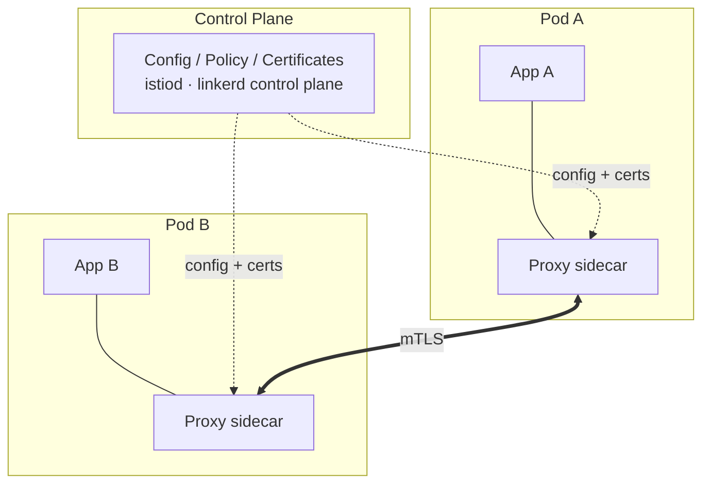

# Service Mesh

## Up
- [[Kubernetes]]

A **service mesh** is a dedicated infrastructure layer that manages service-to-service communication in a microservices cluster — handling traffic routing, security (mTLS), observability, and resilience **without changing application code**. It does this by injecting a proxy (a "sidecar") next to each workload, or by running proxies at the node level.

---

## Why a Service Mesh

Once you have dozens of services talking to each other, each needs retries, timeouts, TLS, metrics, and access control. Baking that into every app (in every language) is repetitive and inconsistent. A mesh moves it into the platform:

| Concern | What the mesh provides |
|---|---|
| **Traffic management** | Routing, load balancing, canary/blue-green, traffic splitting, mirroring |
| **Security** | Automatic mutual TLS (mTLS), identity, authN/authZ policies |
| **Observability** | Uniform metrics, distributed traces, access logs for every hop |
| **Resilience** | Retries, timeouts, circuit breaking, fault injection, rate limiting |

If you have only a handful of services, a mesh is usually overkill — the operational cost outweighs the benefit.

---

## Architecture: Data Plane + Control Plane



- **Data plane** — the network of proxies (e.g. **Envoy** for Istio, a purpose-built Rust "micro-proxy" for Linkerd) that actually intercept and forward every request. All app traffic flows through them.
- **Control plane** — the brain that configures the proxies, distributes identity certificates, and enforces policy (Istio's `istiod`, Linkerd's control plane).

### Sidecar vs Sidecar-less

- **Sidecar model** (classic): one proxy container per pod. Full features, but adds a container + latency + resource cost to every pod.
- **Ambient / sidecar-less** (Istio Ambient, Cilium): proxies run per-node (L4) with optional per-namespace L7 "waypoint" proxies — lower overhead, no per-pod injection.

---

## The Major Meshes

| Mesh | Proxy | Notes |
|---|---|---|
| **Istio** | Envoy | Most feature-rich, largest ecosystem; sidecar or **Ambient** mode; CNCF graduated |
| **Linkerd** | Linkerd2-proxy (Rust) | Simplest, lightest, security-focused; CNCF graduated |
| **Cilium Service Mesh** | eBPF (+ Envoy for L7) | Kernel-level via eBPF, can be sidecar-free |
| **Consul** | Envoy | HashiCorp; strong multi-datacenter / VM + K8s hybrid |
| **AWS App Mesh / others** | Envoy | Cloud-managed variants |

**Gateway API** (and Istio/Linkerd support for it) is becoming the standard, vendor-neutral way to configure mesh and ingress traffic.

---

## Core Traffic-Management Concepts (Istio examples)

Istio configures behaviour with CRDs. The two foundational ones:

```yaml
# VirtualService — routing rules (the "how requests are routed")
apiVersion: networking.istio.io/v1
kind: VirtualService
metadata:
  name: reviews
spec:
  hosts: ["reviews"]
  http:
    - match:
        - headers:
            end-user: { exact: tester }
      route:
        - destination: { host: reviews, subset: v2 }   # testers → v2
    - route:
        - destination: { host: reviews, subset: v1 }
          weight: 90                                     # 90/10 canary
        - destination: { host: reviews, subset: v3 }
          weight: 10
```

```yaml
# DestinationRule — policies for a destination + named subsets
apiVersion: networking.istio.io/v1
kind: DestinationRule
metadata:
  name: reviews
spec:
  host: reviews
  trafficPolicy:
    connectionPool:
      http: { http1MaxPendingRequests: 100 }
    outlierDetection:                # circuit breaking
      consecutive5xxErrors: 5
      interval: 30s
      baseEjectionTime: 30s
  subsets:
    - name: v1
      labels: { version: v1 }
    - name: v2
      labels: { version: v2 }
    - name: v3
      labels: { version: v3 }
```

Other key Istio CRDs: **Gateway** (ingress/egress edge), **ServiceEntry** (add external services to the mesh), **Sidecar** (scope proxy config), **PeerAuthentication** (mTLS mode), **AuthorizationPolicy** (access control), **Telemetry**.

---

## Security — mutual TLS

```yaml
# Enforce STRICT mTLS namespace-wide (Istio)
apiVersion: security.istio.io/v1
kind: PeerAuthentication
metadata:
  name: default
  namespace: prod
spec:
  mtls:
    mode: STRICT        # PERMISSIVE (plaintext + mTLS) | STRICT | DISABLE
```

```yaml
# Authorization: only allow the "frontend" identity to call this service
apiVersion: security.istio.io/v1
kind: AuthorizationPolicy
metadata:
  name: reviews-allow-frontend
  namespace: prod
spec:
  selector:
    matchLabels: { app: reviews }
  action: ALLOW
  rules:
    - from:
        - source:
            principals: ["cluster.local/ns/prod/sa/frontend"]
      to:
        - operation:
            methods: ["GET"]
```

The mesh issues each workload a **SPIFFE identity** cert and rotates it automatically — mTLS "for free" without app changes.

---

## Resilience Patterns

```yaml
# Retries + timeout (in a VirtualService http route)
http:
  - route:
      - destination: { host: ratings }
    timeout: 3s
    retries:
      attempts: 3
      perTryTimeout: 1s
      retryOn: 5xx,reset,connect-failure
```

```yaml
# Fault injection — test resilience by injecting delays/errors
http:
  - fault:
      delay: { percentage: { value: 10 }, fixedDelay: 5s }
      abort: { percentage: { value: 5 }, httpStatus: 500 }
    route:
      - destination: { host: ratings }
```

- **Circuit breaking** → `DestinationRule.outlierDetection` (eject unhealthy hosts).
- **Rate limiting** → local (Envoy) or global (external rate-limit service).
- **Traffic mirroring** → send a copy of live traffic to a new version without affecting responses (`mirror:` in a route).

---

## Installing & Operating (quick reference)

### Istio

```bash
istioctl install --set profile=demo -y      # install control plane
kubectl label namespace prod istio-injection=enabled   # auto sidecar injection
istioctl analyze                            # lint mesh config for problems
istioctl proxy-status                        # sync state of all proxies
istioctl proxy-config routes <pod>          # inspect a proxy's config
istioctl dashboard kiali                     # open the Kiali topology UI
# Ambient mode:  istioctl install --set profile=ambient
```

### Linkerd

```bash
linkerd install --crds | kubectl apply -f -
linkerd install | kubectl apply -f -
linkerd check                                # verify install/health
kubectl get deploy -o yaml | linkerd inject - | kubectl apply -f -   # add sidecars
linkerd viz install | kubectl apply -f -     # metrics dashboard
linkerd viz dashboard                        # open it
linkerd viz stat deploy -n prod              # live golden-metrics
```

---

## Observability — the "Golden Metrics"

Because every request passes through a proxy, the mesh emits consistent metrics for all services:

- **Rate** — requests per second
- **Errors** — % of failing responses (e.g. 5xx)
- **Duration / Latency** — p50/p95/p99 response times
- **Saturation** — how loaded the service is

Typical stack: **Prometheus** (metrics) + **Grafana** (dashboards) + **Kiali** (Istio topology) / **linkerd viz**, plus **Jaeger**/**Tempo** for distributed tracing. See [[Prometheus]] for the metrics backend.

---

## When to Use / When to Skip

**Use a mesh when** you have many services, need uniform mTLS/zero-trust, want progressive delivery (canaries), or need consistent cross-service observability without per-app instrumentation.

**Skip (or delay) it when** you have a small number of services, a single team, or tight latency/resource budgets — start with Kubernetes-native Services, Ingress/Gateway API, and app-level libraries, and adopt a mesh only when the pain is real.

**Rules of thumb**
- Start with **Linkerd** if you want the simplest path to mTLS + golden metrics; choose **Istio** when you need advanced traffic policy, extensibility, or ambient mode.
- Every proxy adds latency and resources — measure the overhead.
- Prefer **STRICT** mTLS and least-privilege `AuthorizationPolicy` once traffic is migrated (start `PERMISSIVE`).
- Adopt the **Gateway API** for new ingress/routing config rather than legacy mesh-specific ingress.
