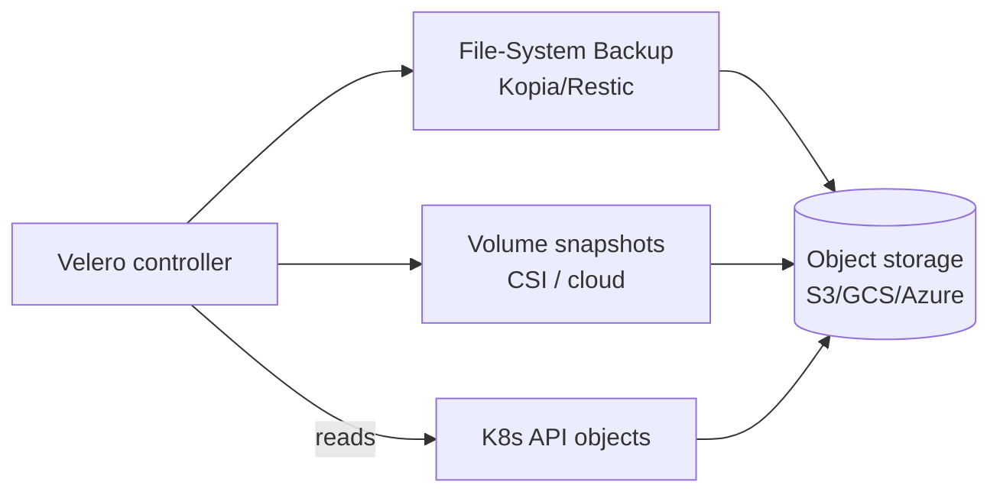

# Velero

## Up
- [[Kubernetes]]

Velero backs up, restores, and migrates Kubernetes clusters — both **API objects** (Deployments, Services, ConfigMaps…) and **persistent volume data**. Used for disaster recovery, cluster migration, and namespace snapshots. Stores backups in object storage (S3/GCS/Azure Blob).

---

## How it works



- Backs up selected objects to an object-storage **BackupStorageLocation**.
- Volume data via **CSI snapshots** (fast, cloud-native) or **File System Backup** (Kopia/Restic, storage-agnostic).

---

## Install

```bash
velero install \
  --provider aws \
  --plugins velero/velero-plugin-for-aws:v1.9.0 \
  --bucket my-velero-bucket --backup-location-config region=us-east-1 \
  --snapshot-location-config region=us-east-1 \
  --use-node-agent            # enable File System Backup (Kopia)
```

---

## Backup & Restore

```bash
# backup
velero backup create full-backup                       # whole cluster
velero backup create ns-backup --include-namespaces prod
velero backup create app --selector app=web            # by label
velero backup create data --default-volumes-to-fs-backup   # include PV data
velero backup describe ns-backup ; velero backup logs ns-backup

# scheduled backups (cron)
velero schedule create daily --schedule="0 2 * * *" \
  --include-namespaces prod --ttl 168h0m0s             # keep 7 days

# restore
velero restore create --from-backup ns-backup
velero restore create --from-backup ns-backup \
  --namespace-mappings prod:prod-restored              # restore into a new ns
velero restore describe <name>
```

---

## Common Uses
- **Disaster recovery** — scheduled full/namespace backups with TTL retention.
- **Cluster migration** — backup on cluster A → restore on cluster B (great for moving between providers or K8s versions). PV data moves via File System Backup even across storage types.
- **Namespace clone / pre-change snapshot** — back up before a risky deploy; restore if it goes wrong.
- **Selective restore** — by namespace, label, or resource type; remap namespaces/storage classes on restore.

---

## Hooks & selectors
- **Backup/restore hooks** run commands in pods (e.g. `fsfreeze`, DB flush) for app-consistent backups.
- Include/exclude by namespace, resource, or label; `--snapshot-volumes` toggles PV snapshots.

---

## Tips
- Test **restores** regularly — an untested backup is not a backup.
- Use **CSI snapshots** where supported (fast); **File System Backup (Kopia)** for portability/cross-provider migration.
- Set **TTL** on backups (auto-prune) and store the bucket in a *different* account/region than the cluster.
- Quiesce stateful apps with **hooks** for consistency; back up etcd separately for control-plane DR (managed clusters handle etcd for you).
- Pairs with your DR runbook; complements platform backups, doesn't replace [[Cloud]] provider snapshots.
