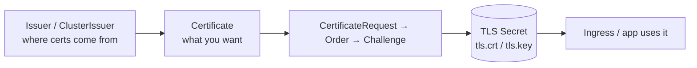

# cert-manager

## Up
- [[Kubernetes]]

cert-manager automates **X.509 certificate** issuance and renewal in Kubernetes — most commonly free **Let's Encrypt** certs for [[Ingress Controllers]], but also internal CAs, Vault, and Venafi. It watches `Certificate` resources and keeps TLS Secrets valid and rotated.

---

## Install

```bash
helm repo add jetstack https://charts.jetstack.io
helm install cert-manager jetstack/cert-manager -n cert-manager \
  --create-namespace --set crds.enabled=true
kubectl get pods -n cert-manager        # controller, webhook, cainjector
```

---

## The Objects



- **Issuer** (namespaced) / **ClusterIssuer** (cluster-wide) — the CA/source (ACME, self-signed, CA, Vault).
- **Certificate** — declarative "I want a cert for these DNS names, stored in this Secret."
- cert-manager creates CertificateRequest → Order → Challenge, then writes the **TLS Secret** and renews before expiry.

---

## Let's Encrypt (ACME) ClusterIssuer

```yaml
apiVersion: cert-manager.io/v1
kind: ClusterIssuer
metadata: { name: letsencrypt-prod }
spec:
  acme:
    server: https://acme-v02.api.letsencrypt.org/directory
    email: you@example.com
    privateKeySecretRef: { name: letsencrypt-prod-key }
    solvers:
      - http01: { ingress: { ingressClassName: nginx } }     # HTTP-01
      # - dns01: { cloudflare: { apiTokenSecretRef: {...} } } # DNS-01 (needed for wildcards)
```

- **HTTP-01** — proves domain control via a temporary path on port 80 (needs public Ingress).
- **DNS-01** — proves via a TXT record; the only way to get **wildcard** (`*.example.com`) certs; needs a DNS provider solver.

---

## Two ways to get a cert

**1. Ingress annotation (easiest)** — cert-manager auto-creates the Certificate:
```yaml
kind: Ingress
metadata:
  annotations:
    cert-manager.io/cluster-issuer: letsencrypt-prod
spec:
  tls: [{ hosts: [app.example.com], secretName: app-tls }]
```

**2. Explicit Certificate resource:**
```yaml
apiVersion: cert-manager.io/v1
kind: Certificate
metadata: { name: app-tls, namespace: web }
spec:
  secretName: app-tls
  issuerRef: { name: letsencrypt-prod, kind: ClusterIssuer }
  dnsNames: [app.example.com, www.app.example.com]
  duration: 2160h        # 90d
  renewBefore: 360h      # renew 15d early
```

---

## Operate & Debug

```bash
kubectl get certificate,certificaterequest,order,challenge -A
kubectl describe certificate app-tls        # READY True/False + events
cmctl status certificate app-tls            # cert-manager CLI
cmctl renew app-tls
kubectl get secret app-tls -o yaml          # tls.crt / tls.key
```
Stuck cert? Walk the chain: Certificate → CertificateRequest → Order → **Challenge** (HTTP-01 path reachable? DNS-01 TXT propagated?).

---

## Tips
- Use the **staging** ACME server first (`acme-staging-v02`) to avoid Let's Encrypt rate limits, then switch to prod.
- **Wildcards require DNS-01** — HTTP-01 can't do `*.`.
- One **ClusterIssuer** shared across namespaces beats per-namespace Issuers for most setups.
- Renewal is automatic; alert on `Certificate` not-Ready and near-expiry.
- Pairs directly with [[Ingress Controllers]] (the `tls.secretName` it fills) and can back [[Service Mesh]] mTLS roots.
