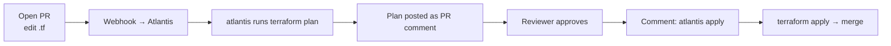

# Atlantis

## Up
- [[IaC]]

Atlantis is **Terraform pull-request automation** — a self-hosted app that runs `terraform plan`/`apply` from PR comments and posts the results back to the PR. It makes Terraform collaborative and auditable: every infra change is reviewed as code, planned automatically, and applied only after approval. Works with [[Terraform]]/OpenTofu (and [[Terragrunt]]).

---

## The workflow



1. Developer opens a PR changing Terraform.
2. Atlantis (via webhook) auto-runs **`plan`** and comments the diff on the PR.
3. Team reviews the plan + code.
4. On approval, someone comments **`atlantis apply`** → Atlantis applies and (per config) the PR merges.

Key benefit: the **plan is reviewed before apply**, applies are gated by approval, and everything is logged in the PR — no one runs `apply` from a laptop.

---

## PR comment commands
```text
atlantis plan                      # re-run plan
atlantis plan -d dir -w workspace  # target a dir/workspace
atlantis apply                     # apply approved plan(s)
atlantis apply -d dir
atlantis unlock                    # release the state/PR lock
atlantis help
```

Atlantis **locks** a project while a PR is open so two PRs can't plan/apply the same state concurrently.

---

## Config: atlantis.yaml (repo)

```yaml
version: 3
projects:
  - name: vpc
    dir: environments/prod/vpc
    workspace: default
    autoplan: { when_modified: ["*.tf", "../modules/**/*.tf"], enabled: true }
    apply_requirements: [approved, mergeable]
  - name: eks
    dir: environments/prod/eks
    apply_requirements: [approved, mergeable]
```

- **`apply_requirements: [approved, mergeable]`** — block applies until the PR is approved and mergeable.
- **`autoplan.when_modified`** — which file changes trigger a plan (include shared module paths).
- Server-side **workflows** can inject `terragrunt`, custom `plan`/`apply` steps, policy checks (conftest/OPA).

---

## Deploy Atlantis
```bash
# runs as a server (container/K8s) reachable by your VCS webhooks
atlantis server \
  --gh-user=bot --gh-token=$GH_TOKEN --gh-webhook-secret=$SECRET \
  --repo-allowlist='github.com/org/*' --atlantis-url=https://atlantis.example.com
```
Supports GitHub/GitLab/Bitbucket/Azure DevOps. Give it cloud credentials (IAM role/OIDC) scoped to what it manages; store the state backend + locking (S3+DynamoDB) as usual.

---

## Atlantis vs alternatives
- **Atlantis** — free, self-hosted, PR-centric Terraform automation.
- **Terraform Cloud / Spacelift / env0 / Scalr** — managed TF automation with policies, RBAC, drift detection (paid/SaaS).
- General CI ([[CI/CD]]) can run `terraform apply`, but Atlantis adds the **plan-in-PR + locking + approval** guardrails purpose-built for Terraform.

---

## Tips
- Require **`[approved, mergeable]`** for applies so infra changes always get a human review of the plan.
- Give Atlantis **least-privilege** cloud creds (OIDC/short-lived) — it can change your whole infra.
- Include **module paths** in `when_modified` or edits to shared modules won't trigger plans.
- Use **project locks** to serialize changes to the same state; `atlantis unlock` to clear a stuck lock.
- Pairs with [[Terragrunt]] (via custom workflow) and fits the broader **GitOps** approach ([[ArgoCD]] for K8s, Atlantis for Terraform).
