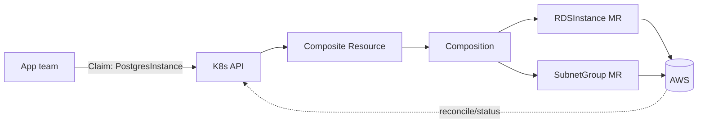

# Crossplane

## Up
- [[IaC]]

Crossplane turns **Kubernetes into a control plane for infrastructure**: you provision cloud resources (databases, buckets, clusters) as Kubernetes objects, and Crossplane's controllers continuously **reconcile** them — no separate `apply` step, no drift. It's IaC via the K8s API + [[Operators & CRDs]] rather than a CLI like [[Terraform]].

---

## The Pieces

| Piece | Role |
|---|---|
| **Provider** | Package of Managed Resources for a cloud (provider-aws, provider-gcp, provider-azure, Terraform/Helm providers) |
| **Managed Resource (MR)** | A single cloud object as a CRD (`Bucket`, `RDSInstance`, `Cluster`) |
| **Composite Resource Definition (XRD)** | Defines your own high-level API (`XPostgres`) |
| **Composition** | Maps that XRD to concrete MRs (the "recipe") |
| **Claim (XRC)** | Namespaced request app teams make for a composed resource |
| **ProviderConfig** | Credentials/settings for a provider |



---

## Install & a provider

```bash
helm install crossplane crossplane-stable/crossplane -n crossplane-system --create-namespace

# install the AWS provider + credentials
kubectl apply -f - <<'EOF'
apiVersion: pkg.crossplane.io/v1
kind: Provider
metadata: { name: provider-aws-s3 }
spec: { package: xpkg.upbound.io/upbound/provider-aws-s3:v1 }
EOF
kubectl create secret generic aws-creds -n crossplane-system --from-file=creds=./aws-creds.txt
# + a ProviderConfig referencing that secret
```

## Provision a Managed Resource directly

```yaml
apiVersion: s3.aws.upbound.io/v1beta1
kind: Bucket
metadata: { name: my-bucket }
spec:
  forProvider: { region: us-east-1 }
  providerConfigRef: { name: default }
```
`kubectl apply` → Crossplane creates the real S3 bucket and keeps it in sync; `kubectl delete` removes it.

## Platform API (XRD + Composition + Claim)

Platform team publishes a simple API; app teams consume it:
```yaml
# app team's Claim — they don't touch cloud details
apiVersion: example.org/v1alpha1
kind: PostgresInstance
metadata: { name: orders-db, namespace: team-a }
spec: { parameters: { storageGB: 20 }, compositionRef: { name: rds-postgres } }
```
The Composition expands this into VPC/subnet/RDS MRs. This is the **platform-engineering / internal-developer-platform** use case.

---

## Crossplane vs Terraform

| | Crossplane | [[Terraform]] |
|---|---|---|
| Model | Continuous reconcile (K8s controllers) | Run `plan`/`apply` on demand |
| Drift | Auto-corrected | Detected on next plan |
| State | In Kubernetes/etcd (+ provider) | Terraform state files |
| Interface | K8s API / CRDs / GitOps | HCL + CLI |
| Best for | Platform APIs, self-service, GitOps-native | General IaC, huge ecosystem |

Not either/or — Crossplane has a **Terraform provider** to run existing TF, and both fit [[ArgoCD]]/GitOps.

---

## Tips
- Its superpower is **self-service platform APIs**: publish an `XRD` so app teams request DBs/clusters with a tiny Claim, no cloud knowledge.
- **Continuous reconciliation** means no drift and no manual apply — but also that deleting the K8s object deletes real infra (guard with policies/`deletionPolicy: Orphan`).
- Manage credentials via `ProviderConfig` + Secrets/IRSA; scope tightly.
- Naturally **GitOps-native** — store Claims/Compositions in Git and let [[ArgoCD]] apply them.
- Builds directly on the [[Operators & CRDs]] pattern — Crossplane *is* a set of operators for cloud resources.
