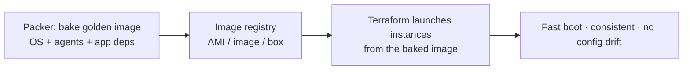

# Packer

## Up
- [[IaC]]

Packer builds **machine images** — identical, pre-baked images across platforms (AWS AMI, Azure/GCP images, VMware/VirtualBox, Docker, QEMU) from a single HCL2 template. It's the "golden image" tool: bake config once, boot fast immutable instances (pairs well with [[Terraform]] provisioning and [[Vagrant]] for dev boxes).

---

## Template anatomy (HCL2)

```hcl
packer {
  required_plugins { amazon = { version = ">= 1.2", source = "github.com/hashicorp/amazon" } }
}

variable "region" { default = "us-east-1" }

# SOURCE = what/where to build (a "builder")
source "amazon-ebs" "web" {
  region        = var.region
  instance_type = "t3.micro"
  source_ami_filter {
    filters = { name = "ubuntu/images/*ubuntu-22.04-amd64-server-*" }
    owners  = ["099720109477"]
    most_recent = true
  }
  ssh_username = "ubuntu"
  ami_name     = "web-{{timestamp}}"
}

# BUILD = run provisioners against the source
build {
  sources = ["source.amazon-ebs.web"]

  provisioner "shell" {
    inline = ["sudo apt-get update", "sudo apt-get install -y nginx"]
  }
  provisioner "ansible" { playbook_file = "./site.yml" }   # or file/powershell
  provisioner "file"    { source = "app/", destination = "/tmp/app" }

  post-processor "manifest" { output = "manifest.json" }
}
```

---

## Commands

```bash
packer init .              # install required plugins
packer fmt . && packer validate .
packer build web.pkr.hcl   # build the image(s)
packer build -var 'region=eu-west-1' .
packer build -only='amazon-ebs.web' .
PACKER_LOG=1 packer build .   # debug
```

---

## Building blocks

| Block | Role |
|---|---|
| **source / builder** | The platform + base image to build on (amazon-ebs, azure-arm, googlecompute, docker, qemu, virtualbox, vsphere) |
| **provisioner** | Configure the image: `shell`, `ansible`, `file`, `powershell`, `chef`/`puppet` |
| **post-processor** | After build: `manifest`, `docker-push`, `vagrant` (make a box), `compress` |
| **variable / locals** | Parameterize; `-var`/`-var-file` |

One template can define **multiple sources** to build the *same* image for AWS + Azure + Docker in one run.

---

## Where it fits (immutable infrastructure)



Bake stable, slow-changing bits (OS hardening, agents, runtimes) into the image; keep fast-changing app code in a container or deploy step.

---

## Packer vs Dockerfile
- **Packer** → full VM/machine images (and can build Docker images too). Golden AMIs, hardened base OS, multi-platform.
- **[[Dockerfile Best Practices]]** → container images specifically. For containers, prefer Dockerfile/BuildKit; use Packer for VM images and multi-target golden images.

---

## Tips
- Bake **slow/stable** layers (OS, agents, security baseline); leave **fast** layers (app) to containers/deploy — avoids rebuilding the whole image per code change.
- Reuse your config-management: the **ansible provisioner** lets one playbook serve both Packer image builds and live [[Ansible]] runs.
- Version images with `{{timestamp}}`/git SHA; scan built images (Trivy) and track them in a `manifest`.
- Combine with **[[Terraform]]** (launch from the AMI) for immutable infrastructure; make **[[Vagrant]]** boxes via the `vagrant` post-processor.
