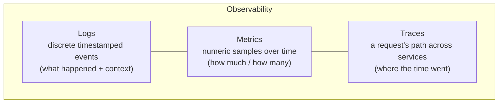
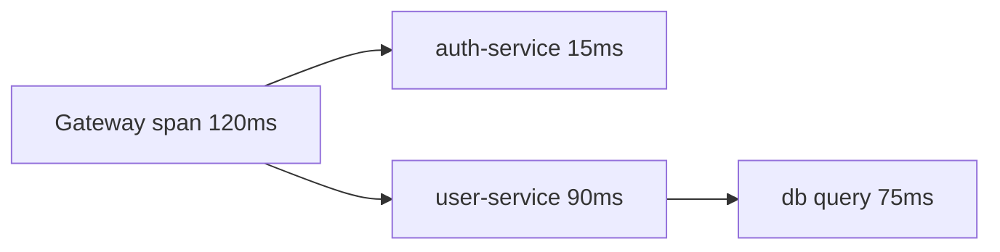
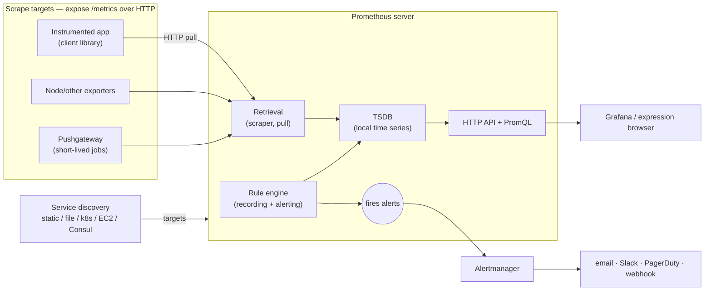
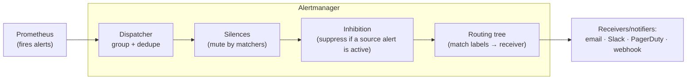
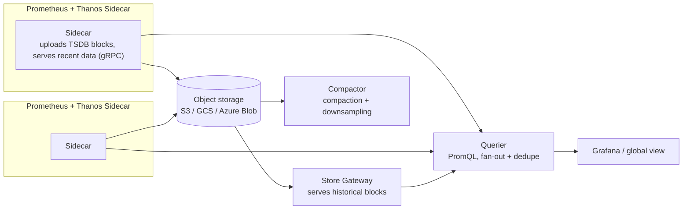

---
tags:
  - cloud
  - monitoring
  - prometheus
  - pca
type: study-notes
source: KodeKloud "Prometheus Certified Associate (PCA)" course (notes.kodekloud.com)
last-verified: 2026-08-25
---

# Prometheus

## Up
- [[Monitoring]]

> Notes follow the **KodeKloud PCA** course, drawn from its pages. Everything is rewritten from scratch; the diagrams are **original recreations** of the course's concepts (not copies of its images). Source: the [PCA course](https://notes.kodekloud.com/docs/Prep-Course-Prometheus-Certified-Associate-PCA-Certification/).

## Contents
1. Observability fundamentals · 2. SLI/SLO/SLA · 3. Architecture · 4. Metrics & data model · 5. Installation · 6. Configuration · 7. Security (TLS/auth) · 8. Node Exporter · 9. Containers (cAdvisor/Docker) · 10. promtool · 11. PromQL · 12. Recording rules · 13. Visualization · 14. Instrumentation · 15. Service discovery & relabeling · 16. Pushgateway · 17. Alerting & Alertmanager · 18. Kubernetes · 19. Scaling & long-term storage · 20. Quick reference

---

## 1. Observability fundamentals

**Observability** = the ability to infer a system's *internal* state from what it emits externally, so you can answer questions you didn't pre-plan for (why errors rose, why latency spiked for some requests, which dependency timed out). Monolith → microservices made this harder: state/logs are no longer in one place, so isolating a root cause across distributed components is the challenge observability solves.

### The three pillars



- **Logs** — event records (app/kernel logs, JSON). Rich per-event context but verbose and scattered → slow to analyze during incidents. *e.g. kernel messages showing a NIC link dropping and the adapter resetting.*
- **Metrics** — numeric samples over time. Compact, cheap, efficient to query → trends, dashboards, alerts. *e.g. CPU load / HTTP response time graphed.*
- **Traces** — one request's journey across services, made of **spans** (start, duration, operation, parent). Find slow hops and correlate errors to a span.



**Where Prometheus fits:** it is a **metrics-only, pull-based** system — it scrapes numeric time series, evaluates rules, stores them, and fires alerts. It is *not* logging or tracing; pair it with logs (Elasticsearch/Logstash/Fluentd, Loki) and tracing (Jaeger, Zipkin, OpenTelemetry) for full observability.

*Monitoring vs observability:* monitoring watches known signals against known thresholds; observability is the broader property that also lets you explore unknown problems after the fact.

---

## 2. SLI / SLO / SLA and error budgets

- **SLI (Indicator)** — a quantitative measure of service behaviour *from the user's perspective*. Common SLIs: **latency**, **error rate**, **throughput/request rate**, **saturation** (resource pressure), **availability**.
- **SLO (Objective)** — an internal target for an SLI over a window. *e.g. "99% of requests < 100 ms over a 30-day rolling window"; "99.9% availability over 30 days".*
- **SLA (Agreement)** — a customer contract guaranteeing an SLO with consequences (service credits, exit rights) if breached; usually looser than the internal SLO.
- **Error budget** — `1 − SLO`. A 99.9% SLO allows ~0.1% failure; that budget is what you can "spend" on releases/risk. Alert on **burn rate** (how fast you're consuming the budget), not just instantaneous thresholds.

```
SLI (measured)  →  SLO (internal target)  →  SLA (contract + penalty)
p99 latency=120ms   99% < 100ms/30d          "99% or credits owed"
```

---

## 3. Prometheus architecture



**Server units:** *Retrieval* (scraper) polls each target's `/metrics` on a schedule → *TSDB* (write-optimized, compressed local storage) → *HTTP server / PromQL engine* (UI + API). A separate *rule engine* evaluates recording and alerting rules.

**Around it:** **exporters** translate a system's metrics into Prometheus format (node_exporter, windows_exporter, mysqld_exporter, apache_exporter, haproxy_exporter…); **client libraries** (Go/Java/Python/Ruby/Rust) instrument your own apps; **Pushgateway** buffers batch-job metrics; **service discovery** finds targets dynamically; **Alertmanager** turns fired alerts into notifications; **Grafana** dashboards.

### Pull vs push
Prometheus **pulls**: it initiates the HTTP scrape on its own schedule. Advantages — a target being down is directly visible (the `up` metric = 0), no uncontrolled inbound writes, and one target can be scraped by many Prometheis. Push systems (Graphite, OpenTSDB) suit short-lived/ephemeral jobs that a pull can't reach — for those, push once to the **Pushgateway** and Prometheus pulls from it.

---

## 4. Metrics & the data model

A metric = **name** + **labels** + a stream of `(timestamp, float value)`.

```
node_cpu_seconds_total{cpu="0", mode="idle"}  258277.86  1668215300
└──────── name ───────┘└───── labels ──────┘  └ value ┘  └Unix ts┘
```
Internally the name is the label `__name__`. **Every unique name+label set is a distinct time series** — `...{cpu="0"}` and `...{cpu="1"}` are two series.

### Exposition format
```
# HELP node_disk_discard_time_seconds_total Total seconds spent by all discards.
# TYPE node_disk_discard_time_seconds_total counter
node_cpu_seconds_total{cpu="0",mode="idle"} 258277.86
```
`# HELP` = description, `# TYPE` = counter/gauge/histogram/summary. Names use ASCII letters/digits/underscores/colons. Prometheus auto-adds `job` (from the scrape config) and `instance` (target address) labels, plus `up` and `scrape_duration_seconds`.

### The four types
| Type | Behaviour | Use for | Query pattern |
|---|---|---|---|
| **Counter** | Only increases; resets to 0 on restart | requests, errors, bytes | `rate()`/`increase()` — never the raw value |
| **Gauge** | Goes up **and** down | memory in use, temperature, connections, queue depth | read directly; `*_over_time`, `delta` |
| **Histogram** | Cumulative **buckets** `{le=...}` + `_sum` + `_count` | latency, sizes | `histogram_quantile()` (server-side, aggregatable) |
| **Summary** | Client-computed **quantiles** + `_sum` + `_count` | per-instance percentiles | quantiles **can't** be aggregated across instances |

Histogram series example:
```
http_request_duration_seconds_bucket{le="0.1"}  240
http_request_duration_seconds_bucket{le="0.5"}  290
http_request_duration_seconds_bucket{le="+Inf"} 300
http_request_duration_seconds_sum              123.4
http_request_duration_seconds_count            300
```

### Cardinality
Cardinality = number of distinct series. It **explodes** with unbounded labels (user/session IDs, full paths, timestamps), exhausting memory/storage and slowing queries. Keep labels **bounded** (status code, method, instance, job). The classic mistake is one metric per endpoint (`api_requests_cars_total`, `api_requests_users_total`…) instead of one metric dimensioned by a `path` label.

---

## 5. Installation

Single static binary (ships with `promtool`).
```bash
wget https://github.com/prometheus/prometheus/releases/download/v3.0.0/prometheus-3.0.0.linux-amd64.tar.gz
tar xvf prometheus-3.0.0.linux-amd64.tar.gz && cd prometheus-3.0.0.linux-amd64
./prometheus --config.file=prometheus.yml     # UI at http://localhost:9090
```
**systemd unit** (run as a dedicated non-root user):
```ini
# /etc/systemd/system/prometheus.service
[Unit]
Description=Prometheus
Wants=network-online.target
After=network-online.target
[Service]
User=prometheus
Group=prometheus
Type=simple
ExecStart=/usr/local/bin/prometheus \
  --config.file=/etc/prometheus/prometheus.yml \
  --storage.tsdb.path=/var/lib/prometheus/ \
  --web.enable-lifecycle
ExecReload=/bin/kill -HUP $MAINPID
Restart=on-failure
[Install]
WantedBy=multi-user.target
```
```bash
sudo systemctl daemon-reload && sudo systemctl enable --now prometheus
```
Retention flags: `--storage.tsdb.retention.time=15d`, `--storage.tsdb.retention.size=50GB`. You can also run Prometheus **in Docker**: `docker run -p 9090:9090 -v $(pwd)/prometheus.yml:/etc/prometheus/prometheus.yml prom/prometheus`.

---

## 6. Configuration (`prometheus.yml`)

```yaml
global:
  scrape_interval: 15s        # default 1m
  evaluation_interval: 15s    # default 1m — how often rules run
  scrape_timeout: 10s         # default 10s
  external_labels:            # added to data sent to Alertmanager / remote storage
    cluster: prod

rule_files:
  - "rules/*.yml"

alerting:
  alertmanagers:
    - static_configs:
        - targets: ["localhost:9093"]

scrape_configs:
  - job_name: "node"
    scrape_interval: 15s      # overrides global
    scrape_timeout: 5s
    metrics_path: /metrics    # default
    scheme: http              # http | https
    sample_limit: 1000        # drop scrape if it exceeds this many samples
    static_configs:
      - targets: ["10.231.1.2:9100", "192.168.43.9:9100"]
        labels: { env: prod }
```

**Applying changes:** by default Prometheus does **not** auto-reload — either `sudo systemctl restart prometheus`, send `kill -HUP <pid>`, or (with `--web.enable-lifecycle`) `curl -X POST http://localhost:9090/-/reload`. Verify targets under **Status → Targets** (each should be `up`, value 1).

---

## 7. Security — TLS & authentication

Exporters/Prometheus use a **web config file** for TLS and basic auth.

**Generate a self-signed cert:**
```bash
sudo openssl req -new -newkey rsa:2048 -days 365 -nodes -x509 \
  -keyout node_exporter.key -out node_exporter.crt \
  -subj "/C=US/ST=California/L=Oakland/O=MyOrg/CN=localhost" \
  -addext "subjectAltName = DNS:localhost"
```
**Enable TLS + basic auth on Node Exporter** (`config.yml`):
```yaml
tls_server_config:
  cert_file: node_exporter.crt
  key_file: node_exporter.key
basic_auth_users:
  prometheus: $2y$12$dCqkk9uah20wF...   # bcrypt hash
```
```bash
sudo apt install apache2-utils
htpasswd -nBC 12 "" | tr -d ':\n'        # produce the bcrypt hash
./node_exporter --web.config=config.yml
```
**Tell Prometheus to scrape the secured target:**
```yaml
scrape_configs:
  - job_name: "node"
    scheme: https
    basic_auth:
      username: prometheus
      password: password
    tls_config:
      ca_file: /etc/prometheus/node_exporter.crt
      insecure_skip_verify: true      # for self-signed certs in labs
    static_configs:
      - targets: ["192.168.1.168:9100"]
```
Prometheus/Alertmanager have no built-in user auth for their own UIs — front them with a reverse proxy/mTLS and lock down `--web.enable-lifecycle` / `--web.enable-admin-api`.

---

## 8. Node Exporter & system metrics

**Node Exporter** exposes host metrics (CPU, memory, disk, filesystem, network) on **:9100** at `/metrics`.
```ini
# /etc/systemd/system/node_exporter.service
[Unit]
Description=Node Exporter
After=network-online.target
[Service]
User=node_exporter
Group=node_exporter
Type=simple
ExecStart=/usr/local/bin/node_exporter
[Install]
WantedBy=multi-user.target
```
Key metrics: `node_cpu_seconds_total` (counter, per cpu+mode), `node_memory_MemAvailable_bytes`, `node_filesystem_avail_bytes`, `node_disk_io_time_seconds_total`, `node_network_receive_bytes_total`, `node_load1`. Toggle collectors with `--collector.*` flags.

---

## 9. Monitoring containers

**cAdvisor** gives per-container CPU/memory/network/uptime. Run it (privileged, with host mounts) and scrape it:
```yaml
# docker-compose.yml (key bits)
services:
  cadvisor:
    image: gcr.io/cadvisor/cadvisor
    privileged: true
    ports: ["8080:8080"]     # course maps 8000; upstream default is 8080
    volumes:
      - /:/rootfs:ro
      - /var/run:/var/run:ro
      - /sys:/sys:ro
      - /var/lib/docker:/var/lib/docker:ro
      - /dev/disk:/dev/disk:ro
```
```yaml
scrape_configs:
  - job_name: "cadvisor"
    static_configs:
      - targets: ["cadvisor-host:8080"]
```
**Docker daemon** metrics (host-level engine health): enable in `/etc/docker/daemon.json`, restart Docker, scrape `:9323`:
```json
{ "metrics-addr": "127.0.0.1:9323", "experimental": true }
```
cAdvisor = per-container granularity; Docker engine metrics = overall daemon health.

---

## 10. promtool

Bundled CLI for validation/testing/queries:
```bash
promtool check config /etc/prometheus/prometheus.yml     # SUCCESS: ... valid ...
promtool check rules rules/*.yml                         # validate recording/alerting rules
promtool check metrics < metrics.txt                     # validate exposition format
promtool query instant http://localhost:9090 'up'        # ad-hoc query
promtool query range   http://localhost:9090 'rate(x[5m])' --start ... --end ...
promtool test rules tests.yml                            # unit-test rules
```
A typo like `metric_path` (instead of `metrics_path`) fails config check with a clear line number — run `check config` in CI.

---

## 11. PromQL

Four expression types: **instant vector** (one sample/series now), **range vector** (`[5m]` window of samples/series), **scalar**, **string**.

### Selectors & matchers
```promql
http_requests_total                         # all series of this name
http_requests_total{job="api", code="500"}  # = exact match
http_requests_total{code=~"5.."}             # =~ regex,  !~ negated regex
http_requests_total{handler!="/health"}      # != not equal
```

### Modifiers (time)
```promql
node_memory_Active_bytes offset 5m           # value 5m ago (units: ms,s,m,h,d,w,y)
node_memory_Active_bytes offset 1h30m
node_memory_Active_bytes @1663265188         # evaluate at an exact Unix timestamp
node_memory_Active_bytes @1663265188 offset 5m   # @ anchors, offset shifts from it
node_memory_Active_bytes[2m] @1663265188         # range vector at a point in time
```

### Operators
- **Arithmetic** `+ - * / % ^` — a math op **drops the metric name** (result becomes `{labels} value`).
- **Comparison** `== != > < >= <=` — filter series. Add **`bool`** to return 1/0 instead of filtering (handy in alerts): `node_filesystem_avail_bytes < 1000 bool`.
- **Logical/set** `and`, `or`, `unless` (left-side series with no match on the right).
- **Precedence** (high→low): `^` → `* / %` → `+ -` → comparisons → `and`/`unless` → `or`.

### Vector matching
Default **one-to-one**: every label must match exactly on both sides.
```promql
node_filesystem_avail_bytes / node_filesystem_size_bytes * 100   # matches on instance,job,mountpoint
http_errors{code="500"} / ignoring(code) http_requests           # ignore differing labels
http_errors{code="500"} / on(method)     http_requests           # match only these labels
```
**Many-to-one / one-to-many** needs `group_left` / `group_right`:
```promql
http_errors_total / ignoring(error) group_left http_requests_total
```
Without the group modifier, a many-to-one match errors with "multiple matches for labels".

### Aggregation
```promql
sum by (path)   (http_requests)          # keep only these labels
sum without(cpu)(node_cpu_seconds_total) # drop these labels, keep the rest
avg by (instance)(node_load1)
topk(3, sum by (instance)(rate(http_requests_total[5m])))
count(up == 0)                            # how many targets are down
```
Operators: `sum, min, max, avg, count, count_values, stddev, stdvar, topk, bottomk, quantile, group` with `by(...)` or `without(...)`.

### Functions
- **Counter rates:** `rate(x[5m])` (avg per-second over the window — for alerts/graphs), `irate(x[5m])` (instantaneous from the last 2 samples — for volatile graphs), `increase(x[1h])` (total = rate × seconds). *Compute rate **before** aggregating* so counter resets are handled. (e.g. samples `[1.2,2.3,3.1,3.3]` over 60s → `rate = (3.3−1.2)/60 = 0.035/s`.)
- **Gauges over time:** `avg_over_time / max_over_time / min_over_time / sum_over_time (gauge[1h])`.
- **Deltas/trends (gauges):** `delta`, `idelta`, `deriv`, `predict_linear(node_filesystem_avail_bytes[6h], 4*3600)` (extrapolate disk-full), `changes`, `resets`.
- **Presence:** `absent()`, `absent_over_time()`, `present_over_time()`.
- **Math/time/util:** `ceil, floor, abs`, `time, minute, hour, day_of_week, month, year`, `scalar, vector, sort, sort_desc, clamp_max/min, label_replace, label_join`.
- **Histograms:** `histogram_quantile(0.95, sum by (le)(rate(http_request_duration_seconds_bucket[5m])))` → p95.

### Subqueries
Turn an instant expression into a range vector: `expr[<range>:<resolution>]`.
```promql
max_over_time( rate(http_requests_total[1m]) [5m:30s] )    # peak of the 1m-rate over 5m, sampled every 30s
max_over_time( rate(node_network_transmit_bytes_total[1m]) [5h:30s] )
```
(The `[1m]` inside `rate` only groups points for the rate; the subquery `[5h:30s]` is what selects the historical range.)

### HTTP API
Query programmatically: `GET /api/v1/query?query=up`, `GET /api/v1/query_range?query=...&start=&end=&step=`, plus `/api/v1/series`, `/api/v1/labels`, `/api/v1/targets`, `/api/v1/rules`.

---

## 12. Recording rules

Precompute expensive/frequent PromQL and store the result as a new series (speeds dashboards/alerts, and is the right way to shrink data before federation).
```yaml
groups:
  - name: http
    interval: 30s
    rules:
      - record: job:http_requests:rate5m
        expr: sum by (job) (rate(http_requests_total[5m]))
```
Naming convention: `level:metric:operation`. Validate with `promtool check rules`.

---

## 13. Visualization & dashboards

- **Expression browser** (`:9090/graph`) — ad-hoc PromQL, quick table/graph; great for debugging queries.
- **Grafana** — add Prometheus as a data source (`http://prometheus:9090`), build panels with PromQL, use **variables** (`label_values(node_load1, instance)`) for dropdowns, import community dashboards (Node Exporter Full = ID 1860).
- **Console templates** — Go-templated HTML pages served by Prometheus itself (a lightweight, older alternative to Grafana), placed in `consoles/` and reached at `/consoles/<file>.html`.

---

## 14. Application instrumentation

Use an official **client library**.
```python
from prometheus_client import Counter, Histogram, Gauge, start_http_server
REQS = Counter("app_requests_total", "Total requests", ["method", "code"])
LAT  = Histogram("app_request_duration_seconds", "Latency", ["method"])
INPROG = Gauge("app_inprogress_requests", "In-flight requests")

@INPROG.track_inprogress()
@LAT.labels("GET").time()
def handle():
    REQS.labels("GET", "200").inc()

start_http_server(8000)   # /metrics on :8000
```
**Naming/best practice:** snake_case; start with app/library name; append the **base unit** (`_seconds`, `_bytes` — not ms/KB); reserve `_total` for counters (not histograms). What to instrument — **online serving** (requests, errors, latency, in-progress), **offline processing** (queued/in-progress/processed, per-stage errors), **batch jobs** (per-stage time, total runtime, last-success timestamp → via Pushgateway). Keep label sets bounded (never label by user/request ID). Handy mnemonics: **RED** (Rate, Errors, Duration) for request services, **USE** (Utilization, Saturation, Errors) for resources.

---

## 15. Service discovery & relabeling

Avoid hard-coded targets; discover dynamically and shape with relabeling.

**Static / file SD:**
```yaml
scrape_configs:
  - job_name: file-example
    file_sd_configs:
      - files: ["/etc/prometheus/targets/*.json"]
        refresh_interval: 30s
```
```json
[ { "targets": ["node1:9100","node2:9100"], "labels": {"team":"dev","job":"node"} } ]
```
Prometheus watches the files and reloads automatically. Check **Status → Service Discovery** for discovered targets and their pre-relabel labels.

**AWS EC2 SD:**
```yaml
scrape_configs:
  - job_name: "ec2"
    ec2_sd_configs:
      - region: "us-east-1"
        access_key: "<key>"      # IAM user with EC2 read-only
        secret_key: "<secret>"
        port: 9100
```
EC2 metadata arrives as `__meta_ec2_*` labels (tags, instance type, VPC ID, private IP…); by default the private IP becomes the `instance` label. Others: `kubernetes_sd_configs`, `azure_sd_configs`, `gce_sd_configs`, `consul_sd_configs`, `dns_sd_configs`.

### Relabeling
- **`relabel_configs`** — runs **before scraping** on discovery labels: filter targets, build `__address__`, promote `__meta_*` metadata to real labels.
- **`metric_relabel_configs`** — runs **after scraping** on sample labels: drop noisy metrics, rename labels.

Actions and examples:
```yaml
relabel_configs:
  # keep only prod targets
  - source_labels: [__meta_ec2_tag_env]
    regex: prod
    action: keep
  # replace: extract IP from host:port into a new label
  - source_labels: [__address__]
    regex: (.*):.*
    target_label: ip
    replacement: $1
  # labelmap: __meta_ec2_<x>  ->  ec2_<x>
  - regex: __meta_ec2_(.*)
    action: labelmap
    replacement: ec2_$1
  # labeldrop / labelkeep
  - regex: __meta_ec2_owner_id
    action: labeldrop
  # multi-label match (joined by ';', or a custom separator)
  - source_labels: [env, team]
    regex: dev;marketing
    action: keep

metric_relabel_configs:
  - source_labels: [__name__]         # drop a metric
    regex: go_gc_duration_seconds.*
    action: drop
  - source_labels: [__name__]         # rename a metric
    regex: http_errors_total
    target_label: __name__
    replacement: http_failures_total
    action: replace
```
Actions: `keep, drop, replace, labelmap, labeldrop, labelkeep, hashmod`. Special labels: `__address__` (host:port), `__scheme__`, `__metrics_path__`, `__param_*`, `__name__`, and all `__meta_*` from SD (dropped after relabeling unless promoted).

---

## 16. Pushgateway & short-lived jobs

Batch jobs push their final metrics to the **Pushgateway** (:9091); Prometheus scrapes the gateway.
```
http://<pushgateway>:9091/metrics/job/<job>/<label1>/<value1>/...
```
```bash
# push one metric to job "db_backup"
echo "example_metric 4421" | curl --data-binary @- http://localhost:9091/metrics/job/db_backup

# push a group of metrics (grouping key = job/db/mysql)
cat <<EOF | curl --data-binary @- http://localhost:9091/metrics/job/archive/db/mysql
# TYPE metric_one counter
metric_one{label="val1"} 11
# TYPE metric_two gauge
metric_two 100
EOF
```
- **POST** updates only same-named metrics in the group; **PUT** replaces the whole group; **DELETE** removes the group:
  ```bash
  curl -X DELETE http://localhost:9091/metrics/job/archive/app/web
  ```
- From a client library (Python):
  ```python
  from prometheus_client import CollectorRegistry, Gauge, push_to_gateway
  reg = CollectorRegistry()
  g = Gauge('test_metric', 'example', registry=reg); g.set(10)
  push_to_gateway('pushgw:9091', job='batch', registry=reg)   # push=PUT, pushadd=POST, delete
  ```
- **Caveat:** the gateway keeps the last pushed value **forever** until overwritten/deleted (it is not an aggregator). Use it only for service-level batch jobs.

---

## 17. Alerting & Alertmanager

Prometheus **evaluates alerting rules** and sends firing alerts to **Alertmanager**, which does the notifying.

### Alerting rules
```yaml
# rules/alerts.yml (referenced from rule_files)
groups:
  - name: node
    interval: 15s
    rules:
      - alert: LowMemory
        expr: node_memory_memFree_percent < 20
        for: 3m                     # hold-down before firing
        labels:
          severity: critical
        annotations:
          summary: "Node memory low on {{ $labels.instance }}"
          description: "Free memory {{ $value }}% for >3m."
```
Fields: `alert` (name), `expr` (each returned series = one alert instance), `for` (hold-down), `labels` (routing keys), `annotations` (templated text via `{{ $labels.x }}` / `{{ $value }}`).
**States:** `inactive` → `pending` (expr true but `for` not yet elapsed) → `firing` (sent to Alertmanager).

### Alertmanager pipeline

- **Group + dedupe** — batch related alerts (`group_by`) and drop duplicates from HA Prometheis.
- **Silences** — temporarily mute alerts matching labels (maintenance); created in the UI/API with matchers + start/duration.
- **Inhibition** — suppress lower-severity alerts while a higher/source alert is firing (e.g. mute per-node alerts when the whole cluster is down). *Silence = explicit mute; inhibition = conditional on another active alert.*
- **Routing** — a tree of matchers directs alerts to receivers; `continue: true` lets an alert match multiple routes.

```yaml
# alertmanager.yml
route:
  receiver: staff
  group_by: ['alertname', 'job']
  group_wait: 30s
  group_interval: 5m
  repeat_interval: 4h
  routes:
    - match_re: { job: (node|windows) }
      receiver: infra-email
    - matchers: [ severity="critical" ]
      receiver: infra-pager
inhibit_rules:
  - source_matchers: [ severity="critical" ]
    target_matchers: [ severity="warning" ]
    equal: [ alertname, instance ]
receivers:
  - name: infra-pager
    slack_configs:
      - api_url: https://hooks.slack.com/services/XXX
        channel: "#pages"
    email_configs:
      - to: "oncall@example.com"
        from: "alerts@example.com"
        smarthost: smtp.gmail.com:587
        auth_username: "alerts@example.com"
        auth_password: "app-password"
```
Shared secrets (e.g. an API key) can live in the `global:` section to avoid repetition. Alertmanager listens on **:9093**.

---

## 18. Monitoring Kubernetes

Building blocks: **cAdvisor** (in the kubelet — per-container), **kube-state-metrics** (object state: deployments/pods/replicas), **node_exporter** (DaemonSet — node metrics), and the **Prometheus Operator** (installed via the `kube-prometheus-stack` Helm chart) which brings Prometheus + Alertmanager + Grafana and CRDs.

**Install:**
```bash
helm repo add prometheus-community https://prometheus-community.github.io/helm-charts
helm install prometheus prometheus-community/kube-prometheus-stack -f values.yaml
```

**ServiceMonitor** — declarative scrape config that targets a Kubernetes Service by label:
```yaml
apiVersion: monitoring.coreos.com/v1
kind: ServiceMonitor
metadata:
  name: api-service-monitor
  labels:
    release: prometheus          # must match the Prometheus CR's serviceMonitorSelector
spec:
  jobLabel: job
  selector:
    matchLabels: { app: service-api }   # picks Services with this label
  endpoints:
    - port: web                  # the Service's *named* port (not the number)
      path: /metrics
      interval: 30s
```
The Prometheus CR selects which ServiceMonitors to include:
```yaml
serviceMonitorSelector:
  matchLabels: { release: prometheus }
```
The Operator translates ServiceMonitors into scrape configs + relabeling automatically.

**Additional scrape configs** — for targets not covered by a ServiceMonitor (uses `kubernetes_sd_configs` with roles `node`, `pod`, `endpoints`, `service`):
```yaml
# values.yaml (kube-prometheus-stack) — NOT validated by the chart, so be careful
additionalScrapeConfigs:
  - job_name: kube-etcd
    kubernetes_sd_configs:
      - role: node
    scheme: https
    tls_config:
      ca_file: /etc/prometheus/secrets/etcd-client-cert/etcd-ca
      cert_file: /etc/prometheus/secrets/etcd-client-cert/etcd-client
      key_file: /etc/prometheus/secrets/etcd-client-cert/etcd-client-key
    relabel_configs:
      - action: labelmap
        regex: __meta_kubernetes_node_label_(.+)
      - source_labels: [__address__]
        regex: ([^;]+):(\d+)
        target_label: __address__
        replacement: ${1}:2379
```
Rules/alerts on K8s go through the **PrometheusRule** CRD; Alertmanager config through the Operator's `alertmanager` config/secret.

---

## 19. Scaling & long-term storage

A single Prometheus stores data **locally**, isn't clustered, and has bounded retention. To scale/keep data:

- **HA** — run two identical Prometheis per environment; Alertmanager dedupes their alerts.
- **Federation** — a "global" Prometheus scrapes **pre-aggregated** series from leaf Prometheis via `/federate`:
  ```yaml
  - job_name: "prometheus-federation"
    metrics_path: "/federate"
    honor_labels: true
    params:
      'match[]':
        - '{__name__="node:cpu_seconds:sum_rate5m"}'
        - '{__name__="node:memory_MemAvailable_bytes:sum"}'
    static_configs:
      - targets: ["172.16.17.128:9090", "172.16.17.129:9090"]
  ```
  `honor_labels: true` keeps the source labels; **federate only recording-rule roll-ups** (add a distinguishing label like `datacenter` on each leaf) — federating raw instance metrics causes cardinality blow-up and conflicting-sample drops.
- **Remote write / read** — stream samples to an external store (`remote_write:`), query back with `remote_read:`.
- **Thanos** — turns many Prometheis into one long-term, globally-queryable system:


  Components: **Sidecar** (uploads blocks, serves recent local data), **Store Gateway** (serves historical blocks from object storage), **Querier** (PromQL front-end that federates across sidecars + stores and **deduplicates** HA series), **Compactor** (compaction/downsampling), plus **Ruler** (rules over the global view) and **Receive** (a push endpoint alternative to sidecars). Alternatives: **Grafana Mimir / Cortex / VictoriaMetrics**.
- **Horizontal sharding** — split scrape load across multiple Prometheis by service/team (or via `hashmod` relabeling) when one instance's cardinality is too large.

---

## 20. Quick reference

| Port | Service | | Flag/endpoint | Purpose |
|---|---|---|---|---|
| 9090 | Prometheus UI/API | | `POST /-/reload` | reload config (needs `--web.enable-lifecycle`) |
| 9100 | Node Exporter | | `/federate?match[]=` | federation endpoint |
| 9091 | Pushgateway | | `/metrics` | exposition endpoint on targets |
| 9093 | Alertmanager | | `up`, `scrape_duration_seconds` | scrape health |
| 8080 | cAdvisor | | `promtool check config/rules` | validate |
| 9323 | Docker engine metrics | | `histogram_quantile(0.95, sum by(le)(rate(x_bucket[5m])))` | p95 |

### Exam-flavored reminders
- Prometheus is **metrics-only** and **pull-based**; Pushgateway is the exception for batch jobs (and keeps the last value forever).
- `rate()`/`increase()` on **counters** (rate **before** sum); read **gauges** directly.
- **Histogram** quantiles aggregate server-side (`histogram_quantile`); **summary** quantiles do **not** aggregate across instances.
- Watch **cardinality** — unbounded labels are the classic mistake.
- `relabel_configs` shapes **targets** (pre-scrape); `metric_relabel_configs` shapes **samples** (post-scrape).
- Comparison + `bool` → 1/0; a math op **drops the metric name**.
- Alert states: `inactive → pending (for) → firing`; **Alertmanager** does grouping/silences/inhibition/routing — Prometheus only evaluates the rule.
- Default `scrape_interval`/`evaluation_interval` = **1m** (labs set 15s); Prometheus does **not** auto-reload config.
