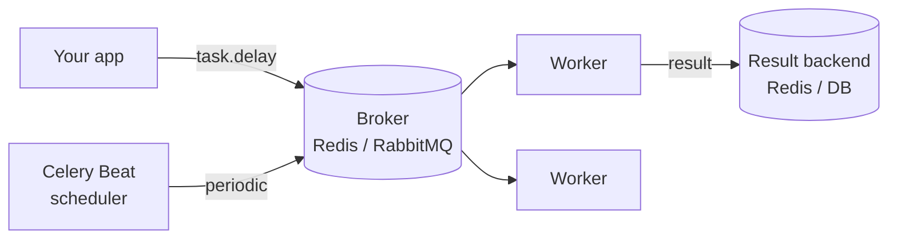

# Celery

## Up
- [[Python]]

Celery is a distributed **task queue** — offload slow/background work (emails, image processing, ETL) from your web request to worker processes, and schedule periodic jobs. It needs a **broker** (message transport) and optionally a **result backend**. Install: `pip install celery redis`.

---

## Architecture



- **Broker** — queues messages (RabbitMQ or Redis).
- **Worker** — pulls tasks and executes them (scale horizontally).
- **Result backend** — stores return values/state (optional; Redis/DB).
- **Beat** — scheduler that enqueues periodic tasks (cron-like).

---

## Define an App & Tasks

```python
# app.py
from celery import Celery

app = Celery(
    "myapp",
    broker="redis://localhost:6379/0",
    backend="redis://localhost:6379/1",
)

@app.task
def add(x, y):
    return x + y

@app.task(bind=True, max_retries=3, default_retry_delay=10)
def fetch(self, url):
    try:
        return do_fetch(url)
    except TimeoutError as e:
        raise self.retry(exc=e)          # retry with backoff
```

---

## Calling Tasks

```python
add.delay(2, 3)                          # shortcut → enqueue
res = add.apply_async((2, 3), countdown=10, queue="high", expires=60)

res.id                                   # task id
res.ready()                              # finished?
res.get(timeout=5)                       # BLOCK for result (avoid in web requests)
res.status                               # PENDING / STARTED / SUCCESS / FAILURE / RETRY
```

**Don't call `.get()` inside a web request** — it blocks. Poll by id or use webhooks/websockets.

---

## Running Workers & Beat

```bash
celery -A app worker --loglevel=info                 # start a worker
celery -A app worker -Q high,default -c 8            # queues + concurrency
celery -A app beat --loglevel=info                   # start the scheduler
celery -A app worker -B                              # worker + beat (dev only)
celery -A app flower                                 # Flower web monitor
celery -A app inspect active / stats / registered
```

---

## Periodic Tasks (Beat schedule)

```python
from celery.schedules import crontab

app.conf.beat_schedule = {
    "every-30s": {"task": "app.add", "schedule": 30.0, "args": (16, 16)},
    "daily-report": {"task": "app.report", "schedule": crontab(hour=7, minute=0)},
    "monday-9am": {"task": "app.x", "schedule": crontab(hour=9, minute=0, day_of_week=1)},
}
```

---

## Workflows (Canvas)

```python
from celery import chain, group, chord

chain(add.s(2, 2), add.s(4))()           # sequential: add(2,2) → add(4, result) = 8
group(add.s(i, i) for i in range(10))()  # parallel fan-out
chord(group(add.s(i, i) for i in range(10)), summarize.s())()  # fan-out then callback
add.s(2, 2)                              # .s() = signature (partial task)
```

---

## Config Essentials

```python
app.conf.update(
    task_serializer="json",
    result_expires=3600,
    task_acks_late=True,                 # ack after completion (survive worker crash)
    task_track_started=True,
    worker_prefetch_multiplier=1,        # fair dispatch for long tasks
    task_time_limit=300,                 # hard kill after 5 min
    task_routes={"app.heavy": {"queue": "heavy"}},
)
```

---

## Tips
- Keep tasks **small, idempotent, and serializable** (pass IDs, not big objects/ORM instances).
- Use **`acks_late=True` + idempotency** so a crashed worker's task can safely re-run.
- Route heavy/slow tasks to their **own queue + workers**; set time limits.
- Never block on `.get()` in request/response paths; return the task id and poll.
- Monitor with **Flower**; alert on queue backlog and failure rate.
- Alternatives worth knowing: **RQ** (simpler, Redis-only), **Dramatiq**, **arq** ([[asyncio]]-native), or cloud queues ([[KEDA]] can autoscale workers on queue depth).
