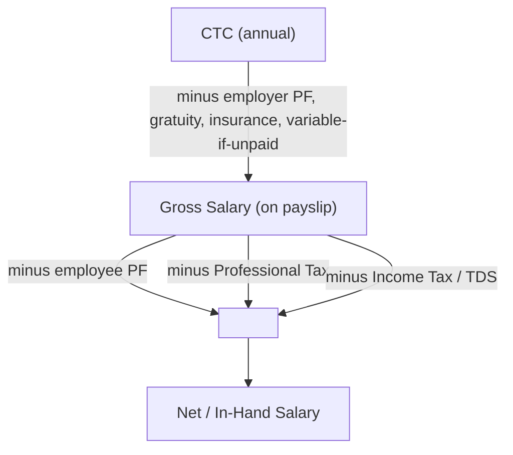

# Salary in India — CTC vs In-Hand & Old vs New Regime

How an Indian salary actually breaks down: from the **CTC** a company quotes, down to the **in-hand** amount that hits your bank — and how income tax under the **Old vs New regime** changes that number.

> Slabs below are **FY 2025-26 / FY 2026-27 (AY 2026-27)** as set by Budget 2025. Tax rules change every Union Budget (Feb) — re-verify each year. Educational reference, not tax advice.

## Contents
- [[#1. The big picture — CTC → Gross → In-hand]]
- [[#2. Salary components explained]]
- [[#3. What gets deducted]]
- [[#4. Old Regime vs New Regime]]
- [[#5. How to calculate the tax (step by step)]]
- [[#6. Worked examples]]
- [[#7. Which regime should you pick?]]
- [[#8. Deductions cheat-list (Old Regime)]]
- [[#9. Quick formulas & rules of thumb]]

---

## 1. The big picture — CTC → Gross → In-hand

**CTC (Cost to Company)** is everything the company spends on you in a year — *not* what you take home. Peel off the parts you never see in cash, then the statutory deductions, and you get **in-hand**.

| Layer | What it is | Formula |
|---|---|---|
| **CTC** | Total annual cost to employer | Fixed pay + variable/bonus + **employer PF** + **gratuity** + benefits/insurance |
| **Gross Salary** | Taxable cash salary on the payslip | CTC − employer PF − gratuity − (unpaid variable) − benefits |
| **In-Hand (Net)** | What reaches your bank | Gross − employee PF − Professional Tax − Income Tax (TDS) |

**Key trap:** two offers with the same CTC can pay very different in-hand amounts, depending on how much is Basic (drives PF), how much is variable/bonus (may not be fully paid), and what "benefits" are stuffed into CTC.

---

## 2. Salary components explained

| Component | Typical size | Notes |
|---|---|---|
| **Basic Pay** | 40–50% of CTC | The core. Drives PF, gratuity, HRA exemption. Higher basic = more PF (more forced savings, lower take-home). |
| **DA** (Dearness Allowance) | varies | Inflation top-up; common in govt/PSU, rare in private IT. Counts with basic for PF. |
| **HRA** (House Rent Allowance) | 40–50% of basic | Partly tax-exempt **(Old regime only)** if you pay rent. |
| **Special / Other Allowance** | balancing figure | Fully taxable "filler" that makes the numbers add up. |
| **LTA** (Leave Travel Allowance) | small | Travel reimbursement; exempt twice in 4 years on actual travel **(Old regime)**. |
| **Bonus / Variable Pay / PLI** | 0–20%+ | Performance-linked; may be quarterly/annual and **not fully guaranteed** — a big in-hand risk. |
| **Employer EPF** | 12% of basic | Employer's PF contribution. In CTC, not in cash. |
| **Gratuity** | 4.81% of basic | Accrues in CTC; actually paid only after **5 years** of service. |
| **Employer NPS** | up to 14% of basic | Optional; deductible under 80CCD(2) in **both** regimes. |
| **Perks / Benefits** | varies | Insurance premium, meal cards, phone, etc. — inflate CTC, little cash value. |
| **ESOP / RSU** | varies | Equity grants; taxed as perquisite at vesting + capital gains at sale. |

---

## 3. What gets deducted

From **gross** to reach **in-hand**:

| Deduction | How much | Detail |
|---|---|---|
| **EPF (employee)** | 12% of (Basic + DA) | Your own PF contribution. Employer adds another 12% (part goes to EPS pension, capped at ₹1,250/mo). Optional lower rate if basic > ₹15k and you opt out (rare). |
| **Professional Tax (PT)** | up to ₹2,500/year | State tax (e.g. Karnataka/Maharashtra ~₹200/month). A few states have none. |
| **Income Tax (TDS)** | per your slab | Employer deducts monthly based on your declared regime & investments. |
| **Other** | varies | Group insurance premium, NPS (if you opt in), food card, etc. |

> **EPF is savings, not a loss** — it's your money (currently ~8.25% p.a., tax-advantaged). But it *does* reduce monthly take-home.

---

## 4. Old Regime vs New Regime

Two parallel tax systems. **New regime is the default**; you must opt for Old if you want it. New = lower rates, almost no deductions. Old = higher rates, but you can claim many deductions.

### New Regime slabs — FY 2025-26 (AY 2026-27)

| Income slab | Rate |
|---|---|
| Up to ₹4,00,000 | Nil |
| ₹4,00,001 – ₹8,00,000 | 5% |
| ₹8,00,001 – ₹12,00,000 | 10% |
| ₹12,00,001 – ₹16,00,000 | 15% |
| ₹16,00,001 – ₹20,00,000 | 20% |
| ₹20,00,001 – ₹24,00,000 | 25% |
| Above ₹24,00,000 | 30% |

- **Standard deduction:** ₹75,000 (salaried)
- **Section 87A rebate:** full rebate if taxable income ≤ **₹12,00,000** (max rebate ₹60,000) → **salaried pay ₹0 tax up to ₹12.75 lakh** gross (after ₹75k standard deduction).
- **Deductions allowed:** basically only Standard Deduction + Employer NPS 80CCD(2). No 80C, no HRA exemption, no home-loan interest on self-occupied, no 80D.

### Old Regime slabs — FY 2025-26 (individual < 60 yrs)

| Income slab | Rate |
|---|---|
| Up to ₹2,50,000 | Nil |
| ₹2,50,001 – ₹5,00,000 | 5% |
| ₹5,00,001 – ₹10,00,000 | 20% |
| Above ₹10,00,000 | 30% |

- **Standard deduction:** ₹50,000 (salaried)
- **Section 87A rebate:** full rebate if taxable income ≤ **₹5,00,000** (max ₹12,500).
- **Deductions allowed:** the full menu — 80C, 80D, HRA, home-loan interest, NPS, LTA, etc. (see [[#8. Deductions cheat-list (Old Regime)]]).
- *Senior citizens (60–80): basic exemption ₹3L; super-senior (80+): ₹5L.*

### On top of both regimes

- **Health & Education Cess:** **4%** on the tax amount.
- **Surcharge** (on high incomes, on the tax):

| Taxable income | Old | New |
|---|---|---|
| ₹50L – ₹1cr | 10% | 10% |
| ₹1cr – ₹2cr | 15% | 15% |
| ₹2cr – ₹5cr | 25% | 25% |
| Above ₹5cr | **37%** | **25%** (capped) |

---

## 5. How to calculate the tax (step by step)

1. **Gross salary** = Basic + HRA + allowances + taxable bonus (cash components; exclude employer PF & gratuity).
2. **Subtract exemptions/deductions** for your regime → **Taxable Income**.
   - *New:* Gross − ₹75,000 standard deduction (− employer NPS if any).
   - *Old:* Gross − ₹50,000 std deduction − HRA exemption − 80C (≤₹1.5L) − 80D − 80CCD(1B) NPS (≤₹50k) − home-loan interest (≤₹2L) − …
3. **Apply the slab rates** to taxable income → base tax.
4. **Apply Section 87A rebate** if eligible (≤₹12L new / ≤₹5L old) → tax may become ₹0.
5. **Add surcharge** (if income above ₹50L).
6. **Add 4% cess** on (tax + surcharge) → **final annual tax**.
7. **In-hand/month** = (Gross − employee PF − PT − final tax) ÷ 12.

**HRA exemption (Old regime)** = least of: (a) actual HRA received, (b) rent paid − 10% of basic, (c) 50% of basic (metro) / 40% (non-metro).

---

## 6. Worked examples

Assumed structure: Basic = 40% of CTC, HRA = 50% of basic, Employer PF = 12% of basic, Gratuity = 4.81% of basic, Special allowance = balancing figure. PT = ₹2,400/yr. Employee PF = 12% of basic.

### Example A — CTC ₹8,00,000 (new regime → zero tax)

| Item | Amount (₹) |
|---|---|
| Basic (40%) | 3,20,000 |
| HRA (50% of basic) | 1,60,000 |
| Employer PF (12%) | 38,400 |
| Gratuity (4.81%) | 15,392 |
| Special allowance (balancing) | 2,66,208 |
| **Gross (cash) = Basic+HRA+Special** | **7,46,208** |

**New regime:** Taxable = 7,46,208 − 75,000 = ₹6,71,208 → base tax ₹13,560, but income ≤ ₹12L so **87A rebate → ₹0 tax.**
**In-hand:** 7,46,208 − 38,400 (PF) − 2,400 (PT) − 0 = **₹7,05,408/yr ≈ ₹58,784/month.**

### Example B — CTC ₹15,00,000

| Item | Amount (₹) |
|---|---|
| Basic (40%) | 6,00,000 |
| HRA | 3,00,000 |
| Employer PF | 72,000 |
| Gratuity | 28,860 |
| Special allowance | 4,99,140 |
| **Gross (cash)** | **13,99,140** |

**New regime:** Taxable = 13,99,140 − 75,000 = ₹13,24,140.
Tax = 5%(4L)=20,000 + 10%(4L)=40,000 + 15%(1,24,140)=18,621 → **₹78,621**; income > ₹12L so no rebate. +4% cess = **₹81,766**.

**Old regime** (assume deductions: std 50k + 80C 1.5L + 80D 25k + NPS 50k = ₹2,75,000):
Taxable = 13,99,140 − 2,75,000 = ₹11,24,140.
Tax = 5%(2.5L)=12,500 + 20%(5L)=1,00,000 + 30%(1,24,140)=37,242 → **₹1,49,742**; +4% cess = **₹1,55,732**.

➡️ **New regime wins by ~₹74,000 here.** In-hand (new) = 13,99,140 − 72,000 − 2,400 − 81,766 = **₹12,42,974/yr ≈ ₹1,03,581/month.**

### Example C — the take-home reality

Same ₹15L CTC: the headline is ₹1.25L/month, but in-hand is **~₹1.03L/month** — the gap is employer PF/gratuity (never cash), your own PF (savings), and tax.

---

## 7. Which regime should you pick?

**Default assumption for FY 2025-26: the New regime wins for most people**, because of the ₹12 lakh rebate and lower rates.

**Old regime only beats New if your total deductions are large.** Rough break-even: your Old-regime deductions (80C + 80D + HRA + home-loan interest + NPS + std deduction) need to exceed roughly **₹4.5–5.5 lakh** (the exact figure rises with income) before Old wins.

| Choose **New** if… | Choose **Old** if… |
|---|---|
| You don't have a home loan / big rent | You pay large **home-loan interest** (up to ₹2L) |
| You don't max out 80C/80D/NPS | You already max **80C (₹1.5L) + 80D + NPS (₹50k)** |
| You want simplicity, no proofs | You claim significant **HRA** (high metro rent) |
| Income ≤ ₹12.75L (zero tax!) | Your total deductions clear ~₹4.5L+ |

> Run both every year — many salary/tax calculators (ClearTax, Income Tax dept e-filing portal) compute both from your numbers. Salaried can switch regime each year; business income cannot switch back freely.

---

## 8. Deductions cheat-list (Old Regime)

| Section | For | Limit |
|---|---|---|
| **Std Deduction** | Salaried | ₹50,000 (Old) / ₹75,000 (New) |
| **80C** | EPF, PPF, ELSS, life insurance, home-loan principal, kids' tuition, NSC, 5-yr FD | ₹1,50,000 |
| **80CCD(1B)** | NPS (extra) | ₹50,000 |
| **80CCD(2)** | Employer NPS | up to 14% of basic *(both regimes)* |
| **80D** | Health insurance premium (self/family + parents) | ₹25,000 + ₹25,000/₹50,000 (senior parents) |
| **24(b)** | Home-loan **interest** (self-occupied) | ₹2,00,000 |
| **HRA** | Rent paid | least-of formula (see §5) |
| **80E** | Education-loan interest | no cap (8 yrs) |
| **80G** | Donations | 50–100% of donation |
| **80TTA/80TTB** | Savings interest / senior FD interest | ₹10,000 / ₹50,000 |
| **LTA** | Travel | actual, twice in 4 yrs |

---

## 9. Quick formulas & rules of thumb

- **Gross = CTC − employer PF − gratuity − (unpaid variable) − benefits.**
- **In-hand = Gross − employee PF (12% basic) − Professional Tax − Income Tax.**
- **Employee PF = Employer PF = 12% of (Basic + DA).**
- **Gratuity = (15 ÷ 26) × last drawn basic × years of service** (payable after 5 yrs).
- **Bonus/variable is a risk** — treat the "fixed" figure as your real base.
- **Higher Basic** → more PF → lower monthly cash but more forced savings + higher HRA/gratuity.
- **New regime:** salaried pay **₹0 tax up to ₹12.75L**; standard deduction ₹75k; almost no other deductions.
- **Cess 4%** always on top; **surcharge** kicks in above ₹50L income.
- Rule of thumb: **in-hand ≈ 65–75% of a private-sector CTC** after PF, gratuity, and tax (varies widely).

---

> **Related:** [[Finance]] glossary (EPF, NAV, CAGR, etc.). Pair with [[Python]]/[[pandas]] to build your own CTC→in-hand calculator. Re-verify slabs after each Union Budget (February).
