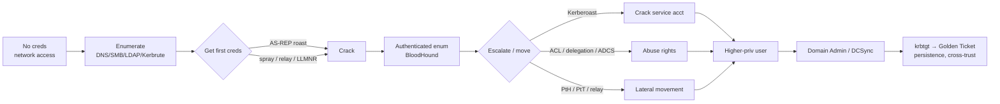

# Active Directory

## Up
- [[Hacking]]

Comprehensive Active Directory attack & defense reference — built from my Notion AD cheat sheet and extended with the attack classes it didn't cover (delegation, ACL/GPO abuse, NTLM relay & coercion, AD CS/ESC, trust attacks, persistence). AD is the crux of the modern OSCP exam and most enterprise engagements. **Authorized labs/engagements only.**

## Subtopics
- [[AD Fundamentals]] — forest/domain/OU, DCs & FSMO, objects & UAC flags, trusts, NTLM & Kerberos deep dive, SIDs, PAC/SPN
- [[AD Enumeration]] — network/DNS/SMB/LDAP/RPC/Kerbrute enumeration + BloodHound collection
- [[Kerberos Attacks]] — AS-REP roasting, Kerberoasting, Pass-the-Ticket, Overpass-the-Hash, Golden & Silver tickets, spraying
- [[Delegation Attacks]] — unconstrained / constrained / RBCD + shadow credentials *(added)*
- [[ACL & GPO Abuse]] — DACL rights (GenericAll/Write, WriteDACL…), targeted Kerberoast, GPO abuse *(added)*
- [[NTLM Relay & Coercion]] — LLMNR/NBT-NS poisoning, mitm6, ntlmrelayx, PetitPotam/PrinterBug *(added)*
- [[AD CS Attacks]] — Active Directory Certificate Services ESC1–ESC8 (Certipy) *(added)*
- [[Lateral Movement & Credential Access]] — PtH, exec methods, Mimikatz/secretsdump, DCSync, GPP/LAPS/DPAPI
- [[Trusts & Persistence]] — cross-domain/forest trust abuse; Golden/Silver/DCShadow/AdminSDHolder/DSRM/Skeleton Key *(added)*
- [[AD Defense & Detection]] — key Event IDs, hardening, LAPS, gMSA, tiering

## Boards
- [[Attacking Kerberos.canvas|🎫 Attacking Kerberos]] — visual attack-flow canvas linking these notes end to end

## Related
- [[AD Quick Reference]] — the compact CTF-flow version (in [[CTF]] → [[Privilege Escalation]])
- [[Password Cracking]] ([[Hashcat]] `-m 18200`/`13100`, [[John the Ripper]]) — crack roasted hashes
- [[WinRM (5985,5986)]] · [[SMB (139,445)]] · [[LDAP (389)]] · [[Kerberos]]-relevant CTF service notes
- [[MITRE ATT&CK]] — technique mapping for reporting

---

## The AD Attack Lifecycle

**Golden rule:** enumerate → get *any* creds → BloodHound → follow the shortest path. Reuse creds/hashes/tickets **everywhere** before cracking.

---

## AD Ports (what a DC exposes)

| Port | Service | Attacker value |
|---|---|---|
| 53 | DNS | Enumerate domain/DCs; SRV records |
| 88 | Kerberos | AS-REP roast, Kerberoast, ticket attacks |
| 135 | RPC / EPM | User/group enum, DCOM |
| 139/445 | NetBIOS/SMB | Shares, null sessions, relay, lateral movement |
| 389 / 636 | LDAP / LDAPS | Dump AD objects, ACLs |
| 464 | kpasswd | Kerberos password change |
| 3268 / 3269 | Global Catalog | Forest-wide LDAP search |
| 3389 | RDP | Remote access |
| 5985 / 5986 | WinRM | Remote PowerShell (evil-winrm) |
| 9389 | ADWS | AD Web Services (PowerShell AD module / SOAPHound) |

DNS(53) + Kerberos(88) + LDAP(389) + SMB(445) together ⇒ **you're looking at a Domain Controller.**

---

## Quick Primer (see [[AD Fundamentals]] for depth)

- **Forest** = security boundary (top). **Domain** = admin/replication boundary. **OU** = container for GPO/delegation.
- **SID** `S-1-5-21-<domain>-<RID>`; RID **500** = Administrator, **512** = Domain Admins, **519** = Enterprise Admins.
- **Kerberos > NTLM** (ticket-based, mutual auth). Attacks live in the ticket flow (AS-REP/TGS).
- **krbtgt** hash encrypts all TGTs → owning it = **Golden Ticket** = domain persistence.
- **NTLM hash ≈ password** for auth → **Pass-the-Hash**. Tickets ≈ identity → **Pass-the-Ticket**.

> *This reference is for authorized security testing and education only.*
