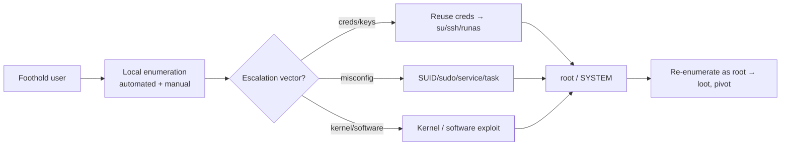

# Privilege Escalation

## Up
- [[CTF]]

You have a foothold as a low-priv user (after [[Shell Stabilization]]). Now enumerate locally and escalate to **root** (Linux) / **SYSTEM** or **Domain Admin** (Windows/AD). The golden rule: **automated enum for breadth, manual checks for depth**, and re-enumerate after every privilege change.

## Subtopics
- [[Linux PrivEsc]] — SUID, sudo, cron, capabilities, kernel, GTFOBins
- [[Windows PrivEsc]] — tokens, services, registry, credentials, potatoes
- [[AD Quick Reference]] — Kerberoasting, AS-REP, BloodHound, lateral movement (full: [[Active Directory]])

## Related
- [[Password Cracking]] ([[Hashcat]]/[[John the Ripper]]) — crack hashes you loot
- [[Cloud Attack Concepts]] · [[Container Attack Concepts]] — if the box is cloud/K8s

---

## Universal First Moves

- **Who am I / what can I do:** `id`,`sudo -l` (Linux) · `whoami /all` (Windows).
- **Automated:** LinPEAS / WinPEAS / linux-smart-enumeration / PrivescCheck / Seatbelt.
- **Loot:** config files, history, SSH keys, DB creds, backups, `.git`, memory. **Reuse creds everywhere.**
- **GTFOBins** (Linux) / **LOLBAS** (Windows) — how to abuse a specific allowed binary.

---

## Always Grab the Flags

- Linux: `user.txt` usually in `/home/<user>/`, `root.txt` in `/root/`.
- Windows: `user.txt` in `C:\Users\<user>\Desktop\`, `root.txt`/`proof.txt` in `C:\Users\Administrator\Desktop\`.
- Then **loot for the report/next host**: hashes, keys, creds, interesting files.

---

## Quick Decision

| OS / situation | Go to |
|---|---|
| Linux shell | [[Linux PrivEsc]] |
| Windows standalone | [[Windows PrivEsc]] |
| Windows + domain (port 88/389/445, domain in hostname) | [[Active Directory]] |
| Found creds/hashes | reuse first, then [[Password Cracking]] |
