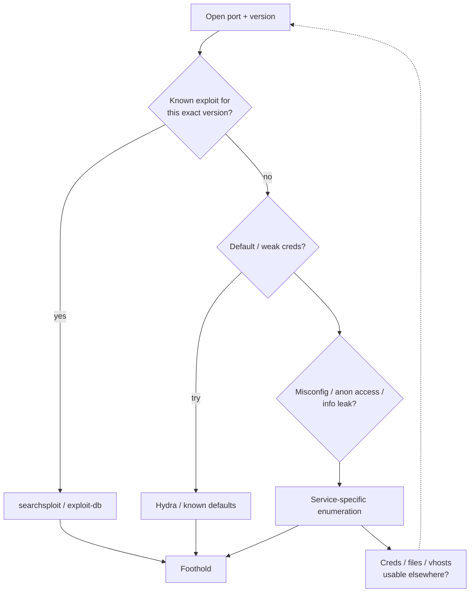

# Recon & Enumeration

## Up
- [[CTF]]

Step 1 of every box: find the open ports, identify the services/versions, and decide what to do with each. Enumeration is ~80% of a CTF — do it thoroughly. See [[Nmap]] for the tool depth; this note is the **CTF workflow**.

---

## Set Up First

```bash
export IP=10.10.10.10                     # target
export LHOST=$(ip -4 addr show tun0 | grep -oP '(?<=inet\s)\d+(\.\d+){3}')   # your VPN IP
mkdir -p ~/boxes/$IP/{nmap,loot,www,exploits} && cd ~/boxes/$IP
echo "$IP  box.thm target" | sudo tee -a /etc/hosts   # add hostname if the app needs it
```

Keep a running notes file per box: ports, versions, creds, foothold, privesc.

---

## The Nmap Workflow (fast → deep)

```bash
# 1) fast full-TCP port sweep — find WHICH ports are open
nmap -p- --min-rate 5000 -T4 $IP -oN nmap/allports.txt

# 2) deep scan of ONLY the open ports (versions + default scripts)
ports=$(grep '^[0-9]' nmap/allports.txt | cut -d/ -f1 | paste -sd, -)
nmap -sC -sV -p$ports $IP -oN nmap/deep.txt

# 3) UDP top ports (slow but catches SNMP/DNS/TFTP/SMB)
sudo nmap -sU --top-ports 100 $IP -oN nmap/udp.txt

# 4) targeted vuln scripts once you know the services
nmap --script vuln -p$ports $IP -oN nmap/vuln.txt
```

- `-sC` = default NSE scripts, `-sV` = version detection — the versions drive everything.
- Don't forget **UDP** (SNMP 161, DNS 53, TFTP 69, IKE 500).
- Re-run nmap after adding a **vhost/hostname** to `/etc/hosts` if the app redirects.

---

## Port Triage — the decision loop

For **every** open port, walk this loop:



- **Version → exploit:** `searchsploit <product> <version>` (offline exploit-db mirror). Update with `searchsploit -u`.
- **Creds:** try defaults, then targeted [[Hydra]] with usernames you found. **Reuse every credential on every service.**
- **Misconfig / info leak:** anonymous FTP, SMB null session, SNMP public, directory listing, exposed `.git`, verbose banners → often the real path in.
- **Pivoting info:** a username on one service, a vhost in a cert, an email in SMTP → feed the next port.

---

## Which Note for Which Port

See the index in [[CTF]] and the [[Services]] MOC. The common OSCP-relevant ports each have a dedicated note; the long tail is tabled in [[Services]].

---

## When You're Stuck (the checklist)

- Re-run `nmap -p-` (did you miss a high port?) and the **UDP** scan.
- Web: fuzz **directories AND vhosts/subdomains**, check source, `robots.txt`, default creds, other HTTP ports.
- Try creds you already have on **every** service (SSH, SMB, MySQL, RDP, WinRM…).
- Check **service versions** against searchsploit again — exact version matters.
- Look for **hostnames** (nmap `-sV`, TLS certs, HTTP redirects) → add to `/etc/hosts` → re-scan/re-fuzz.
- Enumerate **UDP/SNMP** — often overlooked and very chatty.
- Read banners/error messages carefully; they leak versions and paths.

---

## Handy One-Liners

```bash
searchsploit apache 2.4.49          # find public exploits
searchsploit -m 50383               # copy an exploit locally (-m = mirror)
nc -nv $IP 21                        # banner-grab a port manually
whatweb http://$IP                   # quick web fingerprint
```

**Next:** dive into the specific service note ([[Services]]), get a shell, then [[Shell Stabilization]] → [[Privilege Escalation]].
