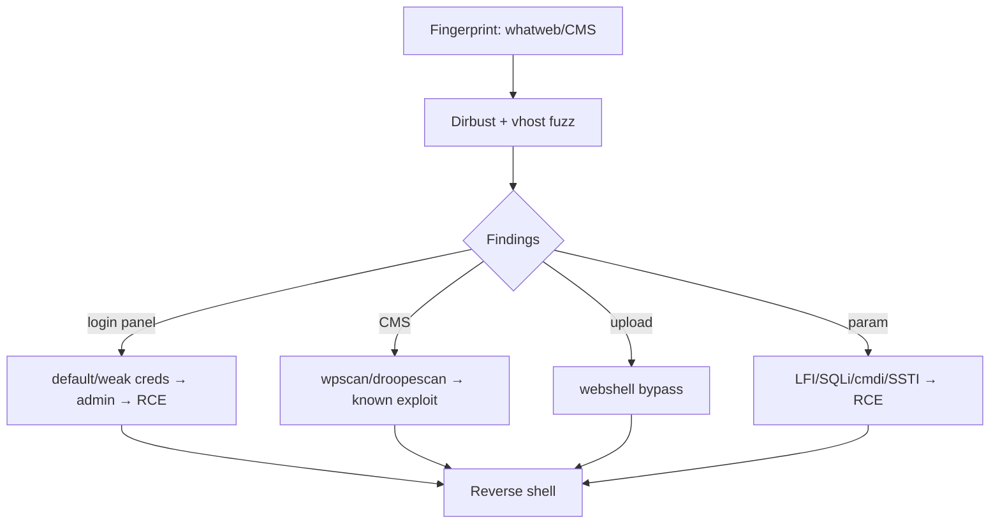

# HTTP (80,443)

## Up
- [[Services]]

Web is the **biggest attack surface** on most boxes and the most common foothold. For deep vuln theory see the [[Web]] category (PortSwigger/OWASP); this note is the **CTF enumeration → foothold** workflow. Also treat 8080/8000/8443/etc. as HTTP.

---

## Enumerate (methodical)

```bash
whatweb http://$IP ; curl -sI http://$IP          # fingerprint + headers
nmap --script http-enum,http-title -p80,443 $IP

# directory / file brute
gobuster dir -u http://$IP -w /usr/share/seclists/Discovery/Web-Content/directory-list-2.3-medium.txt -x php,txt,html,bak -t 50
feroxbuster -u http://$IP -x php,txt,html          # recursive (great default)
ffuf -u http://$IP/FUZZ -w wordlist.txt -e .php,.txt

# VHOST / subdomain fuzzing (add domain to /etc/hosts first)
ffuf -u http://$IP -H "Host: FUZZ.corp.local" -w subdomains.txt -fs <size-of-default>
gobuster vhost -u http://corp.local -w subdomains.txt --append-domain

# always check:
curl http://$IP/robots.txt ; view-source ; /sitemap.xml ; comments in HTML/JS
nikto -h http://$IP                                 # quick vuln sweep
```

Fingerprint the **CMS/framework** (WordPress, Drupal, Joomla, Tomcat, Jenkins…) → dedicated tool + `searchsploit`.

---

## Foothold Techniques (common CTF web paths)

```bash
# CMS-specific
wpscan --url http://$IP -e ap,u --api-token <t>     # WordPress: plugins/users → creds → theme editor RCE
droopescan scan drupal -u http://$IP                # Drupal (Drupalgeddon)
# Tomcat /manager, Jenkins /script (Groovy console), phpMyAdmin, Adminer → RCE

# default / weak creds on login panels → then admin features → RCE
hydra -l admin -P rockyou.txt $IP http-post-form "/login:user=^USER^&pass=^PASS^:F=invalid"

# file upload → webshell (bypass filters: .phtml, .php5, double ext, magic bytes, Content-Type)
# LFI → source/creds, log poisoning, php://filter, /etc/passwd, wrappers → RCE
curl "http://$IP/?page=../../../../etc/passwd"
# LFI → RCE via php filter chain / log poisoning / /proc/self/environ
# SQLi → auth bypass / dump creds / INTO OUTFILE webshell
sqlmap -u "http://$IP/item?id=1" --batch --dbs
# SSTI, command injection, XXE, deserialization, SSRF — see [[Web]]
```

### The web foothold loop


---

## Common Misconfigurations / Things to Always Check

- **Directory listing** enabled; exposed **`.git`** (`git-dumper`) → source + creds.
- **Backup files**: `index.php.bak`, `.swp`, `~`, `.zip`, `config.php`.
- **Default creds** on admin panels (admin/admin, tomcat/tomcat, jenkins).
- **Robots.txt / comments / JS** leaking endpoints, creds, API keys.
- **Upload** with weak validation → webshell; **LFI** → creds/keys/log-poison RCE.
- **Verbose errors** leaking paths, stack traces, DB info.
- **Separate vhosts** serving different apps on the same IP (fuzz Host header!).
- SSL cert (443) **CN/SAN** → hostnames → add to `/etc/hosts`.

---

## OSCP Tips

- **Enumerate exhaustively before exploiting:** dirbust *and* vhost-fuzz, check every port that speaks HTTP, read source/robots.
- Filter fuzzing noise with `-fs`/`-fc` (size/status) once you know the default response.
- Identify the exact **CMS/app + version** → `searchsploit` is often the whole box.
- Upload filters: try `.phtml/.php5/.pht`, double extensions, `Content-Type` swap, magic bytes.
- Creds found in web configs/DBs → **reuse** on [[SSH (22)]]/[[SMB (139,445)]]/[[MySQL (3306)]].
- Deep technique reference lives in [[Web]] (SQLi, LFI, SSTI, upload, SSRF, deserialization…).
