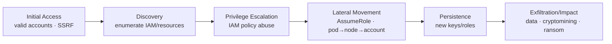

# Cloud Attack Concepts

## Up
- [[Cloud Pentesting]]

The core techniques behind cloud attacks — the concepts every cloud pentest tool automates. Cloud compromise is mostly about **identity, configuration, and metadata**, not binary exploits. Authorized environments only.

---

## Initial Access — how attackers get in

| Vector | Description |
|---|---|
| **Leaked credentials/keys** | Access keys in Git, S3, CI logs, `.env`, laptops, Pastebin |
| **SSRF → metadata** | App SSRF used to hit the instance metadata service (see below) |
| **Public resources** | World-readable S3/blob, public snapshots/AMIs, exposed databases |
| **Phishing / OAuth abuse** | Steal console creds or consent-grant a malicious app |
| **Vulnerable app on IaaS** | Classic RCE on an EC2/VM, then pivot to its role |
| **Exposed CI/CD & secrets** | Pipeline tokens with broad cloud permissions |

---

## Instance Metadata Service (IMDS) — the crown-jewel target

The metadata endpoint returns instance data **including temporary IAM role credentials**. Reaching it (often via **SSRF**) hands an attacker the instance's cloud permissions.

```bash
# AWS IMDSv1 (no auth — the dangerous legacy mode)
curl http://169.254.169.254/latest/meta-data/iam/security-credentials/
curl http://169.254.169.254/latest/meta-data/iam/security-credentials/<ROLE>
#   → AccessKeyId / SecretAccessKey / Token  →  use with aws CLI

# Azure IMDS (requires a header)
curl -H "Metadata: true" \
  "http://169.254.169.254/metadata/identity/oauth2/token?api-version=2018-02-01&resource=https://management.azure.com/"

# GCP metadata (requires a header)
curl -H "Metadata-Flavor: Google" \
  "http://metadata.google.internal/computeMetadata/v1/instance/service-accounts/default/token"
```

**Defense:** enforce **IMDSv2** (session-token, hop-limit) on AWS; block egress to `169.254.169.254` from apps; least-privilege instance roles. IMDS abuse via SSRF was the mechanism in major cloud breaches.

---

## Enumeration (Discovery)

Once you have any credentials, learn *who you are* and *what you can do*:

```bash
# AWS — identity + permissions
aws sts get-caller-identity
aws iam get-account-authorization-details
aws iam list-attached-user-policies --user-name X
aws s3 ls ; aws ec2 describe-instances ; aws secretsmanager list-secrets

# Azure
az account show ; az role assignment list --assignee <id>
az resource list

# GCP
gcloud auth list ; gcloud projects list
gcloud projects get-iam-policy <proj>
```

Tools like [[ScoutSuite]]/[[Prowler]] automate the read-only enumeration across the whole account.

---

## IAM Privilege Escalation (the heart of cloud attacks)

Over-permissioned identities let you grant yourself more power. Classic AWS privesc primitives:

| Permission held | Escalation |
|---|---|
| `iam:CreateAccessKey` | Make keys for a more-privileged user |
| `iam:AttachUserPolicy` / `PutUserPolicy` | Attach `AdministratorAccess` to yourself |
| `iam:CreatePolicyVersion` | Rewrite a policy you're attached to |
| `iam:PassRole` + `ec2:RunInstances` | Launch an instance with an admin role, steal its creds |
| `lambda:CreateFunction` + `iam:PassRole` | Run code as a privileged role |
| `sts:AssumeRole` (loose trust) | Assume a more-privileged role |

[[Pacu]]'s `iam__privesc_scan` automates finding and abusing these paths.

---

## Common Misconfigurations

- **Public storage** — S3 buckets / Azure blobs / GCS open to `AllUsers`.
- **Wildcard IAM** — `Action:"*" Resource:"*"`; overly broad trust policies.
- **Exposed secrets** — keys in user-data, env vars, unencrypted params.
- **Open network** — security groups/NSGs allowing `0.0.0.0/0` to SSH/RDP/DB.
- **Unencrypted / public snapshots & AMIs** — data leakage.
- **Disabled logging** — CloudTrail/Activity Log off = blind defenders.
- **No MFA on privileged/root** accounts.

---

## Persistence

- Create new IAM **users/access keys** or a **backdoor role** with a trust policy to an attacker account.
- Add a **Lambda trigger** or scheduled task that re-creates access.
- Console login profile on a service account; modify existing policies subtly.
- Leave a role assumable cross-account (stealthier than a new user).

---

## Container & Kubernetes Attacks

Cloud pentests increasingly land in **Kubernetes** (EKS/AKS/GKE):

- **Exposed components** — kubelet (10250), etcd (2379), dashboard, API server (6443) without auth.
- **Over-privileged ServiceAccounts / RBAC** — a pod token that can create pods, read secrets, or is cluster-admin.
- **Container escape** — privileged containers, `hostPath` mounts, host PID/network namespaces → break out to the node.
- **Cloud pivot** — a pod hitting the **node's IMDS** to steal the node IAM role → full account.

Tools: [[kube-hunter]] (find the surface), [[Peirates]] (exploit from inside a pod), kube-bench (CIS check). See [[Kubernetes]].

---

## Mapping to MITRE ATT&CK (Cloud)



See [[MITRE ATT&CK]] for the technique-level detail.

---

## Takeaways

- **Identity is the perimeter** — enumerate your permissions first, then hunt privesc paths.
- **IMDS + SSRF** is the signature cloud pivot; IMDSv2 and egress control are the fixes.
- **Misconfiguration, not malware**, is the usual root cause — public buckets and wildcard IAM.
- From Kubernetes, the goal is often **pod → node → cloud account** via the node's metadata role.
