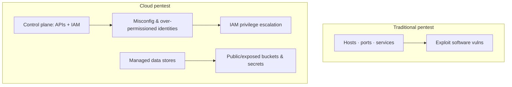
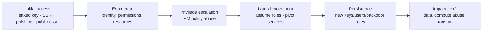

# Cloud Pentesting

## Up
- [[Hacking]]

Cloud penetration testing assesses the security of cloud environments (AWS, Azure, GCP) and cloud-native platforms (Kubernetes, serverless, containers). It's fundamentally different from traditional pentesting: the target is a **control plane of APIs and IAM**, not just hosts and ports — so misconfigurations and identity/permission flaws matter more than memory-corruption exploits. Start with **[[Cloud Attack Concepts]]**, then the tooling.

> **Scope & provider rules:** you can only test cloud assets **you own or are authorized to test**, and each provider has a **penetration-testing policy** — some activities (e.g. DoS/DDoS, testing shared/managed services) still require notification or approval. Read AWS/Azure/GCP pentest rules *before* testing. Educational reference.

## Subtopics
- [[Cloud Attack Concepts]] — shared responsibility, IAM privesc, IMDS/SSRF, misconfig, the cloud kill chain
- [[Pacu]] — AWS exploitation framework (enumerate → escalate → persist)
- [[ScoutSuite]] — multi-cloud security auditing / posture review
- [[Prowler]] — multi-cloud & Kubernetes security assessment (CIS benchmarks)
- [[kube-hunter]] — Kubernetes attack-surface scanner
- [[Peirates]] — Kubernetes privilege escalation & post-exploitation

## Related (defensive / platform side)
- [[AWS]] · [[Azure]] — the platforms under test
- [[Kubernetes]] — cluster attacks target this; see also [[Service Mesh]]
- [[Methodology]] — [[PTES]] lifecycle, [[MITRE ATT&CK]] (Cloud matrix)

---

## Why Cloud Is Different

- The **attack surface is identity + configuration**: roles, policies, keys, trust relationships, and exposed managed services.
- **Misconfiguration is the #1 root cause** (public buckets, wide IAM, open security groups, default creds), not unpatched binaries.
- Actions leave **API/CloudTrail logs** — noisy, but also how attackers are caught.
- Everything is **API-driven**, so the provider's CLI/SDK (`aws`, `az`, `gcloud`, `kubectl`) is your primary "exploit" tool.

---

## Shared Responsibility (what's even in scope)

| Layer | AWS/Azure/GCP secures | Customer secures (your scope) |
|---|---|---|
| Physical / hypervisor | ✅ Provider | — |
| Managed service internals | ✅ Provider | — |
| **IAM, config, data, network rules** | — | ✅ **You** — this is what you test |
| OS/app on IaaS (EC2/VM) | — | ✅ You |

You test the **customer** side. Attacking the provider's underlying infrastructure is out of scope (and illegal).

---

## The Cloud Attack Path (typical)

Maps to the **[[MITRE ATT&CK]] Cloud matrix** (Initial Access → Discovery → Privilege Escalation → Lateral Movement → Exfiltration).

---

## Tool Landscape at a Glance

| Tool | Cloud | Role |
|---|---|---|
| **[[ScoutSuite]]** | AWS/Azure/GCP/OCI/Alibaba | Read-only posture audit (offense recon + defense) |
| **[[Prowler]]** | AWS/Azure/GCP/K8s | Config assessment vs CIS/compliance benchmarks |
| **[[Pacu]]** | AWS | Active **exploitation** framework (attack, don't just audit) |
| **[[kube-hunter]]** | Kubernetes | Remote/where-am-I cluster attack-surface scanning |
| **[[Peirates]]** | Kubernetes | Hands-on **privesc/lateral movement** from inside a pod |
| kube-bench | Kubernetes | CIS benchmark check (defensive; complements above) |

**Audit vs attack:** ScoutSuite/Prowler *find* misconfigurations (assessment); Pacu/Peirates *exploit* them (active pentest).

---

## Takeaways

- In cloud, **identity is the new perimeter** — IAM misconfig and over-permissioned roles are the main path to compromise.
- Always confirm **ownership + the provider's pentest policy** before touching anything.
- Combine **posture tools** (ScoutSuite/Prowler) for breadth with **exploitation tools** (Pacu/Peirates) for proof of impact.
- The provider CLI/SDK is the real weapon; the frameworks just automate enumeration and known privesc paths.
