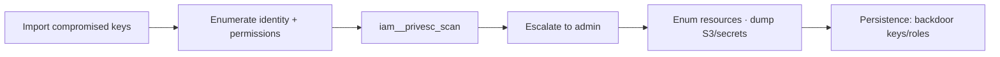

# Pacu

## Up
- [[Cloud Pentesting]]

Pacu (by Rhino Security Labs) is the leading **open-source AWS exploitation framework** — think "Metasploit for AWS." It's **offensive**, not just an auditor: modules enumerate an account, find and abuse IAM privilege-escalation paths, establish persistence, and pivot. Use only against AWS accounts you're authorized to test, and mind the AWS pentest policy. See [[Cloud Attack Concepts]] and [[AWS]].

---

## Setup & Sessions

```bash
pip install pacu        # or git clone RhinoSecurityLabs/pacu
pacu                    # launch the interactive console

# inside Pacu:
> import_keys default   # pull creds from ~/.aws/credentials profile
> set_keys              # or paste an access key / secret / token manually
> whoami                # show current key's identity & gathered data
```

Pacu keeps a **session** (SQLite-backed) storing all enumerated data — keys, users, roles, resources — so modules build on each other.

---

## Console Basics

```text
help                       # list commands
list / ls                  # list available modules
search iam                 # find modules by keyword
help <module>              # module description + args
run <module> [args]        # execute a module
data                       # dump everything gathered this session
services                   # AWS services with collected data
regions / set_regions us-east-1 eu-west-1
swap_keys                  # switch between imported key sets
exec / aws <cli...>        # run raw aws CLI with the session creds
```

---

## Module Categories & Key Modules

Modules are named `category__action`:

| Category | Example modules | Purpose |
|---|---|---|
| **recon/enum** | `iam__enum_users_roles_policies_groups`, `ec2__enum`, `s3__enum` | Map the account |
| **privesc** | `iam__privesc_scan` | Find & exploit IAM privilege-escalation paths |
| **persistence** | `iam__backdoor_users_keys`, `iam__backdoor_assume_role` | Maintain access |
| **exfil / data** | `s3__download_bucket`, `secrets__enum` | Grab data & secrets |
| **evasion** | `detection__disruption`, `cloudtrail__download_event_history` | Tamper with logging |
| **lateral** | `ec2__startup_shell_script`, `lambda__backdoor_new_roles` | Pivot / execute |

### The signature workflow

```text
> run iam__enum_permissions           # what can this identity do?
> run iam__privesc_scan               # auto-find privesc → often self-grant admin
> run ec2__enum --instances
> run s3__enum && run s3__download_bucket
> run iam__backdoor_users_keys        # persistence (if in scope)
```

`iam__privesc_scan` is the star — it checks the ~20+ known AWS IAM privesc primitives (see [[Cloud Attack Concepts]]) against your permissions and can escalate automatically.

---

## Typical Engagement Flow



Starts from **already-obtained credentials** (leaked key, SSRF→IMDS, compromised instance) — Pacu is post-access exploitation, not initial access.

---

## Tips

- Always `whoami` / run the permissions enum first — modules fail loudly without the right IAM rights, and that itself maps your access.
- Pacu **logs to CloudTrail** like any API caller; use evasion modules only if in scope, and expect detection.
- Use `exec aws ...` to run arbitrary CLI with session creds when no module fits.
- Pair with **[[ScoutSuite]]/[[Prowler]]** for read-only breadth first, then Pacu to *prove* exploitability.
- Great for demonstrating the impact of a single leaked key → full-account compromise in a report.
