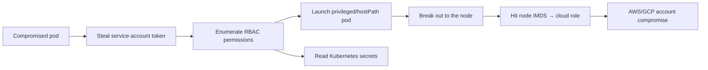

# Peirates

## Up
- [[Cloud Pentesting]]

## Related
- [[Container & K8s Security]] — defensive/hardening side ([[Trivy]], [[kube-bench]], [[Falco]])

Peirates (by InGuardians) is a **Kubernetes penetration-testing / post-exploitation** tool designed to run **from inside a compromised pod**. Where [[kube-hunter]] finds the attack surface, Peirates **exploits a foothold** — harvesting service-account tokens, abusing RBAC, launching privileged/host-mounting pods to escape to the node, and pivoting into the **cloud account** via node metadata. Authorized clusters only. See [[Cloud Attack Concepts]] and [[Kubernetes]].

---

## The Scenario It's Built For

You already have code execution in a container (RCE on an app, a malicious image, etc.). Peirates automates "**now what?**":



---

## Running It

```bash
# typically dropped into a pod you control, then:
./peirates                 # launches an interactive numbered menu
```

Peirates presents a **menu-driven** interface (numbered options) rather than a command language — pick an action, it runs the corresponding technique using the pod's mounted service-account token and reachable APIs.

On start it auto-grabs the pod's service-account token and namespace from `/var/run/secrets/kubernetes.io/serviceaccount/` and locates the API server.

---

## Capability Areas (menu options)

| Area | What it does |
|---|---|
| **Token harvesting** | Grab the current pod's SA token; collect tokens from other pods/secrets |
| **RBAC enumeration** | List what the token can do (`can-i` style), find powerful verbs |
| **Secret access** | List/read Kubernetes `secrets` if permitted |
| **Pod creation** | Launch attacker pods — **privileged**, `hostPath` mount of `/`, host PID/network |
| **Node escape** | Use those pods to gain access to the underlying node/host filesystem |
| **kubelet abuse** | Interact with exposed kubelet (list/exec pods) |
| **Cloud pivot** | Query **AWS/GCP metadata** from the node/pod to steal instance credentials |
| **Lateral movement** | Move to other pods/namespaces with harvested tokens |

---

## The Signature Attack Chain

1. **Token theft** — read the mounted SA token.
2. **RBAC recon** — determine the token's powers (can it create pods? read secrets? is it cluster-admin?).
3. **Escalate** — if allowed, create a **privileged pod** that mounts the host filesystem (`hostPath: /`).
4. **Node breakout** — from that pod, access the node's files/processes (effectively root on the node).
5. **Cloud pivot** — from the node, hit **IMDS** (`169.254.169.254`) to steal the node's **cloud IAM role** → full cloud-account access (feed into [[Pacu]] for AWS).

This **pod → node → cloud account** path is the crown-jewel Kubernetes escalation.

---

## Where It Fits vs Other K8s Tools

| Tool | Role |
|---|---|
| **[[kube-hunter]]** | Discover the attack surface (external/insider scan) |
| **Peirates** | **Exploit** from a foothold — privesc, token theft, node/cloud pivot |
| **kube-bench** | Defensive CIS benchmark check |
| **[[Prowler]] k8s** | Config/compliance assessment |

---

## Tips

- Peirates assumes an **existing foothold** — it's post-exploitation, not initial access.
- The most impactful outcomes are **reading secrets**, **privileged pod → node escape**, and the **cloud metadata pivot** — prioritise checking those RBAC verbs first.
- Over-permissioned **ServiceAccount tokens** and clusters that allow **privileged/hostPath pods** are what make the chain work — note them as findings.
- **Defense:** least-privilege RBAC, disable auto-mounted SA tokens where unused, admission control (Kyverno/OPA/Pod Security) to block privileged/hostPath pods, and enforce **IMDSv2 + hop limit** so pods can't reach node credentials. See [[Kubernetes]].
