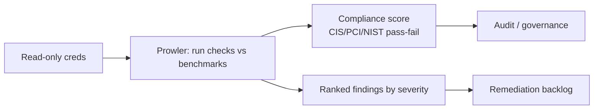

# Prowler

## Up
- [[Cloud Pentesting]]

Prowler is an open-source **multi-cloud security assessment** tool with hundreds of checks mapped to **security benchmarks and compliance frameworks** (CIS, PCI-DSS, HIPAA, NIST, GDPR, SOC2, FedRAMP, and more). It's read-only assessment focused on **posture and compliance scoring** — the benchmark-oriented complement to [[ScoutSuite]]. Authorized accounts only.

---

## Supported Providers

AWS · Azure · Google Cloud (GCP) · Kubernetes (and growing). Modern Prowler (v3/v4+) is a Python tool covering all of these.

---

## Install & Run

```bash
pip install prowler        # or: brew install prowler / docker / git clone prowler-cloud/prowler
prowler --help

# AWS (uses your aws credentials/profile/role)
prowler aws
prowler aws -p pentest-profile
prowler aws -f us-east-1 eu-west-1        # specific regions

# Azure / GCP / Kubernetes
prowler azure --az-cli-auth
prowler gcp --credentials-file key.json
prowler kubernetes --kubeconfig-file ~/.kube/config
```

---

## Targeting Checks

```bash
prowler aws --compliance cis_2.0_aws       # run a specific benchmark
prowler aws --list-compliance              # all available frameworks
prowler aws --list-checks
prowler aws -c iam_root_mfa_enabled iam_user_mfa_enabled   # specific checks
prowler aws --service s3 iam ec2           # whole services
prowler aws --severity critical high       # filter by severity
prowler aws --excluded-checks <id>...
```

| Concept | Meaning |
|---|---|
| **Check** | One control test (e.g. `s3_bucket_public_access`) |
| **Service** | Group of checks for a cloud service |
| **Compliance framework** | A named benchmark mapping (CIS, PCI, NIST…) |
| **Severity** | critical / high / medium / low / informational |

---

## Output & Reporting

```bash
prowler aws -M csv json-ocsf html          # multiple output formats
prowler aws -M html                        # human-readable report
prowler aws --output-directory ./out --output-filename acme
prowler dashboard                          # local web dashboard of results (v4+)
```

Formats include CSV, JSON/JSON-OCSF, HTML, and it can push findings to **AWS Security Hub** (`--security-hub`). OCSF/JSON is ideal for feeding SIEMs and pipelines.

---

## Where It Fits



- Great in **CI/CD** and scheduled scans for continuous compliance (fails builds on drift).
- In a pentest, use it to quickly surface benchmark failures (public buckets, no MFA, IMDSv1) as leads → prove impact with [[Pacu]].

---

## Prowler vs ScoutSuite

| | Prowler | [[ScoutSuite]] |
|---|---|---|
| Strength | **Compliance/benchmark** scoring (CIS, PCI, NIST…) | Rich **HTML** misconfiguration overview |
| Output | CLI + CSV/JSON/HTML/OCSF, Security Hub, dashboard | Single visual HTML report |
| Automation | Excellent for CI/CD, pipelines, SIEM | Point-in-time review |
| Clouds | AWS/Azure/GCP/K8s | AWS/Azure/GCP/OCI/Alibaba |

Complementary — Prowler for "are we compliant?", ScoutSuite for "show me the posture."

---

## Tips

- Start with a benchmark: `prowler aws --compliance cis_2.0_aws` gives an instant pass/fail baseline.
- Filter by `--severity critical high` to cut noise on first pass.
- Read-only, but it's many API calls — expect it in CloudTrail and mind rate limits on huge accounts.
- Schedule it (cron/CI) for **continuous** posture; export JSON-OCSF to your SIEM.
- Pair with [[kube-hunter]]/[[Peirates]] for the Kubernetes attack side vs Prowler's K8s config checks.
