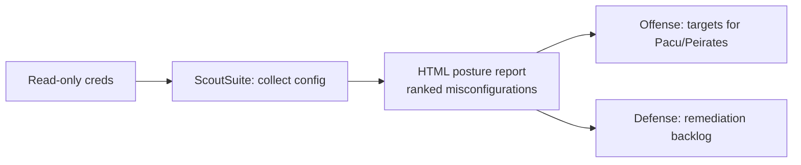

# ScoutSuite

## Up
- [[Cloud Pentesting]]

ScoutSuite (by NCC Group) is an open-source **multi-cloud security auditing** tool. Using the provider's **read-only APIs**, it collects configuration across an account and generates an offline **HTML report** highlighting risky settings — public storage, weak IAM, open network rules, missing encryption/logging. It's assessment/recon (it doesn't exploit), useful to both red and blue teams. Read-only, but still authorized-accounts only.

---

## Supported Providers

AWS · Azure · Google Cloud (GCP) · Oracle Cloud (OCI) · Alibaba Cloud.

---

## Install & Run

```bash
pip install scoutsuite            # or git clone nccgroup/ScoutSuite
scout --help

# AWS (uses your configured credentials / profile / role)
scout aws
scout aws --profile pentest
scout aws --regions us-east-1,eu-west-1

# Azure (various auth methods)
scout azure --cli                 # use az CLI login
scout azure --service-principal --tenant <t> --client-id <c> --client-secret <s>

# GCP
scout gcp --user-account
scout gcp --service-account key.json --project-id my-proj
```

Output: a self-contained report under `scoutsuite-report/` → open `scoutsuite-report/*.html` in a browser.

---

## What It Checks (examples)

| Area | Flags |
|---|---|
| **IAM** | Users without MFA, wide policies, unused keys, root usage |
| **Storage** | Public S3/blob/GCS buckets, no encryption, no logging |
| **Network** | Security groups/NSGs open to `0.0.0.0/0`, open mgmt ports |
| **Compute** | Public IPs, unencrypted volumes, IMDSv1 allowed |
| **Logging** | CloudTrail/Activity Log disabled, no log validation |
| **Databases** | Public RDS/SQL, no encryption, weak backups |
| **KMS/Secrets** | Key rotation, exposure |

Findings are color-ranked (danger/warning) with the affected resources listed and drill-down detail.

---

## Useful Options

```bash
scout aws --report-dir ./out --report-name acme
scout aws --ruleset custom.json          # custom finding rules/severities
scout aws --services s3 iam ec2          # limit to specific services
scout aws --exceptions exceptions.json   # suppress known/accepted findings
scout aws --max-workers 10               # parallelism
scout aws --no-browser                   # don't auto-open the report
```

---

## Where It Fits



- **Offense:** fast breadth-first recon — spot the public bucket / wide role, then prove it with [[Pacu]].
- **Defense:** a periodic posture snapshot and remediation list.

---

## ScoutSuite vs Prowler

| | ScoutSuite | [[Prowler]] |
|---|---|---|
| Output | Rich **HTML** report, visual drill-down | CLI checks + CIS/compliance mappings, many formats |
| Angle | Broad misconfiguration review | Benchmark/compliance (CIS, PCI, etc.) + assessment |
| Clouds | AWS/Azure/GCP/OCI/Alibaba | AWS/Azure/GCP/K8s |
| Best when | You want a readable posture overview | You need compliance/benchmark scoring |

Run both — they overlap but surface different things.

---

## Tips

- Purely **read-only** — safe to run, but it *is* API activity and appears in logs.
- Use **exceptions** files to mute accepted risks so reports stay signal-rich over time.
- Feed its findings into [[Cloud Attack Concepts]] thinking: public storage → data, wide IAM → [[Pacu]] privesc.
- Diff reports across runs to track drift/remediation.
