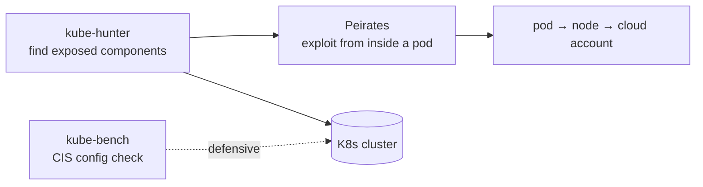

# kube-hunter

## Up
- [[Cloud Pentesting]]

## Related
- [[Container & K8s Security]] — defensive/hardening side ([[Trivy]], [[kube-bench]], [[Falco]])

kube-hunter (originally Aqua Security) probes **Kubernetes clusters for security weaknesses** — exposed components, open ports, weak configs, and information disclosure. It maps a cluster's **attack surface** from an attacker's viewpoint. Pair it with [[Peirates]] (hands-on exploitation) and kube-bench (CIS config check). Authorized clusters only. See [[Kubernetes]].

> **Status note:** the upstream project has been **archived / is no longer actively maintained** (Aqua deprecated it in favour of Trivy-based tooling). It's still a useful learning tool and quick surface scanner; for current assessments also use **kube-bench**, **Trivy (k8s)**, and **[[Prowler]] kubernetes**.

---

## Scanning Modes

```bash
# pip / source
pip install kube-hunter
kube-hunter                       # interactive: choose a scan option

# remote scan (from outside — attacker perspective)
kube-hunter --remote <cluster-ip>

# network CIDR scan
kube-hunter --cidr 10.0.0.0/24

# interface scan (scan the networks this host is on)
kube-hunter --interface

# pod mode — run INSIDE the cluster as a pod (max discovery)
kubectl apply -f job.yaml          # official kube-hunter Job manifest
```

| Mode | Perspective |
|---|---|
| `--remote <ip>` | External attacker hitting a known cluster IP |
| `--cidr <range>` | Sweep a network range for clusters |
| `--interface` | Scan networks local to the scanning host |
| **pod mode** (Job) | Insider — "what can a compromised pod reach?" (most thorough) |

---

## What It Looks For

- **Exposed API server** (6443), **kubelet** (10250/10255 read-only), **etcd** (2379), **dashboard**, **cAdvisor**.
- Anonymous/unauthenticated access to those components.
- Kubelet endpoints allowing pod listing, exec, or container command execution.
- Service-account token exposure and access to the metadata service from pods.
- Version disclosure → known CVEs.

Findings are grouped as **vulnerabilities** with categories and severity; `--active` goes beyond passive detection.

---

## Passive vs Active

```bash
kube-hunter --remote <ip>            # passive: detect only (default, safe)
kube-hunter --remote <ip> --active   # active: attempt to exploit/prove findings
```

- **Passive** (default) — enumerates and reports without changing anything.
- **Active** (`--active`) — actually tries techniques (e.g. exec via kubelet). More proof, more risk — in-scope engagements only.

---

## Output

```bash
kube-hunter --remote <ip> --report json    # json | yaml | plain
kube-hunter --remote <ip> --report json --log warning
kube-hunter --mapping                       # show the cluster's discovered nodes/services map
```

Each finding references a **KHV** ID (kube-hunter vuln ID) with an explanation and remediation.

---

## Where It Fits



- **kube-hunter** = *where are the holes* (attack surface).
- **[[Peirates]]** = *exploit them* from a foothold (privesc, token theft, cloud pivot).
- **kube-bench** = *is the config CIS-compliant* (defensive baseline).

---

## Tips

- **Pod mode** (running it as a Job in-cluster) reveals the realistic insider surface — what a compromised container can reach — which remote scans miss.
- Keep it **passive** unless active exploitation is explicitly in scope.
- Because it's archived, treat results as a starting point and cross-check with **kube-bench**, **Trivy k8s**, and **[[Prowler]]**.
- A compromised pod reaching the **node's IMDS** to steal the node IAM role is the key K8s→cloud escalation — see [[Cloud Attack Concepts]].
