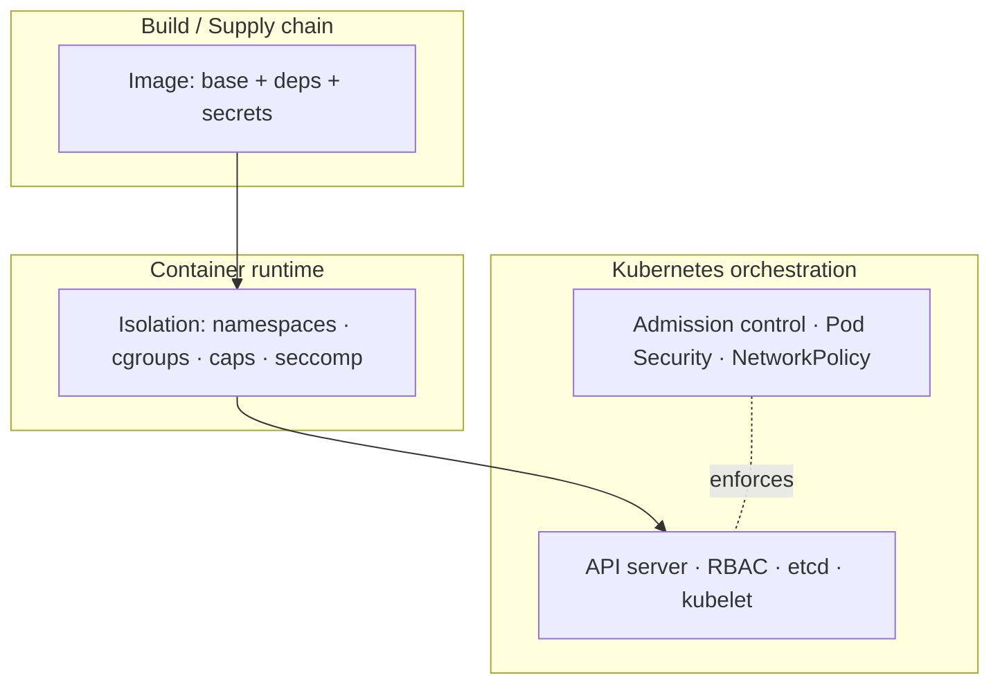
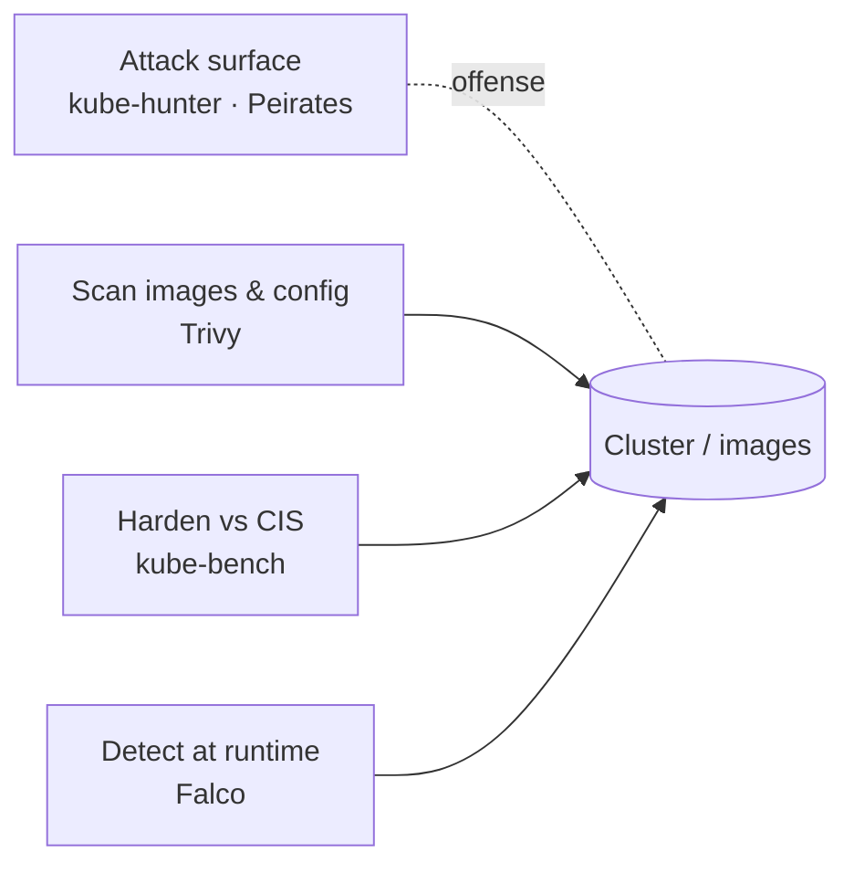

# Container & K8s Security

## Up
- [[Hacking]]

Security of containers (Docker/OCI) and Kubernetes — the attack surface unique to containerized workloads (isolation boundaries, escapes, image supply chain, cluster RBAC) and the tooling to find and stop problems. This category leans **defensive/assessment**; the offensive "attack a cloud-hosted cluster" tooling lives in [[Cloud Pentesting]] ([[kube-hunter]], [[Peirates]]) and is cross-linked throughout. Test only clusters/images you own or are authorized to assess.

## Subtopics
- [[Container Attack Concepts]] — isolation (namespaces/cgroups/caps), container escapes, image supply chain, the K8s attack surface
- [[Trivy]] — all-in-one scanner: images, filesystems, IaC, secrets, SBOM, K8s
- [[kube-bench]] — CIS Kubernetes Benchmark checker (node/control-plane hardening)
- [[Falco]] — runtime threat detection from syscalls/eBPF

## Related
- [[kube-hunter]] · [[Peirates]] — offensive K8s tools (attack surface + exploitation) in [[Cloud Pentesting]]
- [[Cloud Attack Concepts]] — the pod → node → cloud-account escalation path
- [[Kubernetes]] · [[Docker]] — the platforms (defensive/ops side)
- [[Cloud Pentesting]] · [[Methodology]] — where these fit in an engagement

---

## The Layers to Secure

| Layer | What can go wrong | Tooling |
|---|---|---|
| **Image / supply chain** | Vulnerable base, secrets in layers, malicious/unsigned images | [[Trivy]], Grype, Clair, cosign/SBOM |
| **Runtime isolation** | Privileged containers, host mounts, weak caps → **escape** | Falco (detect), seccomp/AppArmor, gVisor |
| **Cluster config** | Weak RBAC, exposed kubelet/etcd, no admission control | [[kube-bench]], [[Trivy]] k8s, [[kube-hunter]] |
| **Runtime behaviour** | Reverse shells, crypto-mining, anomalous syscalls | [[Falco]] |

---

## Scan vs Harden vs Detect vs Attack

- **Scan (shift-left):** [[Trivy]] in CI/CD — catch vulns, misconfig, secrets before deploy.
- **Harden:** [[kube-bench]] (CIS benchmark) + **Docker Bench** for host/daemon.
- **Detect (runtime):** [[Falco]] alerts on suspicious behaviour in running containers.
- **Attack (validate):** [[kube-hunter]]/[[Peirates]] prove the exposure — in [[Cloud Pentesting]].

---

## The Core Threat: Escape & Escalate

The defining container risk is **breaking isolation**: a compromised container escaping to the **node**, then using node credentials to reach the **cloud account** — the *pod → node → cloud* chain (see [[Container Attack Concepts]] and [[Cloud Attack Concepts]]). Everything here exists to prevent, detect, or demonstrate that path.

---

## Takeaways

- Containers are **isolation, not virtualization** — a shared kernel means **escapes** are the central risk.
- Cover all four moves: **scan** images/config ([[Trivy]]), **harden** the cluster ([[kube-bench]]), **detect** at runtime ([[Falco]]), and **validate** offensively ([[kube-hunter]]/[[Peirates]]).
- Most real incidents start with a **vulnerable image or a misconfigured pod/RBAC**, not a kernel 0-day — shift-left scanning + Pod Security + least-privilege RBAC handle the bulk.
