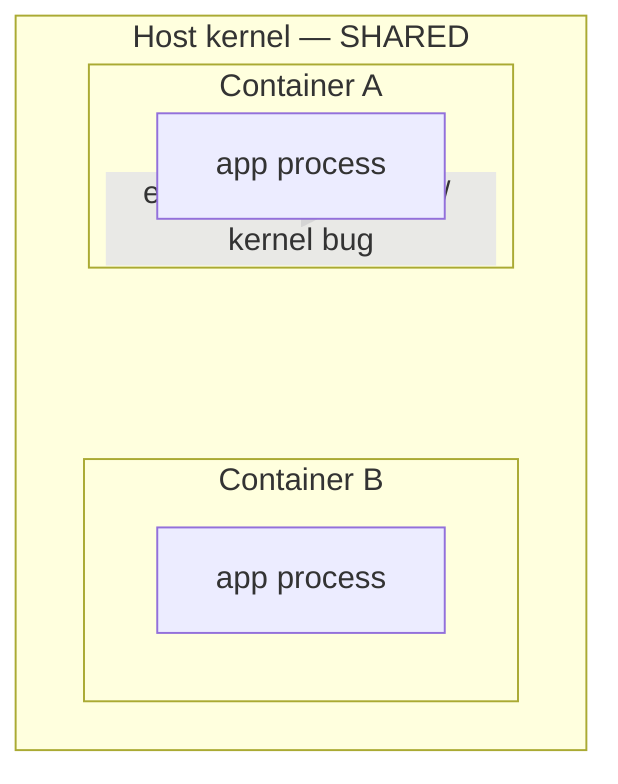
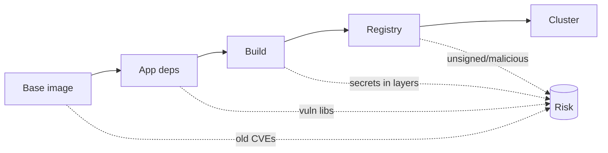

# Container Attack Concepts

## Up
- [[Container & K8s Security]]

The theory behind container and Kubernetes attacks — how isolation works, how it breaks (escapes), and where the cluster's attack surface lies. Every tool in this category exists to find, stop, or demonstrate these. Authorized environments only.

---

## How Container Isolation Works

A container is **not a VM** — it's a normal process on the host kernel, "boxed in" by Linux primitives:

| Primitive | Isolates | Attack relevance |
|---|---|---|
| **Namespaces** | What a process *sees* — `pid`, `net`, `mnt`, `uts`, `ipc`, `user`, `cgroup` | Sharing a host namespace (`hostPID`/`hostNetwork`) breaks the box |
| **cgroups** | Resource limits (CPU/mem/pids) | DoS if unbounded; not a security boundary by itself |
| **Capabilities** | Slices of root power (e.g. `CAP_SYS_ADMIN`, `CAP_NET_RAW`) | Extra caps enable escapes |
| **seccomp** | Allowed syscalls | Unconfined seccomp widens escape options |
| **AppArmor / SELinux** | Mandatory access control | Often disabled → fewer guardrails |

**Key point:** the **kernel is shared**. A kernel exploit or a misconfigured box lets a container become the host. Stronger isolation (gVisor, Kata Containers, Firecrawl microVMs) exists for hostile workloads.



---

## Container Escape Vectors

The crown-jewel goal: **break out to the node**. Common paths:

| Vector | Why it works |
|---|---|
| **Privileged container** (`--privileged`) | Nearly all caps + device access → mount host disk, load modules |
| **hostPath mount** (`/` or `/etc`, `/root`) | Direct read/write to host filesystem |
| **Host namespaces** (`hostPID`, `hostNetwork`, `hostIPC`) | See/kill host processes, sniff host traffic |
| **Docker socket mount** (`/var/run/docker.sock`) | Talk to the Docker daemon = root on host (spawn a privileged container) |
| **Dangerous capabilities** (`CAP_SYS_ADMIN`, `CAP_SYS_PTRACE`, `CAP_DAC_OVERRIDE`) | Mount, ptrace, bypass file perms |
| **Kernel / runtime CVEs** | e.g. **runc** `CVE-2019-5736` (overwrite runc), **"Leaky Vessels"** `CVE-2024-21626` |
| **Writable `/proc`, core_pattern, release_agent** | Classic cgroup `release_agent` escape with `CAP_SYS_ADMIN` |

```bash
# quick "am I in a container / how boxed am I" checks (recon inside a container)
cat /proc/1/cgroup            # container runtime hints
capsh --print                 # what capabilities do I have?
mount | grep -i host          # suspicious host mounts
ls -la /var/run/docker.sock   # docker socket exposed?
env | grep -i kube            # service account / kube env
```

---

## Image & Supply-Chain Risks

- **Vulnerable base images / dependencies** — outdated packages with CVEs (scan with [[Trivy]]/Grype).
- **Secrets baked into layers** — API keys, `.env`, private keys committed into the image (visible in history even if "deleted" in a later layer).
- **Malicious / typosquatted images** — public registry images with backdoors or miners.
- **Unsigned / untrusted images** — no provenance; fix with **cosign/Sigstore** signing + **SBOM** + admission policy requiring signatures.
- **`latest` tag drift** — non-reproducible deploys; pin by digest.



---

## The Kubernetes Attack Surface

| Component | Exposure |
|---|---|
| **API server (6443)** | The control plane; anonymous/over-permissive access = game over |
| **etcd (2379)** | Stores all cluster state **incl. secrets** in plaintext if unencrypted; unauth = full compromise |
| **kubelet (10250)** | Node agent; unauth `exec`/`run` = code exec in pods |
| **Dashboard** | Historically exposed with cluster-admin (Tesla breach) |
| **Service Account tokens** | Auto-mounted in pods; over-privileged tokens enable cluster takeover |
| **RBAC** | Wildcard verbs, `cluster-admin` bindings, `create pods`/`get secrets` → privesc |
| **Cloud metadata (IMDS)** | A pod reaching the node's IMDS steals the node's cloud role → [[Cloud Attack Concepts]] |

### RBAC privesc primitives (examples)
- `create pods` (+ a privileged/hostPath pod spec) → escape to node.
- `get/list secrets` → harvest credentials/tokens.
- `create clusterrolebindings` or `escalate`/`bind` → grant yourself cluster-admin.
- `pods/exec` → run in existing pods.

```bash
kubectl auth can-i --list                 # what can this token do?
kubectl auth can-i create pods
kubectl get secrets -A                    # if allowed → jackpot
```

---

## Defense-in-Depth (what stops the above)

- **Pod Security Standards** (`restricted`) / admission control (**Kyverno**, **OPA Gatekeeper**) — block privileged, hostPath, host namespaces, `runAsRoot`.
- **Least-privilege RBAC**; disable auto-mount of SA tokens where unused.
- **NetworkPolicies** (default-deny) to stop lateral movement; segment namespaces.
- **Encrypt etcd** at rest; authenticate kubelet/API; never expose the dashboard.
- **seccomp/AppArmor**, drop all caps + add back only needed ones, read-only root FS, non-root UID.
- **Runtime detection** with [[Falco]]; **CIS hardening** with [[kube-bench]]; **image scanning** with [[Trivy]].
- **IMDSv2 + hop limit** so pods can't steal the node's cloud credentials.

---

## Takeaways

- Containers share the host **kernel** — **escape** (via privileged/hostPath/host-ns/docker.sock/caps/CVE) is the central risk; the goal is **pod → node → cloud**.
- The K8s control plane (**API/etcd/kubelet**) and **RBAC/service-account** sprawl are the cluster attack surface — enumerate `kubectl auth can-i` first.
- **Supply chain** (vuln bases, baked secrets, unsigned images) is where most real compromises start — scan and sign.
- Defenses stack: **admission control + Pod Security + least-priv RBAC + NetworkPolicy + runtime detection**.
