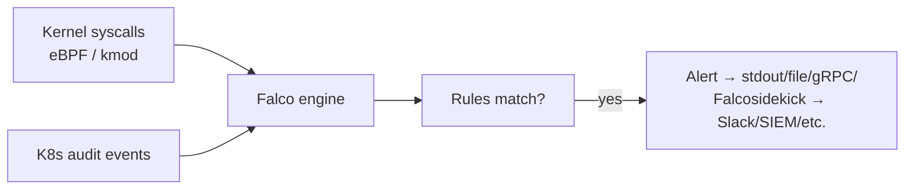
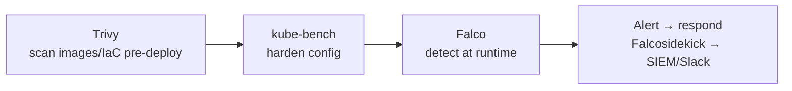

# Falco

## Up
- [[Container & K8s Security]]

Falco (CNCF, originally Sysdig) is the standard open-source **runtime threat-detection** engine for containers, Kubernetes, and Linux hosts. It watches **kernel syscalls** (via eBPF or a kernel module) plus Kubernetes audit events, and fires alerts when behaviour matches a rule — e.g. *a shell spawned in a container*, *a sensitive file read*, *an unexpected outbound connection*. Where [[Trivy]]/[[kube-bench]] are static/pre-deploy, Falco is **detection at runtime**.

---

## How It Works



- A **driver** (modern **eBPF** probe, or legacy kernel module) taps syscalls with low overhead.
- The **engine** evaluates events against **rules**; matches become alerts with a **priority**.
- **Falcosidekick** fans alerts out to Slack, PagerDuty, Elasticsearch, SIEMs, webhooks, etc.

---

## What It Detects (examples)

| Behaviour | Why it's suspicious |
|---|---|
| **Shell in a container** (`bash`/`sh` spawned) | Interactive access → likely compromise/hands-on-keyboard |
| **Write below `/etc`, `/bin`** | Tampering with system binaries/config |
| **Read sensitive files** (`/etc/shadow`, SA token) | Credential theft |
| **Unexpected outbound network** | C2 / exfiltration / crypto-mining |
| **Container running as root / privileged launch** | Policy violation, escape setup |
| **Package manager run in container** | Drift / live tampering (`apt`, `apk` at runtime) |
| **Namespace/mount changes, `ptrace`** | Escape attempts |

These map directly to the escape/escalation techniques in [[Container Attack Concepts]].

---

## Rules

Falco ships a maintained default ruleset; you add your own in YAML.

```yaml
- rule: Terminal shell in container
  desc: A shell was spawned in a container
  condition: >
    spawned_process and container
    and shell_procs and proc.tty != 0
  output: >
    Shell in container (user=%user.name container=%container.name
    cmd=%proc.cmdline image=%container.image.repository)
  priority: WARNING
  tags: [container, shell, mitre_execution]
```

- **condition** — a filter over syscall/event fields (`proc.name`, `fd.name`, `container.id`, `k8s.ns.name`…).
- **output** — the alert message with templated fields.
- **priority** — `EMERGENCY … CRITICAL, ERROR, WARNING, NOTICE, INFO, DEBUG`.
- **macros/lists** — reusable condition fragments (`shell_procs`, `sensitive_files`).
- Rules often carry **MITRE ATT&CK** tags → ties runtime alerts to [[MITRE ATT&CK]] techniques.

---

## Deploying

```bash
# Helm (typical on Kubernetes) — installs Falco as a DaemonSet (one pod per node)
helm repo add falcosecurity https://falcosecurity.github.io/charts
helm install falco falcosecurity/falco -n falco --create-namespace \
  --set tty=true --set driver.kind=modern_ebpf

kubectl logs -n falco -l app.kubernetes.io/name=falco -f   # watch alerts

# add sidekick for routing alerts out
helm install falco falcosecurity/falco --set falcosidekick.enabled=true
```

Runs as a **DaemonSet** so every node is monitored. `modern_ebpf` needs no kernel headers and is the preferred driver.

---

## Where It Fits (static → runtime)



- **[[Trivy]]** stops known-bad **before** deploy; **[[kube-bench]]** hardens config; **Falco** catches what slips through **at runtime**.
- Complements admission control (Kyverno/OPA prevent) with **detection** (Falco observes what actually happens).
- **Falco Talon** / response engines can auto-react (kill pod, isolate) on an alert.

---

## Tips

- Prefer the **modern eBPF** driver (portable, no kernel headers, low overhead).
- **Tune the ruleset** to your environment or you'll drown in false positives — silence expected shells (CI/debug), scope by namespace/image.
- Route alerts via **Falcosidekick** to your SIEM/Slack; alerts nobody sees are useless.
- Map rules to **[[MITRE ATT&CK]]** for consistent reporting (see [[Methodology]]).
- Falco **detects, it doesn't block** — pair with admission control/Pod Security ([[Container Attack Concepts]]) for prevention, and a response tool for reaction.
