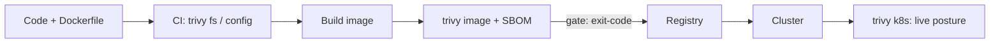

# Trivy

## Up
- [[Container & K8s Security]]

Trivy (Aqua Security) is the de-facto open-source **all-in-one security scanner** — it finds **vulnerabilities, misconfigurations (IaC), exposed secrets, and license issues** across container images, filesystems, git repos, Kubernetes clusters, and SBOMs. It's the "shift-left" workhorse: run it in CI/CD to catch problems before deploy. Scan only assets you own/are authorized to.

---

## What Trivy Scans (targets)

| Command | Scans |
|---|---|
| `trivy image ` | Container image — OS packages + app deps for CVEs, secrets, misconfig |
| `trivy fs <path>` | A filesystem/project directory (deps, secrets, IaC) |
| `trivy repo <url>` | A remote git repository |
| `trivy config <path>` | **IaC misconfig**: Dockerfile, K8s manifests, Terraform, Helm |
| `trivy k8s` | A live **Kubernetes cluster** (workloads, RBAC, infra) |
| `trivy sbom <file>` | Scan from / generate an SBOM (CycloneDX, SPDX) |
| `trivy vm` | VM images / disk (AMI, VMDK) |

### Scanner types (what it looks for)
`vuln` (CVEs) · `misconfig` (IaC) · `secret` (hardcoded creds) · `license`.

---

## Core Examples

```bash
# image vulnerabilities
trivy image nginx:1.25
trivy image --severity HIGH,CRITICAL myapp:latest
trivy image --ignore-unfixed myapp:latest          # only actionable (fixed) vulns

# project / repo (deps + secrets + IaC)
trivy fs .
trivy repo https://github.com/org/app

# IaC misconfiguration
trivy config .                                      # Dockerfile/K8s/Terraform
trivy config --severity HIGH ./k8s/

# live Kubernetes cluster
trivy k8s --report summary
trivy k8s --report all --severity CRITICAL

# SBOM
trivy image --format cyclonedx -o sbom.json myapp:latest
trivy sbom sbom.json
```

---

## Output, Gating & CI/CD

```bash
trivy image -f json -o out.json myapp:latest        # json | table | sarif | cyclonedx | spdx
trivy image -f sarif -o trivy.sarif myapp:latest    # for GitHub code scanning
trivy image --exit-code 1 --severity CRITICAL myapp:latest   # FAIL the build on criticals
trivy image --ignorefile .trivyignore myapp:latest  # suppress accepted CVE IDs
```

- `--exit-code 1` is the key CI gate — break the pipeline when Critical/High vulns appear.
- `.trivyignore` (list CVE IDs) mutes accepted risks so reports stay signal-rich.
- SARIF output integrates with GitHub/GitLab security tabs.

```yaml
# GitHub Actions (illustrative)
- uses: aquasecurity/trivy-action@master
  with:
    image-ref: myapp:${{ github.sha }}
    severity: CRITICAL,HIGH
    exit-code: '1'
```

---

## Where It Fits



- **Shift-left:** scan code/IaC/images in CI before they ship.
- **Runtime posture:** `trivy k8s` audits a live cluster (complements [[kube-bench]] CIS checks and [[Falco]] runtime detection).
- Aqua now positions Trivy-based tooling as the successor to the archived [[kube-hunter]] for much K8s scanning.

---

## Trivy vs Other Scanners

| Tool | Focus |
|---|---|
| **Trivy** | All-in-one: images + IaC + secrets + K8s + SBOM |
| **Grype** (Anchore) | Image/filesystem CVE scanning (pairs with Syft SBOM) |
| **Clair** | Registry-integrated image vuln scanning |
| **[[kube-bench]]** | CIS **benchmark** (host/control-plane config), not CVEs |
| **[[Falco]]** | **Runtime** behaviour, not static scanning |

---

## Tips

- Use `--ignore-unfixed` to focus on vulns you can actually remediate (a fix exists).
- Generate and keep an **SBOM** per build for supply-chain visibility and later re-scanning.
- Combine scanners: **Trivy** (breadth) in CI + **kube-bench** (CIS) + **Falco** (runtime) covers static→config→runtime.
- Fail builds on Critical/High (`--exit-code 1`) but curate `.trivyignore` so the gate stays trusted.
