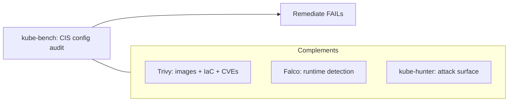

# kube-bench

## Up
- [[Container & K8s Security]]

kube-bench (Aqua Security) checks whether a Kubernetes cluster is deployed according to the **CIS Kubernetes Benchmark** — the industry hardening standard. It's a **defensive/config-audit** tool: it inspects component flags, file permissions, and settings on nodes and the control plane, reporting **PASS / FAIL / WARN** with remediation. Run on clusters you operate/are authorized to assess.

---

## What It Checks (CIS sections)

| Section | Covers |
|---|---|
| **Control plane** | API server, controller-manager, scheduler flags |
| **etcd** | Encryption, TLS, access, file perms |
| **Node (worker)** | kubelet config, auth/authz, cert rotation, file perms |
| **Policies** | RBAC, Pod Security, NetworkPolicy, secrets management |

Each check maps to a CIS control ID (e.g. *1.2.x* API server) and includes the exact **remediation** step.

---

## Running It

```bash
# as a Kubernetes Job (most common — runs on the nodes)
kubectl apply -f https://raw.githubusercontent.com/aquasecurity/kube-bench/main/job.yaml
kubectl logs job/kube-bench

# node-specific jobs
kubectl apply -f job-master.yaml     # control-plane checks
kubectl apply -f job-node.yaml       # worker checks

# as a container directly on a node
docker run --pid=host -v /etc:/etc:ro -v /var:/var:ro \
  -t aquasec/kube-bench:latest --version 1.28

# as a binary on the node
kube-bench run --targets master,node,etcd,policies
```

Because checks read component flags and host files, kube-bench must run **on the node** (or with host mounts) — not remotely.

---

## Targeting & Versions

```bash
kube-bench run --targets node                    # just worker checks
kube-bench --benchmark cis-1.8                    # pin a benchmark version
kube-bench run --check 1.2.1,1.2.2                # specific checks
kube-bench --version 1.28                          # match your K8s version
```

kube-bench auto-detects the platform and applies the right benchmark — including managed variants (**EKS**, **GKE**, **AKS**) and distributions (RKE, OpenShift), which have their own CIS profiles.

---

## Output

```text
[INFO] 1 Control Plane Security Configuration
[PASS] 1.2.1 Ensure --anonymous-auth is false
[FAIL] 1.2.6 Ensure --kubelet-certificate-authority is set
[WARN] 1.2.16 Ensure admission control plugin PodSecurity is set
...
== Summary ==  45 pass, 6 fail, 12 warn
```

```bash
kube-bench run --json | jq .                     # machine-readable
kube-bench run --outputfile results.json --json
```

| Result | Meaning |
|---|---|
| **PASS** | Control satisfied |
| **FAIL** | Violates CIS — fix per remediation |
| **WARN** | Manual verification needed (can't auto-check) |
| **INFO** | Informational |

---

## Where It Fits



- **kube-bench** = *is the cluster **configured** to CIS?* (static hardening).
- **[[Trivy]]** = image/IaC **vulnerabilities & misconfig**.
- **[[Falco]]** = **runtime** behaviour detection.
- **[[kube-hunter]]** = **attacker's-eye** exposed-surface view.
- **Docker Bench for Security** is the equivalent CIS checker for the **Docker host/daemon**.

---

## Tips

- Run it **per node role** — control-plane and worker checks differ; managed clusters (EKS/GKE/AKS) hide the control plane, so use their specific profiles.
- Triage **FAIL** first (real deviations); **WARN** items need human judgement.
- Bake it into CI or a scheduled Job for **continuous** CIS compliance and drift detection.
- Pair with admission control (Kyverno/OPA) and Pod Security to *enforce* what kube-bench *measures*.
