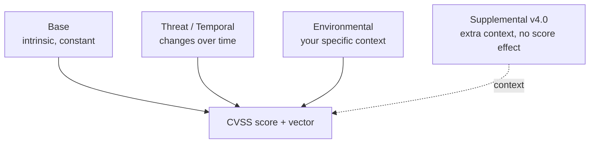

# CVSS

## Up
- [[Methodology]]

The **Common Vulnerability Scoring System (CVSS)**, maintained by **FIRST.org**, is the industry-standard way to rate the **severity of a vulnerability** as a number from **0.0–10.0**, encoded as a shareable **vector string**. It's how findings get prioritised and communicated in a [[PTES]] report. Current versions: **v3.1** (still ubiquitous) and **v4.0** (released 2023).

---

## Severity Bands

| Score | Severity |
|---|---|
| 0.0 | None |
| 0.1 – 3.9 | Low |
| 4.0 – 6.9 | Medium |
| 7.0 – 8.9 | High |
| 9.0 – 10.0 | Critical |

---

## Metric Groups



- **Base** — intrinsic qualities of the vuln that don't change (the number most people quote).
- **Threat** (v4.0) / **Temporal** (v3.1) — factors that change over time, e.g. exploit maturity.
- **Environmental** — adjust for *your* environment (asset criticality, existing mitigations).
- **Supplemental** (v4.0 only) — extra attributes (Safety, Automatable, Recovery…) that add context but **don't** change the score.

---

## Base Metrics — CVSS v3.1

**Exploitability**
- **AV** Attack Vector — Network / Adjacent / Local / Physical
- **AC** Attack Complexity — Low / High
- **PR** Privileges Required — None / Low / High
- **UI** User Interaction — None / Required

**Scope**
- **S** Scope — Unchanged / Changed (does the vuln affect resources beyond its security authority?)

**Impact (CIA)**
- **C / I / A** Confidentiality / Integrity / Availability — None / Low / High

**Example vector (v3.1):**
```
CVSS:3.1/AV:N/AC:L/PR:N/UI:N/S:U/C:H/I:H/A:H   → 9.8 Critical
```
(Network-reachable, easy, no privileges, no user action, full CIA loss.)

---

## Base Metrics — CVSS v4.0 (what changed)

v4.0 refines exploitability and **replaces "Scope"** with an explicit split between the **Vulnerable System** and a **Subsequent System**.

**Exploitability**
- **AV** Attack Vector, **AC** Attack Complexity, **PR** Privileges Required, **UI** User Interaction *(now None/Passive/Active)*
- **AT** Attack Requirements *(new)* — None / Present (preconditions beyond complexity)

**Impact — split into two systems**
- **VC / VI / VA** — Confidentiality/Integrity/Availability impact to the **Vulnerable** system
- **SC / SI / SA** — impact to **Subsequent** systems (replaces Scope)

**Threat:** **E** Exploit Maturity. **Environmental:** modified base + security requirements. **Supplemental:** Safety, Automatable, Recovery, Value Density, Response Effort, Provider Urgency.

**Nomenclature (name by which groups you scored):**

| Label | Includes |
|---|---|
| **CVSS-B** | Base only |
| **CVSS-BT** | Base + Threat |
| **CVSS-BE** | Base + Environmental |
| **CVSS-BTE** | Base + Threat + Environmental (most complete) |

**Example vector (v4.0):**
```
CVSS:4.0/AV:N/AC:L/AT:N/PR:N/UI:N/VC:H/VI:H/VA:H/SC:N/SI:N/SA:N
```

---

## v3.1 → v4.0 at a Glance

| Concept | v3.1 | v4.0 |
|---|---|---|
| Preconditions | (folded into AC) | **AT** Attack Requirements added |
| User Interaction | None / Required | None / **Passive** / **Active** |
| Cross-system impact | **Scope** (U/C) | **Vulnerable (VC/VI/VA)** + **Subsequent (SC/SI/SA)** |
| Time-based group | **Temporal** | **Threat** (simplified → Exploit Maturity) |
| Extra context | — | **Supplemental** metrics |
| Naming | "CVSS score" | **CVSS-B / BT / BE / BTE** |

---

## Using CVSS Well (and its limits)

- **Base ≠ risk.** A 9.8 on an isolated lab box may be low *risk*; use **Environmental** metrics to reflect asset value and mitigations before prioritising.
- Score the **realistic** scenario — worst-case-everything inflates numbers and erodes trust.
- Pair CVSS with **EPSS** (probability a vuln will be exploited in the wild) and **CISA KEV** (known-exploited catalog) for true prioritisation — CVSS measures *severity*, not *likelihood*.
- Always publish the **vector string**, not just the number, so others can see and adjust your assumptions.
- Tools: the **FIRST.org CVSS calculator** (v3.1 and v4.0) generates score + vector from your metric choices.

---

## Takeaways

- CVSS gives a **standard, transportable severity score + vector** for every finding.
- Know the four metric groups; most disputes come from quoting **Base-only** as if it were risk.
- v4.0's headline changes: **AT** metric, richer **UI**, **Scope → Vulnerable/Subsequent systems**, and **-B/BT/BE/BTE** naming.
- In a [[PTES]] report, attach a CVSS score + vector to each finding, then contextualise with EPSS/KEV and business impact.
