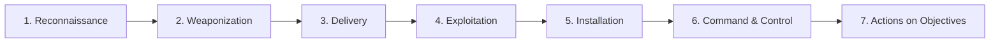
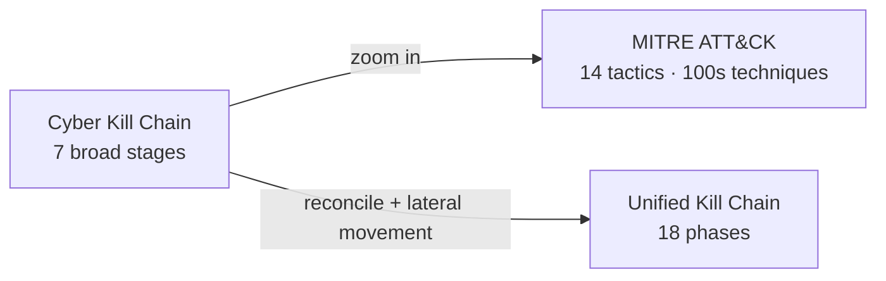

# Cyber Kill Chain

## Up
- [[Methodology]]

The **Cyber Kill Chain**, created by Lockheed Martin, models a targeted intrusion as **seven sequential stages**. Its core idea: an attacker must complete every link to succeed, so defenders who **break any one link** stop the attack. It gives a shared vocabulary for describing intrusions and deciding where to invest defenses.

---

## The 7 Stages

| # | Stage | Attacker does | Maps to (this vault) |
|---|---|---|---|
| 1 | **Reconnaissance** | Gather target info — emails, domains, exposed services | [[OSINT]], [[Reconnaissance]] |
| 2 | **Weaponization** | Build the payload (e.g. malicious doc + exploit) | — (offline, no target contact) |
| 3 | **Delivery** | Transmit it — phishing email, USB, watering hole, web | Phishing / social engineering |
| 4 | **Exploitation** | Trigger the vuln to run attacker code | [[Web]] vulns, memory bugs |
| 5 | **Installation** | Establish persistence — implant, backdoor, service | Persistence techniques |
| 6 | **Command & Control (C2)** | Open a channel to remotely control the host | Beacons, C2 frameworks |
| 7 | **Actions on Objectives** | Achieve the goal — exfiltrate, encrypt, destroy, pivot | Exfiltration, impact |

Stages 1–2 happen **off-target** (hard to see); detection usually starts at **Delivery**.

---

## Defensive Courses of Action

For each stage, defenders can apply the "**D5**" actions — the goal is to act as early (leftward) as possible:

| Action | Meaning |
|---|---|
| **Detect** | Know it's happening (IDS, EDR, logs) |
| **Deny** | Block it (firewall, patching, least privilege) |
| **Disrupt** | Interfere mid-action (kill process, drop traffic) |
| **Degrade** | Slow/limit the attacker (rate limits, quarantine) |
| **Deceive** | Mislead (honeypots, decoys) |
| (Destroy/Contain) | Neutralise the foothold |

**Course-of-action matrix** = stages × actions; you fill each cell with the control you have. Gaps show where you're blind.

---

## Strengths & Criticisms

**Strengths**
- Simple, intuitive, great for executive-level narrative and reporting.
- "Break one link" mindset drives layered (defense-in-depth) thinking.

**Criticisms**
- **Perimeter/malware-centric** — fits classic external-intrusion + APT malware better than insider threats, credential abuse, or cloud/SaaS attacks.
- **Too linear** — real intrusions loop and skip stages; lateral movement isn't well represented.
- **Coarse** — each stage hides dozens of concrete techniques → pair it with **[[MITRE ATT&CK]]** for the granularity.

---

## Related Models

- **Unified Kill Chain** (Pols) — 18 phases across *In → Through → Out*, reconciling Kill Chain with [[MITRE ATT&CK]] and covering lateral movement.
- **Diamond Model** — pivots an intrusion across *adversary · capability · infrastructure · victim*.
- **MITRE ATT&CK** — the technique-level companion; ATT&CK tactics roughly expand the middle/late kill-chain stages.

---

## Takeaways

- Use the Kill Chain for the **story** (how an intrusion unfolds and where to disrupt it), and **[[MITRE ATT&CK]]** for the **details** (which specific techniques to detect).
- Push defenses **left** — stopping at Delivery/Exploitation is far cheaper than at Actions on Objectives.
- Don't force every scenario into 7 linear stages; it's a lens, not a law.
