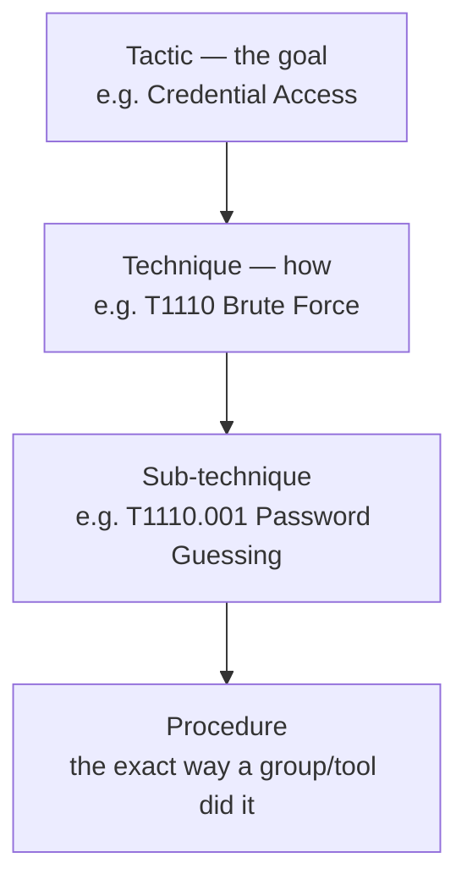
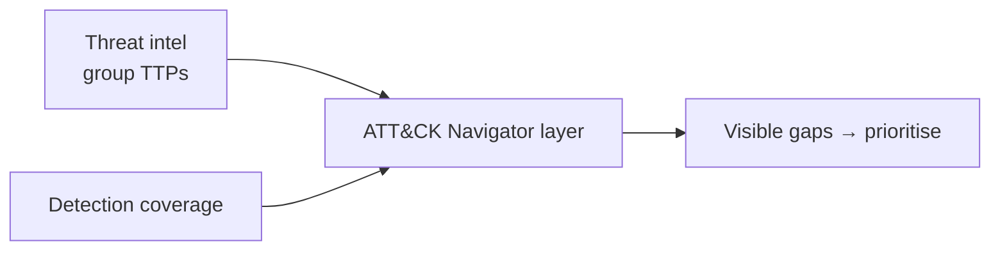

# MITRE ATT&CK

## Up
- [[Methodology]]

**ATT&CK** (Adversarial Tactics, Techniques & Common Knowledge) is MITRE's continuously curated knowledge base of **real-world adversary behaviour**, organised as a matrix of **tactics** (the *why* — the attacker's goal) and **techniques** (the *how*). It's the lingua franca connecting red teams, detection engineers, and threat intelligence.

---

## The Model: Tactics → Techniques → Procedures

- **Tactic** — the adversary's objective for a step (columns of the matrix). ID `TAxxxx`.
- **Technique** — a way to achieve it. ID `Txxxx` (sub-techniques `Txxxx.yyy`).
- **Procedure** — the specific real implementation observed (tied to a group or software).
- This aligns with the intel concept of **TTPs** (Tactics, Techniques, Procedures).

---

## Enterprise Tactics (14, in rough order)

| Tactic | Goal (attacker wants to…) |
|---|---|
| Reconnaissance | Gather info to plan the operation |
| Resource Development | Build/acquire infrastructure & capabilities |
| Initial Access | Get into the network |
| Execution | Run malicious code |
| Persistence | Keep the foothold across reboots/creds |
| Privilege Escalation | Gain higher permissions |
| Defense Evasion | Avoid detection |
| Credential Access | Steal accounts/passwords ([[Password Cracking]]) |
| Discovery | Learn the environment |
| Lateral Movement | Move to other systems |
| Collection | Gather target data |
| Command & Control | Communicate with compromised hosts |
| Exfiltration | Steal data out |
| Impact | Manipulate, disrupt, destroy (e.g. ransomware) |

---

## The Matrices (technology domains)

- **Enterprise** — Windows, macOS, Linux, Cloud (IaaS/SaaS/Office 365/Identity), Network, Containers.
- **Mobile** — Android & iOS.
- **ICS** — Industrial Control Systems.

Columns = tactics; cells = techniques. A real intrusion is a **path** left-to-right across the matrix.

---

## What Else ATT&CK Catalogs

| Object | Contains |
|---|---|
| **Groups** (`Gxxxx`) | Named threat actors (e.g. APTxx) and the techniques they use |
| **Software** (`Sxxxx`) | Malware & tools mapped to techniques |
| **Mitigations** (`Mxxxx`) | Defensive measures per technique |
| **Data Sources / Components** | What telemetry detects a technique |
| **Campaigns** | Time-bound sets of activity |

---

## How Teams Use It

- **Detection engineering (blue):** map your logging/EDR coverage to techniques; find blind spots. Data Sources tell you what to collect.
- **Red team / adversary emulation:** plan an engagement as a chain of techniques mimicking a specific group (e.g. emulate APT29).
- **Threat intel:** describe adversaries in a common language (TTPs), compare groups, track trends.
- **Purple team & gap analysis:** run a technique → check if the SOC detects it → improve.

### ATT&CK Navigator
A web tool for **heatmapping** the matrix — colour techniques by coverage, threat-group overlap, or test results, and export/share JSON layers. The go-to way to visualise "what we can detect" vs "what group X does".

---

## Related MITRE Projects

- **D3FEND** — defensive countermeasures graph (the counterpart to ATT&CK).
- **CAR** (Cyber Analytics Repository) — analytics to detect techniques.
- **ATT&CK Evaluations** — vendor detection tests against emulated adversaries.
- **CAPEC** — attack *pattern* catalog (complements technique-level ATT&CK).
- **ENGAGE** — adversary engagement/deception planning.

---

## ATT&CK vs Cyber Kill Chain

| | [[Cyber Kill Chain]] | MITRE ATT&CK |
|---|---|---|
| Granularity | 7 broad stages | 14 tactics, hundreds of techniques |
| Shape | Linear | Matrix / non-linear path |
| Strength | Executive narrative | Detection & emulation detail |
| Use together | Kill Chain for the story → ATT&CK for the specifics |

---

## Takeaways

- Think **Tactic (why) → Technique (how) → Procedure (exactly)** — it's the whole model.
- ATT&CK is **behaviour-based**, so it's durable: attackers change tools often but reuse techniques.
- Use **Navigator** to turn coverage/intel into a shareable heatmap and drive priorities.
- Map vault findings (e.g. [[Web]], [[Password Cracking]]) to ATT&CK technique IDs in reports for a common language with defenders.
